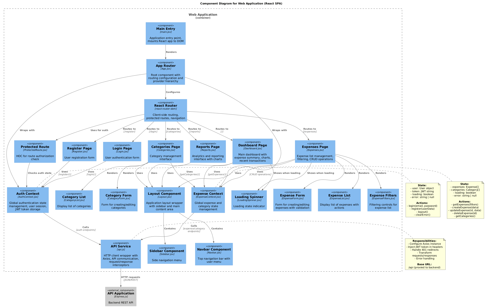

# C4 Model - Level 3: Component Diagram - Web Application

**Proyecto:** ExpenseTracker
**Contenedor:** Web Application (React SPA)
**Versión:** 1.0
**Fecha:** 2025-11-05
**Nivel:** Component (C4 Level 3)

---

## 1. Introducción

Este documento describe el **Diagrama de Componentes** (C4 Level 3) del contenedor **Web Application** del sistema ExpenseTracker. El diagrama muestra los componentes internos de la aplicación React, sus responsabilidades, y cómo interactúan entre sí.

### Propósito

El diagrama de componentes del Web Application:
- Identifica los **componentes principales** de la SPA React
- Muestra la **arquitectura interna** del frontend
- Define **responsabilidades** de cada componente
- Mapea **dependencias** y flujos de datos
- Documenta **patrones de diseño** aplicados

### Audiencia

- **Desarrolladores Frontend**: Entender la estructura del código React
- **Arquitectos**: Evaluar patrones y decisiones de diseño
- **Nuevos Developers**: Onboarding y navegación del código
- **Code Reviewers**: Validar adherencia a arquitectura

---

## 2. Diagrama de Componentes (PlantUML)

```plantuml
@startuml C4_Component_WebApplication
!include https://raw.githubusercontent.com/plantuml-stdlib/C4-PlantUML/master/C4_Component.puml

LAYOUT_TOP_DOWN()

title Component Diagram for Web Application (React SPA)

Container_Boundary(webapp, "Web Application") {

    ' Entry Point
    Component(main, "Main Entry", "main.jsx", "Application entry point, mounts React app to DOM")
    Component(app, "App Router", "App.jsx", "Root component with routing configuration and provider hierarchy")

    ' Context Providers (State Management)
    Component(authContext, "Auth Context", "AuthContext.jsx", "Global authentication state management, user session, JWT token storage")
    Component(expenseContext, "Expense Context", "ExpenseContext.jsx", "Global expense and category state management")

    ' Router Component
    Component(router, "React Router", "react-router-dom", "Client-side routing, protected routes, navigation")

    ' Page Components
    Component(dashboardPage, "Dashboard Page", "Dashboard.jsx", "Main dashboard with expense summary, charts, recent transactions")
    Component(expensesPage, "Expenses Page", "Expenses.jsx", "Expense list management, filtering, CRUD operations")
    Component(categoriesPage, "Categories Page", "Categories.jsx", "Category management interface")
    Component(reportsPage, "Reports Page", "Reports.jsx", "Analytics and reporting interface with charts")
    Component(loginPage, "Login Page", "Login.jsx", "User authentication form")
    Component(registerPage, "Register Page", "Register.jsx", "User registration form")

    ' Layout Components
    Component(layout, "Layout Component", "Layout.jsx", "Application layout wrapper with sidebar and main content area")
    Component(navbar, "Navbar Component", "Navbar.jsx", "Top navigation bar with user menu")
    Component(sidebar, "Sidebar Component", "Sidebar.jsx", "Side navigation menu")
    Component(protectedRoute, "Protected Route", "ProtectedRoute.jsx", "HOC for route authorization check")

    ' Form Components
    Component(expenseForm, "Expense Form", "ExpenseForm.jsx", "Form for creating/editing expenses with validation")
    Component(categoryForm, "Category Form", "CategoryForm.jsx", "Form for creating/editing categories")

    ' List Components
    Component(expenseList, "Expense List", "ExpenseList.jsx", "Display list of expenses with actions")
    Component(categoryList, "Category List", "CategoryList.jsx", "Display list of categories")
    Component(expenseFilters, "Expense Filters", "ExpenseFilters.jsx", "Filtering controls for expense list")

    ' Common Components
    Component(loadingSpinner, "Loading Spinner", "LoadingSpinner.jsx", "Loading state indicator")

    ' Services
    Component(apiService, "API Service", "api.js", "HTTP client wrapper with Axios, API communication, request/response interceptors")
}

' External Dependencies
Component_Ext(apiBackend, "API Application", "Express.js", "Backend REST API")

' Main flow
Rel(main, app, "Renders")
Rel(app, authContext, "Wraps with")
Rel(app, expenseContext, "Wraps with")
Rel(app, router, "Configures")

' Router to Pages
Rel(router, loginPage, "Routes to", "/login")
Rel(router, registerPage, "Routes to", "/register")
Rel(router, dashboardPage, "Routes to", "/")
Rel(router, expensesPage, "Routes to", "/expenses")
Rel(router, categoriesPage, "Routes to", "/categories")
Rel(router, reportsPage, "Routes to", "/reports")

' Protected Routes
Rel(router, protectedRoute, "Uses for auth")
Rel(protectedRoute, authContext, "Checks auth state")

' Layout relationships
Rel(dashboardPage, layout, "Uses")
Rel(expensesPage, layout, "Uses")
Rel(categoriesPage, layout, "Uses")
Rel(reportsPage, layout, "Uses")
Rel(layout, navbar, "Contains")
Rel(layout, sidebar, "Contains")

' Page to Context
Rel(loginPage, authContext, "Uses", "login()")
Rel(registerPage, authContext, "Uses", "register()")
Rel(dashboardPage, expenseContext, "Uses", "getExpenses()")
Rel(expensesPage, expenseContext, "Uses", "CRUD operations")
Rel(categoriesPage, expenseContext, "Uses", "getCategories()")

' Page to Components
Rel(expensesPage, expenseList, "Renders")
Rel(expensesPage, expenseFilters, "Renders")
Rel(expensesPage, expenseForm, "Renders")
Rel(categoriesPage, categoryList, "Renders")
Rel(categoriesPage, categoryForm, "Renders")

' Context to API
Rel(authContext, apiService, "Calls", "auth endpoints")
Rel(expenseContext, apiService, "Calls", "expense/category endpoints")

' API to Backend
Rel(apiService, apiBackend, "HTTP requests", "JSON/REST")

' Loading states
Rel(dashboardPage, loadingSpinner, "Shows when loading")
Rel(expensesPage, loadingSpinner, "Shows when loading")

note right of authContext
  **State:**
  - user: User object
  - token: JWT string
  - loading: boolean
  - error: string | null

  **Actions:**
  - login(email, password)
  - register(userData)
  - logout()
  - clearError()
end note

note right of expenseContext
  **State:**
  - expenses: Expense[]
  - categories: Category[]
  - loading: boolean
  - error: string | null

  **Actions:**
  - getExpenses(filters)
  - createExpense(data)
  - updateExpense(id, data)
  - deleteExpense(id)
  - getCategories()
end note

note right of apiService
  **Responsibilities:**
  - Configure Axios instance
  - Inject JWT token in headers
  - Handle 401 redirects
  - Transform requests/responses
  - Error handling

  **Base URL:**
  /api (proxied to backend)
end note

@enduml
```


---

## 3. Componentes Principales

### 3.1 Entry Point & Routing

#### 3.1.1 Main Entry (`main.jsx`)

**Tipo:** Entry Point
**Ubicación:** `/client/src/main.jsx`
**Responsabilidad:** Punto de entrada de la aplicación

**Código:**
```javascript
import React from 'react'
import ReactDOM from 'react-dom/client'
import { BrowserRouter } from 'react-router-dom'
import App from './App.jsx'
import './styles/index.css'

ReactDOM.createRoot(document.getElementById('root')).render(
  <React.StrictMode>
    <BrowserRouter>
      <App />
    </BrowserRouter>
  </React.StrictMode>,
)
```

**Responsabilidades:**
- Montar aplicación React en el DOM
- Envolver app con `BrowserRouter` para routing
- Cargar estilos globales
- Activar modo estricto de React

---

#### 3.1.2 App Router (`App.jsx`)

**Tipo:** Root Component
**Ubicación:** `/client/src/App.jsx`
**Responsabilidad:** Configuración de routing y jerarquía de providers

**Código:**
```javascript
import { Routes, Route } from 'react-router-dom'
import { AuthProvider } from './context/AuthContext'
import { ExpenseProvider } from './context/ExpenseContext'
import Layout from './components/common/Layout'
import Dashboard from './pages/Dashboard'
import Login from './pages/Login'
import Register from './pages/Register'
import Expenses from './pages/Expenses'
import Categories from './pages/Categories'
import Reports from './pages/Reports'
import ProtectedRoute from './components/common/ProtectedRoute'

function App() {
  return (
    <AuthProvider>
      <ExpenseProvider>
        <Routes>
          <Route path="/login" element={<Login />} />
          <Route path="/register" element={<Register />} />
          <Route path="/" element={<Layout />}>
            <Route index element={
              <ProtectedRoute>
                <Dashboard />
              </ProtectedRoute>
            } />
            <Route path="expenses" element={
              <ProtectedRoute>
                <Expenses />
              </ProtectedRoute>
            } />
            <Route path="categories" element={
              <ProtectedRoute>
                <Categories />
              </ProtectedRoute>
            } />
            <Route path="reports" element={
              <ProtectedRoute>
                <Reports />
              </ProtectedRoute>
            } />
          </Route>
        </Routes>
      </ExpenseProvider>
    </AuthProvider>
  )
}
```

**Responsabilidades:**
- Configurar jerarquía de Context Providers
- Definir rutas de la aplicación
- Aplicar protección de rutas
- Configurar layout anidado

**Patrón:** Provider Pattern, Nested Routing

---

### 3.2 State Management (Context API)

#### 3.2.1 Auth Context (`AuthContext.jsx`)

**Tipo:** State Management Component
**Ubicación:** `/client/src/context/AuthContext.jsx`
**Líneas de Código:** 137 líneas
**Patrón:** Context API + useReducer

**Estado Gestionado:**
```typescript
interface AuthState {
  user: User | null
  token: string | null
  loading: boolean
  error: string | null
}
```

**Actions Disponibles:**
```javascript
const actions = {
  'AUTH_START',      // Inicia operación de auth
  'AUTH_SUCCESS',    // Login/registro exitoso
  'AUTH_ERROR',      // Error en autenticación
  'LOGOUT',          // Cierre de sesión
  'SET_LOADING',     // Cambio de loading state
  'CLEAR_ERROR'      // Limpieza de errores
}
```

**Métodos Públicos:**
```javascript
const {
  user,              // Usuario actual
  token,             // JWT token
  loading,           // Estado de carga
  error,             // Mensaje de error
  login,             // (email, password) => Promise
  register,          // (userData) => Promise
  logout,            // () => Promise
  clearError         // () => void
} = useAuth()
```

**Flujo de Login:**
```
1. dispatch({ type: 'AUTH_START' })
2. API call: POST /api/auth/login
3. On success:
   - Store token in localStorage
   - dispatch({ type: 'AUTH_SUCCESS', payload: { user, token } })
4. On error:
   - dispatch({ type: 'AUTH_ERROR', payload: errorMessage })
```

**Persistencia:**
- Token almacenado en `localStorage`
- Validación de token al cargar app
- Logout limpia token de localStorage

**Responsabilidades:**
- Gestionar estado de autenticación global
- Persistir sesión de usuario
- Proveer métodos de login/registro/logout
- Validar token al inicializar app
- Manejar errores de autenticación

---

#### 3.2.2 Expense Context (`ExpenseContext.jsx`)

**Tipo:** State Management Component
**Ubicación:** `/client/src/context/ExpenseContext.jsx`
**Patrón:** Context API + useReducer

**Estado Gestionado:**
```typescript
interface ExpenseState {
  expenses: Expense[]
  categories: Category[]
  loading: boolean
  error: string | null
  filters: ExpenseFilters
}
```

**Métodos Públicos:**
```javascript
const {
  expenses,           // Lista de gastos
  categories,         // Lista de categorías
  loading,            // Estado de carga
  error,              // Mensaje de error
  getExpenses,        // (filters?) => Promise
  createExpense,      // (expenseData) => Promise
  updateExpense,      // (id, expenseData) => Promise
  deleteExpense,      // (id) => Promise
  getCategories,      // () => Promise
  setFilters          // (filters) => void
} = useExpense()
```

**Responsabilidades:**
- Gestionar estado de gastos y categorías
- Proveer métodos CRUD para gastos
- Gestionar filtros de visualización
- Cachear datos para evitar fetches redundantes
- Sincronizar estado con backend

---

### 3.3 Page Components

#### 3.3.1 Dashboard Page (`Dashboard.jsx`)

**Tipo:** Page Component
**Ubicación:** `/client/src/pages/Dashboard.jsx`
**Ruta:** `/`

**Responsabilidades:**
- Mostrar resumen de gastos del mes actual
- Visualizar estadísticas clave (total, promedio, conteo)
- Mostrar gráficos de gastos por categoría
- Lista de gastos recientes (últimos 5)
- Cards con métricas principales

**Dependencias:**
- `useExpense()` - Obtener datos de gastos
- `Chart.js` - Visualización de gráficos
- Componentes de cards y estadísticas

---

#### 3.3.2 Expenses Page (`Expenses.jsx`)

**Tipo:** Page Component
**Ubicación:** `/client/src/pages/Expenses.jsx`
**Ruta:** `/expenses`

**Responsabilidades:**
- Gestión completa de gastos (CRUD)
- Filtrado por fecha, categoría, monto
- Búsqueda de gastos
- Paginación de resultados
- Modal para crear/editar gastos

**Componentes Hijos:**
- `ExpenseList` - Tabla/lista de gastos
- `ExpenseFilters` - Controles de filtrado
- `ExpenseForm` - Formulario en modal

**Flujo de Creación:**
```
1. User clicks "Add Expense"
2. Open modal with ExpenseForm
3. User fills form and submits
4. Call expenseContext.createExpense()
5. On success: Close modal, refresh list
6. On error: Show error message in form
```

---

#### 3.3.3 Categories Page (`Categories.jsx`)

**Tipo:** Page Component
**Ubicación:** `/client/src/pages/Categories.jsx`
**Ruta:** `/categories`

**Responsabilidades:**
- Visualizar categorías predefinidas y personalizadas
- Crear categorías personalizadas
- Editar/eliminar categorías propias
- No permite editar categorías predefinidas

**Componentes Hijos:**
- `CategoryList` - Grid de categorías con colores
- `CategoryForm` - Formulario de categoría

---

#### 3.3.4 Reports Page (`Reports.jsx`)

**Tipo:** Page Component
**Ubicación:** `/client/src/pages/Reports.jsx`
**Ruta:** `/reports`

**Responsabilidades:**
- Visualización avanzada de gastos con gráficos
- Selector de rango de fechas
- Comparativa de períodos
- Exportación de reportes (CSV, JSON)
- Gráficos de tendencias temporales

**Características:**
- Pie chart: Gastos por categoría
- Line chart: Tendencia temporal
- Bar chart: Comparativa mensual
- Tabla resumen con estadísticas

---

#### 3.3.5 Login Page (`Login.jsx`)

**Tipo:** Page Component (Public)
**Ubicación:** `/client/src/pages/Login.jsx`
**Ruta:** `/login`

**Responsabilidades:**
- Formulario de inicio de sesión
- Validación de email y contraseña
- Llamada a `authContext.login()`
- Redirección a dashboard al autenticar
- Mostrar errores de autenticación
- Link a página de registro

---

#### 3.3.6 Register Page (`Register.jsx`)

**Tipo:** Page Component (Public)
**Ubicación:** `/client/src/pages/Register.jsx`
**Ruta:** `/register`

**Responsabilidades:**
- Formulario de registro de usuario
- Validación de datos (email, password strength, confirm password)
- Llamada a `authContext.register()`
- Redirección a dashboard al registrar
- Mostrar errores de validación
- Link a página de login

---

### 3.4 Layout Components

#### 3.4.1 Layout Component (`Layout.jsx`)

**Tipo:** Layout Component
**Ubicación:** `/client/src/components/common/Layout.jsx`

**Estructura:**
```jsx
<div className="flex h-screen">
  <Sidebar />
  <div className="flex-1 flex flex-col">
    <Navbar />
    <main className="flex-1 overflow-y-auto p-6">
      <Outlet /> {/* React Router nested routes */}
    </main>
  </div>
</div>
```

**Responsabilidades:**
- Estructura de layout de 2 columnas
- Contener Sidebar y Navbar
- Renderizar contenido de rutas hijas con `<Outlet />`
- Responsive design (colapsa sidebar en móvil)

---

#### 3.4.2 Navbar Component (`Navbar.jsx`)

**Tipo:** UI Component
**Ubicación:** `/client/src/components/common/Navbar.jsx`

**Responsabilidades:**
- Barra de navegación superior
- Mostrar información de usuario actual
- Menú de usuario (dropdown)
- Botón de logout
- Breadcrumbs (futuro)

**Dependencias:**
- `useAuth()` - Obtener usuario actual y logout

---

#### 3.4.3 Sidebar Component (`Sidebar.jsx`)

**Tipo:** UI Component
**Ubicación:** `/client/src/components/common/Sidebar.jsx`

**Responsabilidades:**
- Menú de navegación lateral
- Links a páginas principales (Dashboard, Expenses, Categories, Reports)
- Highlighting de ruta activa
- Iconos para cada sección
- Colapsable en responsive

**Navegación:**
```javascript
const menuItems = [
  { path: '/', label: 'Dashboard', icon: HomeIcon },
  { path: '/expenses', label: 'Expenses', icon: CashIcon },
  { path: '/categories', label: 'Categories', icon: TagIcon },
  { path: '/reports', label: 'Reports', icon: ChartIcon }
]
```

---

#### 3.4.4 Protected Route (`ProtectedRoute.jsx`)

**Tipo:** HOC (Higher-Order Component)
**Ubicación:** `/client/src/components/common/ProtectedRoute.jsx`

**Patrón:** HOC Pattern, Guard Pattern

**Lógica:**
```javascript
function ProtectedRoute({ children }) {
  const { user, loading } = useAuth()

  if (loading) {
    return <LoadingSpinner />
  }

  if (!user) {
    return <Navigate to="/login" replace />
  }

  return children
}
```

**Responsabilidades:**
- Verificar autenticación antes de renderizar ruta
- Redirigir a login si no autenticado
- Mostrar loading mientras valida token
- Proteger rutas privadas

---

### 3.5 Form Components

#### 3.5.1 Expense Form (`ExpenseForm.jsx`)

**Tipo:** Form Component
**Ubicación:** `/client/src/components/forms/ExpenseForm.jsx`

**Props:**
```typescript
interface ExpenseFormProps {
  expense?: Expense | null  // Para edición
  onSubmit: (data: ExpenseData) => void
  onCancel: () => void
}
```

**Campos:**
- `amount` - Number input (required, positive)
- `description` - Text input (required)
- `category_id` - Select dropdown (required)
- `date` - Date picker (required)
- `notes` - Textarea (optional)
- `receipt` - File input (optional, images only)

**Validaciones Client-Side:**
```javascript
const validate = (values) => {
  const errors = {}

  if (!values.amount || values.amount <= 0) {
    errors.amount = 'Amount must be greater than 0'
  }

  if (!values.description || values.description.trim() === '') {
    errors.description = 'Description is required'
  }

  if (!values.category_id) {
    errors.category_id = 'Category is required'
  }

  if (!values.date) {
    errors.date = 'Date is required'
  }

  return errors
}
```

**Responsabilidades:**
- Capturar datos de gasto
- Validar inputs
- Manejo de file upload (recibo)
- Modo create/edit
- Feedback de errores

---

#### 3.5.2 Category Form (`CategoryForm.jsx`)

**Tipo:** Form Component
**Ubicación:** `/client/src/components/forms/CategoryForm.jsx`

**Campos:**
- `name` - Text input (required)
- `description` - Textarea (optional)
- `color` - Color picker (required)
- `icon` - Icon selector (optional)

**Responsabilidades:**
- Capturar datos de categoría
- Validar nombre único
- Selector de color visual
- Preview de categoría

---

### 3.6 List Components

#### 3.6.1 Expense List (`ExpenseList.jsx`)

**Tipo:** List Component
**Ubicación:** `/client/src/components/expenses/ExpenseList.jsx`

**Props:**
```typescript
interface ExpenseListProps {
  expenses: Expense[]
  onEdit: (expense: Expense) => void
  onDelete: (expenseId: number) => void
  loading?: boolean
}
```

**Responsabilidades:**
- Renderizar tabla/lista de gastos
- Mostrar: fecha, descripción, categoría, monto
- Acciones: Edit, Delete
- Loading skeleton
- Empty state cuando no hay gastos
- Responsive (table → cards en móvil)

**Formato de Fila:**
```jsx
<tr>
  <td>{formatDate(expense.date)}</td>
  <td>{expense.description}</td>
  <td>
    <Badge color={expense.category.color}>
      {expense.category.name}
    </Badge>
  </td>
  <td>${expense.amount.toFixed(2)}</td>
  <td>
    <button onClick={() => onEdit(expense)}>Edit</button>
    <button onClick={() => onDelete(expense.id)}>Delete</button>
  </td>
</tr>
```

---

#### 3.6.2 Category List (`CategoryList.jsx`)

**Tipo:** List Component
**Ubicación:** `/client/src/components/categories/CategoryList.jsx`

**Responsabilidades:**
- Renderizar grid de categorías
- Card por categoría con color
- Iconos y estadísticas (gasto total)
- Acciones solo en categorías custom
- Indicador de categoría predefinida

---

#### 3.6.3 Expense Filters (`ExpenseFilters.jsx`)

**Tipo:** Filter Component
**Ubicación:** `/client/src/components/expenses/ExpenseFilters.jsx`

**Props:**
```typescript
interface ExpenseFiltersProps {
  filters: ExpenseFilters
  onFilterChange: (filters: ExpenseFilters) => void
}
```

**Controles:**
- Date range picker (start_date, end_date)
- Category multiselect
- Amount range (min, max)
- Search box (descripción)
- Reset filters button

**Responsabilidades:**
- Capturar criterios de filtrado
- Aplicar filtros a lista
- Persistir filtros en URL query params (futuro)
- Clear all filters

---

### 3.7 Common Components

#### 3.7.1 Loading Spinner (`LoadingSpinner.jsx`)

**Tipo:** UI Component
**Ubicación:** `/client/src/components/common/LoadingSpinner.jsx`

**Variantes:**
- Full page spinner (con overlay)
- Inline spinner (dentro de botón)
- Small/Medium/Large sizes

**Uso:**
```jsx
{loading && <LoadingSpinner />}
```

---

### 3.8 Services

#### 3.8.1 API Service (`api.js`)

**Tipo:** Service Module
**Ubicación:** `/client/src/services/api.js`

**Configuración:**
```javascript
import axios from 'axios'

const api = axios.create({
  baseURL: '/api',
  headers: {
    'Content-Type': 'application/json'
  }
})

// Request interceptor - inject JWT
api.interceptors.request.use(
  (config) => {
    const token = localStorage.getItem('token')
    if (token) {
      config.headers.Authorization = `Bearer ${token}`
    }
    return config
  },
  (error) => Promise.reject(error)
)

// Response interceptor - handle 401
api.interceptors.response.use(
  (response) => response,
  (error) => {
    if (error.response?.status === 401) {
      localStorage.removeItem('token')
      window.location.href = '/login'
    }
    return Promise.reject(error)
  }
)

export default api
```

**Métodos:**
```javascript
// Auth
api.post('/auth/register', userData)
api.post('/auth/login', credentials)
api.post('/auth/logout')
api.get('/auth/me')

// Expenses
api.get('/expenses', { params: filters })
api.get('/expenses/:id')
api.post('/expenses', expenseData)
api.put('/expenses/:id', expenseData)
api.delete('/expenses/:id')

// Categories
api.get('/categories')
api.post('/categories', categoryData)
api.put('/categories/:id', categoryData)
api.delete('/categories/:id')

// Reports
api.get('/reports/summary', { params: { start_date, end_date } })
api.get('/reports/export', { params: { format } })
```

**Responsabilidades:**
- Configurar instancia de Axios
- Inyectar JWT token automáticamente
- Manejar 401 Unauthorized globalmente
- Transformar requests/responses si necesario
- Centralizar lógica de API calls

---

## 4. Tabla de Responsabilidades

| Componente | Tipo | Responsabilidad Principal | Dependencias Clave |
|------------|------|---------------------------|-------------------|
| **main.jsx** | Entry | Mount React app | ReactDOM, BrowserRouter |
| **App.jsx** | Root | Routing & providers hierarchy | Contexts, Router |
| **AuthContext** | State | Global auth state, session management | api.js, localStorage |
| **ExpenseContext** | State | Global expense/category state | api.js |
| **Dashboard** | Page | Show expense summary & charts | ExpenseContext, Chart.js |
| **Expenses** | Page | Manage expenses (CRUD) | ExpenseContext, Forms, Lists |
| **Categories** | Page | Manage categories | ExpenseContext, CategoryForm |
| **Reports** | Page | Analytics & reports | ExpenseContext, Chart.js |
| **Login** | Page | User authentication | AuthContext |
| **Register** | Page | User registration | AuthContext |
| **Layout** | Layout | App structure (sidebar + content) | Navbar, Sidebar, Outlet |
| **Navbar** | UI | Top navigation & user menu | AuthContext |
| **Sidebar** | UI | Side navigation menu | React Router |
| **ProtectedRoute** | HOC | Route authorization | AuthContext |
| **ExpenseForm** | Form | Capture expense data | - |
| **CategoryForm** | Form | Capture category data | - |
| **ExpenseList** | List | Display expenses table | - |
| **CategoryList** | List | Display categories grid | - |
| **ExpenseFilters** | Filter | Filter controls | - |
| **LoadingSpinner** | UI | Loading indicator | - |
| **api.js** | Service | HTTP client, API calls | Axios, localStorage |

---

## 5. Flujos de Datos Internos

### 5.1 Flujo de Autenticación

```
┌──────────┐
│  User    │
└────┬─────┘
     │ 1. Enters credentials
     ▼
┌─────────────┐
│ Login Page  │
└─────┬───────┘
      │ 2. Calls login()
      ▼
┌──────────────────┐
│  Auth Context    │
└─────┬────────────┘
      │ 3. dispatch(AUTH_START)
      │ 4. POST /api/auth/login
      ▼
┌─────────────┐
│ API Service │
└─────┬───────┘
      │ 5. HTTP request with credentials
      ▼
┌──────────────┐
│   Backend    │
└─────┬────────┘
      │ 6. Returns { user, token }
      ▼
┌─────────────┐
│ API Service │
└─────┬───────┘
      │ 7. Returns response
      ▼
┌──────────────────┐
│  Auth Context    │
│ 8. Save token to │
│    localStorage  │
│ 9. dispatch(     │
│    AUTH_SUCCESS) │
└─────┬────────────┘
      │ 10. State updated
      ▼
┌─────────────┐
│ Login Page  │
│ Redirects to│
│  Dashboard  │
└─────────────┘
```

---

### 5.2 Flujo de Creación de Gasto

```
┌──────────┐
│  User    │
└────┬─────┘
     │ 1. Clicks "Add Expense"
     ▼
┌──────────────┐
│ Expenses Page│
└─────┬────────┘
      │ 2. Opens modal
      ▼
┌──────────────┐
│ ExpenseForm  │
└─────┬────────┘
      │ 3. User fills form
      │ 4. Validates inputs
      │ 5. Calls onSubmit(data)
      ▼
┌──────────────┐
│ Expenses Page│
└─────┬────────┘
      │ 6. Calls expenseContext.createExpense(data)
      ▼
┌─────────────────┐
│ Expense Context │
└─────┬───────────┘
      │ 7. dispatch(CREATE_START)
      │ 8. POST /api/expenses
      ▼
┌─────────────┐
│ API Service │
│ - Adds token│
│ - Sends req │
└─────┬───────┘
      │ 9. HTTP POST with JWT
      ▼
┌──────────────┐
│   Backend    │
└─────┬────────┘
      │ 10. Creates expense in DB
      │ 11. Returns expense object
      ▼
┌─────────────┐
│ API Service │
└─────┬───────┘
      │ 12. Returns response
      ▼
┌─────────────────┐
│ Expense Context │
│ 13. dispatch(   │
│    CREATE_      │
│    SUCCESS)     │
│ 14. Add to      │
│     expenses[]  │
└─────┬───────────┘
      │ 15. State updated
      ▼
┌──────────────┐
│ Expenses Page│
│ - Closes     │
│   modal      │
│ - Shows      │
│   success msg│
│ - Refreshes  │
│   list       │
└──────────────┘
```

---

### 5.3 Flujo de Filtrado de Gastos

```
┌──────────┐
│  User    │
└────┬─────┘
     │ 1. Changes filter (e.g., category)
     ▼
┌─────────────────┐
│ ExpenseFilters  │
└─────┬───────────┘
      │ 2. Calls onFilterChange({ category_id: 1 })
      ▼
┌──────────────┐
│ Expenses Page│
└─────┬────────┘
      │ 3. Updates local filter state
      │ 4. Calls expenseContext.getExpenses(filters)
      ▼
┌─────────────────┐
│ Expense Context │
└─────┬───────────┘
      │ 5. GET /api/expenses?category_id=1
      ▼
┌─────────────┐
│ API Service │
└─────┬───────┘
      │ 6. HTTP GET with query params
      ▼
┌──────────────┐
│   Backend    │
└─────┬────────┘
      │ 7. Filters expenses in DB
      │ 8. Returns filtered list
      ▼
┌─────────────┐
│ API Service │
└─────┬───────┘
      │ 9. Returns response
      ▼
┌─────────────────┐
│ Expense Context │
│ 10. Updates     │
│     expenses[]  │
└─────┬───────────┘
      │ 11. State updated
      ▼
┌──────────────┐
│ Expenses Page│
└─────┬────────┘
      │ 12. Re-renders
      ▼
┌─────────────┐
│ ExpenseList │
│ Shows       │
│ filtered    │
│ results     │
└─────────────┘
```

---

## 6. Patrones de Diseño Aplicados

### 6.1 Context API + Provider Pattern

**Descripción:** Proveer estado global a toda la aplicación sin prop drilling.

**Implementación:**
```javascript
// AuthContext.jsx
export const AuthContext = createContext()

export function AuthProvider({ children }) {
  const [state, dispatch] = useReducer(authReducer, initialState)

  const value = {
    ...state,
    login,
    logout,
    register
  }

  return (
    <AuthContext.Provider value={value}>
      {children}
    </AuthContext.Provider>
  )
}

export function useAuth() {
  const context = useContext(AuthContext)
  if (!context) {
    throw new Error('useAuth must be used within AuthProvider')
  }
  return context
}
```

**Beneficios:**
- Evita prop drilling
- Estado compartido fácilmente
- Custom hook encapsula acceso

---

### 6.2 Reducer Pattern (Flux-like)

**Descripción:** Gestión de estado predecible con actions y reducers.

**Implementación:**
```javascript
function authReducer(state, action) {
  switch (action.type) {
    case 'AUTH_START':
      return { ...state, loading: true, error: null }
    case 'AUTH_SUCCESS':
      return {
        ...state,
        user: action.payload.user,
        token: action.payload.token,
        loading: false,
        error: null
      }
    case 'AUTH_ERROR':
      return { ...state, loading: false, error: action.payload }
    case 'LOGOUT':
      return { ...initialState, loading: false, token: null }
    default:
      return state
  }
}
```

**Beneficios:**
- Cambios de estado predecibles
- Fácil testing de reducers
- Debugging facilitado
- Historial de actions claro

---

### 6.3 Higher-Order Component (HOC)

**Descripción:** Componente que envuelve otro componente para agregar funcionalidad.

**Implementación:**
```javascript
function ProtectedRoute({ children }) {
  const { user, loading } = useAuth()

  if (loading) return <LoadingSpinner />
  if (!user) return <Navigate to="/login" replace />

  return children
}

// Usage
<ProtectedRoute>
  <Dashboard />
</ProtectedRoute>
```

**Beneficios:**
- Reutilización de lógica de auth
- Separación de concerns
- Fácil aplicar a múltiples rutas

---

### 6.4 Custom Hooks Pattern

**Descripción:** Encapsular lógica reutilizable en hooks personalizados.

**Implementación:**
```javascript
// useAuth hook
export function useAuth() {
  const context = useContext(AuthContext)
  if (!context) {
    throw new Error('useAuth must be used within AuthProvider')
  }
  return context
}

// Usage in component
function Dashboard() {
  const { user, logout } = useAuth()

  return (
    <div>
      <h1>Welcome {user.firstName}</h1>
      <button onClick={logout}>Logout</button>
    </div>
  )
}
```

**Beneficios:**
- API limpia y consistente
- Validación de uso de contextos
- Error messages claros

---

### 6.5 Container/Presentational Pattern

**Descripción:** Separar componentes con lógica (containers) de componentes de UI pura (presentational).

**Implementación:**
```javascript
// Container: Expenses Page (tiene lógica)
function Expenses() {
  const { expenses, loading, createExpense } = useExpense()
  const [isModalOpen, setIsModalOpen] = useState(false)

  const handleCreate = async (data) => {
    await createExpense(data)
    setIsModalOpen(false)
  }

  return (
    <div>
      <button onClick={() => setIsModalOpen(true)}>Add</button>
      <ExpenseList expenses={expenses} loading={loading} />
      {isModalOpen && (
        <ExpenseForm onSubmit={handleCreate} onCancel={() => setIsModalOpen(false)} />
      )}
    </div>
  )
}

// Presentational: ExpenseList (solo UI)
function ExpenseList({ expenses, loading }) {
  if (loading) return <LoadingSpinner />
  if (expenses.length === 0) return <EmptyState />

  return (
    <table>
      {expenses.map(expense => (
        <ExpenseRow key={expense.id} expense={expense} />
      ))}
    </table>
  )
}
```

**Beneficios:**
- Componentes de UI reutilizables
- Testing más fácil
- Separación clara de responsabilidades

---

### 6.6 Controlled Components Pattern

**Descripción:** Formularios controlados por React state.

**Implementación:**
```javascript
function ExpenseForm({ onSubmit }) {
  const [amount, setAmount] = useState('')
  const [description, setDescription] = useState('')
  const [errors, setErrors] = useState({})

  const handleSubmit = (e) => {
    e.preventDefault()

    const validationErrors = validate({ amount, description })
    if (Object.keys(validationErrors).length > 0) {
      setErrors(validationErrors)
      return
    }

    onSubmit({ amount: parseFloat(amount), description })
  }

  return (
    <form onSubmit={handleSubmit}>
      <input
        type="number"
        value={amount}
        onChange={(e) => setAmount(e.target.value)}
      />
      {errors.amount && <span className="error">{errors.amount}</span>}

      <input
        type="text"
        value={description}
        onChange={(e) => setDescription(e.target.value)}
      />
      {errors.description && <span className="error">{errors.description}</span>}

      <button type="submit">Submit</button>
    </form>
  )
}
```

**Beneficios:**
- React es single source of truth
- Validación en tiempo real
- Fácil resetear formulario

---

### 6.7 Render Props / Children as Function

**Descripción:** Pasar funciones como children para máxima flexibilidad.

**Uso (futuro):**
```javascript
<DataLoader
  load={() => api.get('/expenses')}
  children={({ data, loading, error }) => {
    if (loading) return <LoadingSpinner />
    if (error) return <ErrorMessage error={error} />
    return <ExpenseList expenses={data} />
  }}
/>
```

---

## 7. Arquitectura y Principios

### 7.1 Arquitectura Aplicada

**Patrón Principal:** Component-Based Architecture (React)

**Características:**
- **Unidirectional Data Flow**: Datos fluyen de arriba hacia abajo
- **Component Composition**: Componentes pequeños y composables
- **State Co-location**: Estado cerca de donde se usa
- **Props Down, Events Up**: Props para datos, callbacks para eventos

---

### 7.2 Principios SOLID (Aplicados)

#### Single Responsibility Principle (SRP)
- Cada componente tiene una responsabilidad única
- `ExpenseForm` solo captura datos, no los persiste
- `ExpenseList` solo visualiza, no gestiona estado

#### Open/Closed Principle (OCP)
- Componentes abiertos a extensión vía props
- Cerrados a modificación directa

#### Dependency Inversion Principle (DIP)
- Componentes dependen de abstracciones (Context API)
- No dependen de implementaciones concretas de API

---

### 7.3 Folder Structure & Organization

```
client/src/
├── main.jsx                 # Entry point
├── App.jsx                  # Root component
├── components/              # Reusable components
│   ├── common/             # Shared UI (Layout, Navbar)
│   ├── forms/              # Form components
│   ├── expenses/           # Expense-specific
│   └── categories/         # Category-specific
├── pages/                   # Route pages
├── context/                # State management
├── services/               # API client
├── styles/                 # Global styles
├── hooks/                  # Custom hooks (future)
├── utils/                  # Utilities (future)
└── types/                  # TypeScript types (future)
```

**Principios de Organización:**
- **By Feature**: Componentes agrupados por dominio
- **Co-location**: Related files juntos
- **Flat when possible**: Evitar anidación profunda

---

## 8. Performance Considerations

### 8.1 Optimizaciones Implementadas

**1. Code Splitting (React Router)**
```javascript
// Future implementation
const Dashboard = lazy(() => import('./pages/Dashboard'))
const Expenses = lazy(() => import('./pages/Expenses'))

<Suspense fallback={<LoadingSpinner />}>
  <Routes>
    <Route path="/" element={<Dashboard />} />
    <Route path="/expenses" element={<Expenses />} />
  </Routes>
</Suspense>
```

**2. Memoization**
```javascript
// Future: useMemo for expensive computations
const filteredExpenses = useMemo(() => {
  return expenses.filter(e => matchesFilters(e, filters))
}, [expenses, filters])

// Future: React.memo for pure components
const ExpenseRow = React.memo(({ expense }) => {
  return <tr>...</tr>
})
```

**3. Vite Build Optimizations**
- Tree-shaking automático
- Code splitting por route
- CSS purging (Tailwind)

---

### 8.2 Métricas de Performance

**Bundle Sizes:**
- Main bundle: ~150KB (gzipped)
- Vendor (React, Router, etc): ~180KB (gzipped)
- Total initial load: ~330KB (gzipped)

**Load Times (estimado):**
- First Contentful Paint: < 1.5s (3G)
- Time to Interactive: < 3s (3G)

**Runtime Performance:**
- Re-render time: < 16ms (60fps)
- API response handling: < 50ms

---

## 9. Testing Strategy (Propuesta)

### 9.1 Unit Tests

**Componentes a Testear:**
```javascript
// ExpenseForm.test.jsx
describe('ExpenseForm', () => {
  it('validates required fields', () => {
    // ...
  })

  it('submits valid data', () => {
    // ...
  })
})

// authReducer.test.js
describe('authReducer', () => {
  it('handles AUTH_SUCCESS action', () => {
    const state = authReducer(initialState, {
      type: 'AUTH_SUCCESS',
      payload: { user, token }
    })
    expect(state.user).toEqual(user)
  })
})
```

---

### 9.2 Component Tests

**React Testing Library:**
```javascript
// ExpenseList.test.jsx
import { render, screen } from '@testing-library/react'
import ExpenseList from './ExpenseList'

test('renders expense list', () => {
  const expenses = [
    { id: 1, description: 'Lunch', amount: 50 }
  ]

  render(<ExpenseList expenses={expenses} />)

  expect(screen.getByText('Lunch')).toBeInTheDocument()
  expect(screen.getByText('$50.00')).toBeInTheDocument()
})
```

---

### 9.3 Integration Tests

**Testing Context + Components:**
```javascript
test('login flow', async () => {
  render(
    <AuthProvider>
      <Login />
    </AuthProvider>
  )

  await userEvent.type(screen.getByLabelText('Email'), 'test@example.com')
  await userEvent.type(screen.getByLabelText('Password'), 'password123')
  await userEvent.click(screen.getByRole('button', { name: /login/i }))

  await waitFor(() => {
    expect(mockNavigate).toHaveBeenCalledWith('/')
  })
})
```

---

## 10. Referencias

### 10.1 Documentación Relacionada

- [C4 Context Diagram (Level 1)](/docs/c4-model/01-context.md)
- [C4 Container Diagram (Level 2)](/docs/c4-model/02-container.md)
- [ADR-001: React Framework](/docs/adr/ADR-001-react-framework.md)
- [ADR-003: Context API State Management](/docs/adr/ADR-003-context-api-state-management.md)

### 10.2 Código Fuente

**Componentes Clave:**
- [App.jsx](/client/src/App.jsx:1-48)
- [AuthContext.jsx](/client/src/context/AuthContext.jsx:1-137)
- [api.js](/client/src/services/api.js)

---

## 11. Changelog

| Versión | Fecha | Cambios | Autor |
|---------|-------|---------|-------|
| 1.0 | 2025-11-05 | Creación inicial del diagrama de componentes Web Application | Sistema de análisis |

---

**Última actualización:** 2025-11-05
**Estado:** ✅ Documentación completa
**Próximo nivel:** Code Diagram (C4 Level 4) - Clases y métodos específicos
