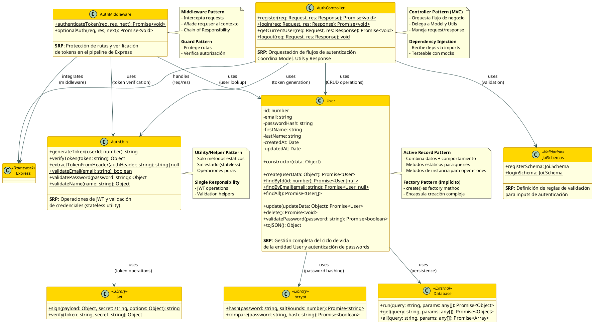

# C4 Level 4 - Code Diagram: Authentication System

**Sistema**: Expense Tracker
**Componente**: Authentication System
**Fecha**: 2025-11-06
**Versión**: 1.0

---

## 📋 Índice

- [Descripción General](#descripción-general)
- [Diagrama de Clases UML](#diagrama-de-clases-uml)
- [Componentes del Sistema](#componentes-del-sistema)
- [Patrones de Diseño](#patrones-de-diseño)
- [Flujo de Autenticación](#flujo-de-autenticación)
- [Principios SOLID](#principios-solid)
- [Responsabilidades (SRP)](#responsabilidades-srp)
- [Mejores Prácticas Implementadas](#mejores-prácticas-implementadas)

---

## Descripción General

El **Authentication System** es el componente crítico responsable de la seguridad del sistema, gestionando:

- **Registro de usuarios** con validación de datos
- **Autenticación** mediante credenciales (email/password)
- **Generación y validación de JWT tokens**
- **Protección de rutas** mediante middleware
- **Hashing seguro de contraseñas** con bcrypt

### Componentes Principales

| Componente | Tipo | Responsabilidad | LOC |
|------------|------|-----------------|-----|
| **User** | Model | Persistencia y lógica de negocio de usuarios | 93 |
| **AuthUtils** | Utility Class | Operaciones JWT y validación | 55 |
| **AuthMiddleware** | Middleware | Protección de rutas y verificación de tokens | 51 |
| **AuthController** | Controller | Orquestación de flujos de autenticación | 108 |

### Tecnologías Utilizadas

- **bcryptjs 2.4.3**: Hash de passwords con salt rounds = 10
- **jsonwebtoken 9.0.2**: Generación y verificación de JWT
- **Joi 17.11.0**: Validación de esquemas
- **Express middleware**: Integración con pipeline de requests

---

## Diagrama de Clases UML



---

## Componentes del Sistema

### 1. User Model (Active Record Pattern)

**Archivo**: `/server/src/models/User.js`

**Responsabilidad**: Gestión completa del ciclo de vida de la entidad User, incluyendo persistencia, validación de passwords y transformación de datos.

#### Propiedades

| Propiedad | Tipo | Descripción |
|-----------|------|-------------|
| `id` | number | Identificador único (auto-increment) |
| `email` | string | Email único del usuario |
| `passwordHash` | string | Hash bcrypt del password (nunca se expone) |
| `firstName` | string | Nombre del usuario |
| `lastName` | string | Apellido del usuario |
| `createdAt` | Date | Timestamp de creación |
| `updatedAt` | Date | Timestamp de última actualización |

#### Métodos Estáticos (Factory/Finder Pattern)

```javascript
// Factory Method - Creación segura
static async create(userData) {
  const { email, password, firstName, lastName } = userData;

  // Hash password con 10 salt rounds
  const saltRounds = 10;
  const passwordHash = await bcrypt.hash(password, saltRounds);

  // Insert con manejo de UNIQUE constraint
  try {
    const result = await database.run(query, [email, passwordHash, firstName, lastName]);
    return await User.findById(result.id);
  } catch (error) {
    if (error.message.includes('UNIQUE constraint failed')) {
      throw new Error('Email already exists');
    }
    throw error;
  }
}

// Finder Methods
static async findById(id): Promise<User|null>
static async findByEmail(email): Promise<User|null>
static async findAll(): Promise<User[]>
```

#### Métodos de Instancia

```javascript
// Actualización segura (solo firstName, lastName)
async update(updateData): Promise<User>

// Eliminación en cascada (handled by DB foreign keys)
async delete(): Promise<void>

// Validación de password con bcrypt.compare
async validatePassword(password): Promise<boolean>

// Serialización segura (excluye passwordHash)
toJSON(): Object
```

#### Ejemplo de Uso

```javascript
// Registro de nuevo usuario
const user = await User.create({
  email: 'user@example.com',
  password: 'SecurePass123',
  firstName: 'John',
  lastName: 'Doe'
});

// Autenticación
const user = await User.findByEmail('user@example.com');
const isValid = await user.validatePassword('SecurePass123');

// Serialización segura para respuesta
res.json({ user: user.toJSON() }); // No incluye passwordHash
```

---

### 2. AuthUtils (Utility/Helper Pattern)

**Archivo**: `/server/src/utils/auth.js`

**Responsabilidad**: Operaciones stateless de JWT y validación de credenciales. No mantiene estado, todas las operaciones son puras.

#### Métodos de JWT

```javascript
// Generación de token JWT
static generateToken(userId: number): string {
  const payload = { userId };
  const options = {
    expiresIn: process.env.JWT_EXPIRES_IN || '7d'
  };

  return jwt.sign(payload, process.env.JWT_SECRET, options);
}

// Verificación de token
static verifyToken(token: string): Object {
  try {
    return jwt.verify(token, process.env.JWT_SECRET);
    // Retorna: { userId: number, iat: number, exp: number }
  } catch (error) {
    throw new Error('Invalid token');
  }
}

// Extracción de token del header Authorization
static extractTokenFromHeader(authHeader: string): string|null {
  if (!authHeader || !authHeader.startsWith('Bearer ')) {
    return null;
  }
  return authHeader.substring(7); // Remueve "Bearer "
}
```

#### Métodos de Validación

```javascript
// Validación de email (regex simple)
static validateEmail(email: string): boolean {
  const emailRegex = /^[^\s@]+@[^\s@]+\.[^\s@]+$/;
  return emailRegex.test(email);
}

// Validación de password (min 6 caracteres)
static validatePassword(password: string): { valid: boolean, message?: string } {
  if (password.length < 6) {
    return { valid: false, message: 'Password must be at least 6 characters long' };
  }
  return { valid: true };
}

// Validación de nombre (no vacío, max 100 chars)
static validateName(name: string): { valid: boolean, message?: string } {
  if (!name || name.trim().length === 0) {
    return { valid: false, message: 'Name cannot be empty' };
  }
  if (name.trim().length > 100) {
    return { valid: false, message: 'Name cannot exceed 100 characters' };
  }
  return { valid: true };
}
```

#### Características Clave

- **Stateless**: No mantiene estado entre llamadas
- **Pure Functions**: Mismos inputs → mismos outputs
- **Single Responsibility**: Solo JWT y validación
- **Testeable**: Fácil de mockear y probar

---

### 3. AuthController (Controller Pattern - MVC)

**Archivo**: `/server/src/controllers/authController.js`

**Responsabilidad**: Orquestación de flujos de autenticación. Coordina Model, Utils, Validation y Response.

#### Métodos del Controller

##### 1. Register (POST /api/auth/register)

```javascript
static async register(req, res) {
  try {
    // 1. Validación con Joi
    const { error, value } = registerSchema.validate(req.body);
    if (error) {
      return res.status(400).json({
        error: 'Validation error',
        details: error.details.map(d => d.message)
      });
    }

    const { email, password, firstName, lastName } = value;

    // 2. Check email único
    const existingUser = await User.findByEmail(email);
    if (existingUser) {
      return res.status(400).json({ error: 'Email already registered' });
    }

    // 3. Crear usuario (hash de password automático en User.create)
    const user = await User.create({ email, password, firstName, lastName });

    // 4. Generar token JWT
    const token = AuthUtils.generateToken(user.id);

    // 5. Response con user y token
    res.status(201).json({
      message: 'User registered successfully',
      user: user.toJSON(), // Sin passwordHash
      token
    });
  } catch (error) {
    console.error('Registration error:', error);
    res.status(500).json({ error: 'Internal server error' });
  }
}
```

**Validación Schema (Joi)**:

```javascript
const registerSchema = Joi.object({
  email: Joi.string().email().required(),
  password: Joi.string().min(6).required(),
  firstName: Joi.string().trim().min(1).max(100).required(),
  lastName: Joi.string().trim().min(1).max(100).required()
});
```

##### 2. Login (POST /api/auth/login)

```javascript
static async login(req, res) {
  try {
    // 1. Validación con Joi
    const { error, value } = loginSchema.validate(req.body);
    if (error) {
      return res.status(400).json({
        error: 'Validation error',
        details: error.details.map(d => d.message)
      });
    }

    const { email, password } = value;

    // 2. Buscar usuario por email
    const user = await User.findByEmail(email);
    if (!user) {
      return res.status(401).json({ error: 'Invalid credentials' });
    }

    // 3. Validar password con bcrypt
    const isValidPassword = await user.validatePassword(password);
    if (!isValidPassword) {
      return res.status(401).json({ error: 'Invalid credentials' });
    }

    // 4. Generar token JWT
    const token = AuthUtils.generateToken(user.id);

    // 5. Response con user y token
    res.json({
      message: 'Login successful',
      user: user.toJSON(),
      token
    });
  } catch (error) {
    console.error('Login error:', error);
    res.status(500).json({ error: 'Internal server error' });
  }
}
```

**Validación Schema (Joi)**:

```javascript
const loginSchema = Joi.object({
  email: Joi.string().email().required(),
  password: Joi.string().required()
});
```

##### 3. Get Current User (GET /api/auth/me)

```javascript
static async getCurrentUser(req, res) {
  try {
    // req.user ya está disponible por authenticateToken middleware
    res.json({
      user: req.user.toJSON()
    });
  } catch (error) {
    console.error('Get current user error:', error);
    res.status(500).json({ error: 'Internal server error' });
  }
}
```

##### 4. Logout (POST /api/auth/logout)

```javascript
static async logout(req, res) {
  // Para JWT stateless, logout se maneja client-side removiendo token
  // En el futuro: blacklist de tokens o refresh tokens
  res.json({ message: 'Logged out successfully' });
}
```

---

### 4. AuthMiddleware (Middleware Pattern)

**Archivo**: `/server/src/middleware/auth.js`

**Responsabilidad**: Protección de rutas mediante verificación de JWT tokens. Implementa Chain of Responsibility.

#### Middleware Functions

##### 1. authenticateToken (Required Auth)

```javascript
const authenticateToken = async (req, res, next) => {
  try {
    // 1. Extraer token del header Authorization
    const authHeader = req.headers.authorization;
    const token = AuthUtils.extractTokenFromHeader(authHeader);

    if (!token) {
      return res.status(401).json({ error: 'Access token required' });
    }

    // 2. Verificar token JWT
    const decoded = AuthUtils.verifyToken(token);
    // decoded = { userId: number, iat: number, exp: number }

    // 3. Buscar usuario en DB
    const user = await User.findById(decoded.userId);

    if (!user) {
      return res.status(401).json({ error: 'User not found' });
    }

    // 4. Añadir usuario al request object
    req.user = user;

    // 5. Continuar al siguiente middleware/controller
    next();
  } catch (error) {
    return res.status(401).json({ error: 'Invalid token' });
  }
};
```

**Uso en rutas**:

```javascript
// Ruta protegida
router.get('/expenses', authenticateToken, ExpenseController.getExpenses);

// Ruta pública
router.post('/auth/login', AuthController.login);
```

##### 2. optionalAuth (Optional Auth)

```javascript
const optionalAuth = async (req, res, next) => {
  try {
    const authHeader = req.headers.authorization;
    const token = AuthUtils.extractTokenFromHeader(authHeader);

    if (token) {
      const decoded = AuthUtils.verifyToken(token);
      const user = await User.findById(decoded.userId);
      if (user) {
        req.user = user; // Añade user si token es válido
      }
    }

    // Siempre continúa, incluso sin token
    next();
  } catch (error) {
    // Ignora errores de token, continúa sin autenticación
    next();
  }
};
```

**Uso en rutas**:

```javascript
// Ruta con autenticación opcional
router.get('/categories', optionalAuth, CategoryController.getCategories);
// Si req.user existe, retorna categorías del usuario + default
// Si req.user no existe, retorna solo categorías default
```

---

## Patrones de Diseño

### 1. Active Record Pattern

**Implementado en**: `User` Model

**Descripción**: Combina datos y comportamiento de persistencia en una sola clase.

**Ventajas**:
- ✅ Simplicidad: Una clase = una tabla
- ✅ Intuitividad: `user.save()`, `User.find()`
- ✅ Menos código boilerplate

**Trade-offs**:
- ⚠️ Acoplamiento: Model conoce detalles de persistencia
- ⚠️ Testing: Requiere DB o mocks complejos

**Ejemplo**:

```javascript
// Factory method (create)
const user = await User.create({ email, password, firstName, lastName });

// Finder methods
const user = await User.findById(1);
const users = await User.findAll();

// Instance methods
await user.update({ firstName: 'Jane' });
await user.delete();
```

---

### 2. Factory Pattern

**Implementado en**: `User.create()` método estático

**Descripción**: Encapsula la creación compleja de objetos.

**Ventajas**:
- ✅ Encapsulación: Hash de password oculto
- ✅ Validación centralizada
- ✅ Manejo de errores (UNIQUE constraint)

**Ejemplo**:

```javascript
// Sin Factory (inseguro)
const passwordHash = await bcrypt.hash(password, 10);
await database.run('INSERT INTO users ...', [email, passwordHash, ...]);

// Con Factory (seguro)
const user = await User.create({ email, password, firstName, lastName });
// Hash, validación y error handling automáticos
```

---

### 3. Middleware Pattern (Chain of Responsibility)

**Implementado en**: `AuthMiddleware`

**Descripción**: Intercepta requests para añadir comportamiento (autenticación).

**Ventajas**:
- ✅ Reusabilidad: Un middleware protege N rutas
- ✅ Separación de concerns: Auth separado de lógica de negocio
- ✅ Composición: `[cors, auth, validate, controller]`

**Ejemplo**:

```javascript
// Middleware chain
router.post(
  '/expenses',
  authenticateToken,     // 1. Verifica JWT
  validateExpense,       // 2. Valida body
  ExpenseController.create // 3. Ejecuta lógica
);
```

**Flujo de ejecución**:

```
Request → authenticateToken → req.user añadido → next() → controller
          ↓ (si falla)
          401 Unauthorized
```

---

### 4. Strategy Pattern (Validación)

**Implementado en**: `Joi` schemas

**Descripción**: Define familia de algoritmos de validación intercambiables.

**Ventajas**:
- ✅ Declarativo: Schema define reglas
- ✅ Reusable: Mismo schema en múltiples endpoints
- ✅ Extensible: Fácil añadir nuevas reglas

**Ejemplo**:

```javascript
// Strategy: registerSchema
const registerSchema = Joi.object({
  email: Joi.string().email().required(),
  password: Joi.string().min(6).required(),
  firstName: Joi.string().trim().min(1).max(100).required(),
  lastName: Joi.string().trim().min(1).max(100).required()
});

// Uso en controller
const { error, value } = registerSchema.validate(req.body);
if (error) {
  return res.status(400).json({
    error: 'Validation error',
    details: error.details.map(d => d.message)
  });
}
```

---

### 5. Utility/Helper Pattern

**Implementado en**: `AuthUtils` class

**Descripción**: Clase con solo métodos estáticos (sin estado).

**Ventajas**:
- ✅ Stateless: Sin efectos secundarios
- ✅ Testeable: Pure functions
- ✅ Reutilizable: Desde cualquier parte del código

**Ejemplo**:

```javascript
// Utility class (stateless)
class AuthUtils {
  static generateToken(userId) { ... }
  static verifyToken(token) { ... }
  static extractTokenFromHeader(authHeader) { ... }
}

// Uso
const token = AuthUtils.generateToken(user.id);
const decoded = AuthUtils.verifyToken(token);
```

---

### 6. Dependency Injection Pattern

**Implementado en**: Controllers y Middleware

**Descripción**: Dependencias inyectadas vía imports (no hardcoded).

**Ventajas**:
- ✅ Testeable: Fácil mockear dependencias
- ✅ Flexible: Cambiar implementación sin tocar código
- ✅ SOLID: Inversión de dependencias

**Ejemplo**:

```javascript
// Dependencies inyectadas vía imports
const User = require('../models/User'); // Mockeable en tests
const AuthUtils = require('../utils/auth'); // Mockeable en tests

class AuthController {
  static async login(req, res) {
    const user = await User.findByEmail(email); // Usa dependency
    const token = AuthUtils.generateToken(user.id); // Usa dependency
  }
}

// En tests:
jest.mock('../models/User');
jest.mock('../utils/auth');
```

---

## Flujo de Autenticación

### 1. Flujo de Registro

```
┌──────┐       ┌────────────┐       ┌──────┐       ┌─────────┐       ┌──────────┐
│Client│       │AuthController│      │Joi   │       │User Model│      │Database│
└──┬───┘       └─────┬──────┘       └──┬───┘       └────┬────┘       └────┬─────┘
   │                  │                 │                │                  │
   │ POST /auth/register              │                │                  │
   │ {email, password, ...}            │                │                  │
   ├─────────────────>│                │                │                  │
   │                  │                │                │                  │
   │                  │ validate(body) │                │                  │
   │                  ├───────────────>│                │                  │
   │                  │<───────────────┤                │                  │
   │                  │  {error, value}│                │                  │
   │                  │                │                │                  │
   │                  │ findByEmail(email)              │                  │
   │                  ├─────────────────────────────────>│                  │
   │                  │                │                │ SELECT * FROM users│
   │                  │                │                ├─────────────────>│
   │                  │                │                │<─────────────────┤
   │                  │<─────────────────────────────────┤ null (no existe) │
   │                  │                │                │                  │
   │                  │ create(userData)                │                  │
   │                  ├─────────────────────────────────>│                  │
   │                  │                │                │ bcrypt.hash(pwd) │
   │                  │                │                │                  │
   │                  │                │                │ INSERT INTO users│
   │                  │                │                ├─────────────────>│
   │                  │                │                │<─────────────────┤
   │                  │<─────────────────────────────────┤ {id: 1, ...}     │
   │                  │   User instance                │                  │
   │                  │                │                │                  │
   │                  │ AuthUtils.generateToken(user.id)│                  │
   │                  │                │                │                  │
   │<─────────────────┤                │                │                  │
   │  201 Created     │                │                │                  │
   │  {user, token}   │                │                │                  │
   │                  │                │                │                  │
   │ localStorage.setItem('token', token)               │                  │
   │                  │                │                │                  │
```

**Pasos**:
1. **Validación**: Joi valida estructura y tipos
2. **Check único**: Verifica que email no existe
3. **Hash password**: bcrypt con 10 salt rounds
4. **Persistencia**: INSERT en DB
5. **Token JWT**: Genera token con 7 días de expiración
6. **Response**: Retorna user (sin passwordHash) + token

---

### 2. Flujo de Login

```
┌──────┐       ┌────────────┐       ┌──────┐       ┌─────────┐
│Client│       │AuthController│      │User Model│   │AuthUtils│
└──┬───┘       └─────┬──────┘       └────┬────┘    └────┬────┘
   │                  │                   │              │
   │ POST /auth/login │                   │              │
   │ {email, password}│                   │              │
   ├─────────────────>│                   │              │
   │                  │                   │              │
   │                  │ findByEmail(email)│              │
   │                  ├──────────────────>│              │
   │                  │<──────────────────┤              │
   │                  │   User instance   │              │
   │                  │                   │              │
   │                  │ user.validatePassword(password)  │
   │                  ├──────────────────>│              │
   │                  │  bcrypt.compare() │              │
   │                  │<──────────────────┤              │
   │                  │     true/false    │              │
   │                  │                   │              │
   │                  │ generateToken(user.id)           │
   │                  ├─────────────────────────────────>│
   │                  │<─────────────────────────────────┤
   │                  │          JWT token               │
   │<─────────────────┤                   │              │
   │  200 OK          │                   │              │
   │  {user, token}   │                   │              │
   │                  │                   │              │
```

**Pasos**:
1. **Buscar usuario**: `User.findByEmail()`
2. **Validar password**: `user.validatePassword()` con bcrypt.compare
3. **Generar token**: `AuthUtils.generateToken(user.id)`
4. **Response**: Retorna user + token

---

### 3. Flujo de Request Autenticado

```
┌──────┐       ┌───────────┐       ┌─────────┐       ┌──────────┐       ┌───────────┐
│Client│       │AuthMiddleware│    │AuthUtils│       │User Model│       │Controller │
└──┬───┘       └─────┬─────┘       └────┬────┘       └────┬─────┘       └─────┬─────┘
   │                  │                  │                 │                    │
   │ GET /api/expenses│                  │                 │                    │
   │ Authorization: Bearer <token>       │                 │                    │
   ├─────────────────>│                  │                 │                    │
   │                  │                  │                 │                    │
   │                  │ extractTokenFromHeader()           │                    │
   │                  ├─────────────────>│                 │                    │
   │                  │<─────────────────┤                 │                    │
   │                  │      token       │                 │                    │
   │                  │                  │                 │                    │
   │                  │ verifyToken(token)                 │                    │
   │                  ├─────────────────>│                 │                    │
   │                  │<─────────────────┤                 │                    │
   │                  │  {userId: 1, ...}│                 │                    │
   │                  │                  │                 │                    │
   │                  │ User.findById(decoded.userId)      │                    │
   │                  ├────────────────────────────────────>│                    │
   │                  │<────────────────────────────────────┤                    │
   │                  │           User instance            │                    │
   │                  │                  │                 │                    │
   │                  │ req.user = user  │                 │                    │
   │                  │ next()           │                 │                    │
   │                  ├────────────────────────────────────────────────────────>│
   │                  │                  │                 │                    │
   │<─────────────────────────────────────────────────────────────────────────┤
   │  200 OK          │                  │                 │                    │
   │  {expenses: [...]}                  │                 │                    │
   │                  │                  │                 │                    │
```

**Pasos**:
1. **Extraer token**: Del header `Authorization: Bearer <token>`
2. **Verificar token**: `jwt.verify()` valida firma y expiración
3. **Buscar usuario**: `User.findById(decoded.userId)`
4. **Contexto**: Añade `req.user` para controllers
5. **Next**: Continúa al controller

---

## Principios SOLID

### 1. Single Responsibility Principle (SRP) ✅

Cada clase tiene UNA responsabilidad clara:

| Clase | Responsabilidad Única |
|-------|----------------------|
| `User` | Persistencia y lógica de negocio de usuarios |
| `AuthUtils` | Operaciones JWT y validación de credenciales |
| `AuthController` | Orquestación de flujos de autenticación |
| `AuthMiddleware` | Protección de rutas y verificación de tokens |

**Ejemplo de SRP violado** (anti-pattern):

```javascript
// ❌ Controller con lógica de JWT y validación
class AuthController {
  static async login(req, res) {
    // Validación inline (debería ser Joi)
    if (!email.includes('@')) return res.status(400).json({ error: 'Invalid email' });

    // JWT inline (debería ser AuthUtils)
    const token = jwt.sign({ userId: user.id }, process.env.JWT_SECRET, { expiresIn: '7d' });

    // Hash inline (debería ser User.create)
    const passwordHash = await bcrypt.hash(password, 10);
  }
}
```

**Ejemplo de SRP correcto**:

```javascript
// ✅ Cada clase con su responsabilidad
const { error, value } = registerSchema.validate(req.body); // Joi
const user = await User.create(value); // User.create hace hash
const token = AuthUtils.generateToken(user.id); // AuthUtils JWT
```

---

### 2. Open/Closed Principle (OCP) ✅

**Abierto para extensión, cerrado para modificación.**

**Ejemplo**: Añadir nuevo método de autenticación sin modificar código existente:

```javascript
// Actual: JWT authentication
class JWTAuthUtils extends BaseAuthUtils {
  static generateToken(userId) { ... }
  static verifyToken(token) { ... }
}

// Futura extensión: OAuth authentication
class OAuthAuthUtils extends BaseAuthUtils {
  static generateToken(userId) {
    // OAuth token generation
  }
  static verifyToken(token) {
    // OAuth token verification
  }
}

// Controller no cambia
const token = AuthUtils.generateToken(user.id); // Polimorfismo
```

---

### 3. Liskov Substitution Principle (LSP) ✅

**Subclases deben ser sustituibles por su clase base.**

**Ejemplo**: User model podría extender BaseModel:

```javascript
class BaseModel {
  constructor(data) { ... }
  toJSON() { ... }
  async save() { ... }
  async delete() { ... }
}

class User extends BaseModel {
  // Añade métodos específicos sin romper contrato
  async validatePassword(password) { ... }
}

class Expense extends BaseModel {
  // Añade métodos específicos sin romper contrato
  belongsToUser(userId) { ... }
}

// Cualquier BaseModel es intercambiable
function saveModel(model: BaseModel) {
  await model.save(); // Funciona para User, Expense, etc.
}
```

---

### 4. Interface Segregation Principle (ISP) ✅

**Clientes no deben depender de interfaces que no usan.**

**Ejemplo**: AuthMiddleware tiene dos interfaces:

```javascript
// Interface completa: IAuthMiddleware
interface IAuthMiddleware {
  authenticateToken(req, res, next): void
  optionalAuth(req, res, next): void
}

// Rutas protegidas solo usan authenticateToken
router.get('/expenses', authenticateToken, ...);

// Rutas opcionales solo usan optionalAuth
router.get('/categories', optionalAuth, ...);

// No se fuerza a usar toda la interface
```

---

### 5. Dependency Inversion Principle (DIP) ✅

**Depender de abstracciones, no de concreciones.**

**Ejemplo**: Controllers dependen de interfaces, no de implementaciones concretas:

```javascript
// ✅ Correcto: Dependency Injection
class AuthController {
  static async login(req, res) {
    const user = await User.findByEmail(email); // User es abstracción
    const token = AuthUtils.generateToken(user.id); // AuthUtils es abstracción
  }
}

// En tests, se mockean las abstracciones
jest.mock('../models/User', () => ({
  findByEmail: jest.fn().mockResolvedValue(mockUser)
}));

jest.mock('../utils/auth', () => ({
  generateToken: jest.fn().mockReturnValue('mock-token')
}));
```

---

## Responsabilidades (SRP)

### User Model

**Responsabilidad**: Gestión del ciclo de vida de usuarios

**Incluye**:
- ✅ CRUD operations (Create, Read, Update, Delete)
- ✅ Password hashing con bcrypt
- ✅ Password validation con bcrypt.compare
- ✅ Serialización segura (toJSON sin passwordHash)
- ✅ Manejo de errores (UNIQUE constraint)

**NO Incluye**:
- ❌ JWT generation (responsabilidad de AuthUtils)
- ❌ Request handling (responsabilidad de Controller)
- ❌ Validación de schemas (responsabilidad de Joi)

---

### AuthUtils

**Responsabilidad**: Operaciones JWT y validación de credenciales

**Incluye**:
- ✅ Generación de JWT tokens
- ✅ Verificación de JWT tokens
- ✅ Extracción de tokens de headers
- ✅ Validación de email, password, nombre

**NO Incluye**:
- ❌ Password hashing (responsabilidad de User)
- ❌ Request handling (responsabilidad de Controller)
- ❌ Database operations (responsabilidad de User)

---

### AuthController

**Responsabilidad**: Orquestación de flujos de autenticación

**Incluye**:
- ✅ Validación de request body con Joi
- ✅ Coordinación de User model y AuthUtils
- ✅ Manejo de errores y responses HTTP
- ✅ Lógica de negocio (check email único, etc.)

**NO Incluye**:
- ❌ Password hashing directo (delega a User)
- ❌ JWT generation directo (delega a AuthUtils)
- ❌ Database queries directas (delega a User)

---

### AuthMiddleware

**Responsabilidad**: Protección de rutas y verificación de tokens

**Incluye**:
- ✅ Extracción de tokens de headers
- ✅ Verificación de tokens JWT
- ✅ Lookup de usuario en DB
- ✅ Añadir req.user al contexto
- ✅ Manejo de errores de autenticación

**NO Incluye**:
- ❌ Lógica de negocio (responsabilidad de Controller)
- ❌ JWT generation (responsabilidad de AuthUtils)
- ❌ Password validation (responsabilidad de User)

---

## Mejores Prácticas Implementadas

### 1. Security Best Practices ✅

```javascript
// ✅ Password hashing con salt rounds
const saltRounds = 10;
const passwordHash = await bcrypt.hash(password, saltRounds);

// ✅ JWT con expiración
const options = { expiresIn: '7d' };

// ✅ Serialización segura (sin passwordHash)
toJSON() {
  return {
    id: this.id,
    email: this.email,
    firstName: this.firstName,
    lastName: this.lastName,
    createdAt: this.createdAt,
    updatedAt: this.updatedAt
    // passwordHash NO se incluye
  };
}

// ✅ Mensajes de error genéricos
return res.status(401).json({ error: 'Invalid credentials' });
// No revela si email existe o password es incorrecto
```

---

### 2. Error Handling ✅

```javascript
// ✅ Try-catch en async functions
static async login(req, res) {
  try {
    // ...
  } catch (error) {
    console.error('Login error:', error);
    res.status(500).json({ error: 'Internal server error' });
  }
}

// ✅ Manejo de errores específicos
try {
  const result = await database.run(query, params);
} catch (error) {
  if (error.message.includes('UNIQUE constraint failed')) {
    throw new Error('Email already exists');
  }
  throw error;
}

// ✅ Validación de entrada
const { error, value } = registerSchema.validate(req.body);
if (error) {
  return res.status(400).json({
    error: 'Validation error',
    details: error.details.map(d => d.message)
  });
}
```

---

### 3. Async/Await Consistency ✅

```javascript
// ✅ Todas las operaciones async usan async/await
static async create(userData) {
  const passwordHash = await bcrypt.hash(password, saltRounds);
  const result = await database.run(query, params);
  return await User.findById(result.id);
}

// ❌ Anti-pattern: Mix de promises y async/await
static async create(userData) {
  return bcrypt.hash(password, saltRounds).then(hash => {
    return database.run(query, params).then(result => {
      return User.findById(result.id);
    });
  });
}
```

---

### 4. Immutability ✅

```javascript
// ✅ No se muta el objeto req.user directamente
const user = await User.findById(decoded.userId);
req.user = user; // Asignación, no mutación

// ✅ toJSON retorna nuevo objeto
toJSON() {
  return {
    id: this.id,
    email: this.email,
    // ... nuevo objeto, no this
  };
}
```

---

### 5. Environment Variables ✅

```javascript
// ✅ Secrets en .env
const JWT_SECRET = process.env.JWT_SECRET;
const JWT_EXPIRES_IN = process.env.JWT_EXPIRES_IN || '7d';

// ❌ Anti-pattern: Hardcoded secrets
const JWT_SECRET = 'my-secret-key-123'; // NUNCA hacer esto
```

---

## Mejoras Futuras

### 1. Refresh Tokens

**Problema actual**: Tokens duran 7 días, no hay invalidación inmediata.

**Solución**:

```javascript
class AuthUtils {
  static generateTokenPair(userId) {
    const accessToken = jwt.sign({ userId }, SECRET, { expiresIn: '15m' });
    const refreshToken = jwt.sign({ userId }, REFRESH_SECRET, { expiresIn: '7d' });

    return { accessToken, refreshToken };
  }

  static async refreshAccessToken(refreshToken) {
    // Validar refresh token
    // Generar nuevo access token
    // Retornar nuevo par de tokens
  }
}
```

---

### 2. Token Blacklist

**Problema actual**: Logout no invalida token (stateless JWT).

**Solución**:

```javascript
// Redis para blacklist de tokens
class TokenBlacklist {
  static async add(token, expiresIn) {
    await redis.setex(`blacklist:${token}`, expiresIn, '1');
  }

  static async isBlacklisted(token) {
    return await redis.exists(`blacklist:${token}`);
  }
}

// En middleware
const decoded = AuthUtils.verifyToken(token);
if (await TokenBlacklist.isBlacklisted(token)) {
  return res.status(401).json({ error: 'Token revoked' });
}
```

---

### 3. Rate Limiting

**Problema actual**: Sin protección contra brute force.

**Solución**:

```javascript
const rateLimit = require('express-rate-limit');

const loginLimiter = rateLimit({
  windowMs: 15 * 60 * 1000, // 15 minutos
  max: 5, // 5 intentos
  message: 'Too many login attempts, please try again later'
});

router.post('/auth/login', loginLimiter, AuthController.login);
```

---

### 4. Email Verification

**Problema actual**: Emails no verificados.

**Solución**:

```javascript
class User {
  // Nueva columna: email_verified (boolean)

  static async sendVerificationEmail(user) {
    const verificationToken = crypto.randomBytes(32).toString('hex');
    await redis.setex(`verify:${verificationToken}`, 3600, user.id);

    await emailService.send({
      to: user.email,
      subject: 'Verify your email',
      html: `<a href="${BASE_URL}/verify?token=${verificationToken}">Verify</a>`
    });
  }

  static async verifyEmail(verificationToken) {
    const userId = await redis.get(`verify:${verificationToken}`);
    if (!userId) throw new Error('Invalid or expired token');

    await database.run('UPDATE users SET email_verified = 1 WHERE id = ?', [userId]);
  }
}
```

---

### 5. Two-Factor Authentication (2FA)

**Problema actual**: Solo password como factor.

**Solución**:

```javascript
const speakeasy = require('speakeasy');

class User {
  // Nuevas columnas: two_factor_secret, two_factor_enabled

  async enable2FA() {
    const secret = speakeasy.generateSecret({ name: 'ExpenseTracker' });
    this.two_factor_secret = secret.base32;
    await this.save();

    return {
      secret: secret.base32,
      qrCode: secret.otpauth_url
    };
  }

  async verify2FACode(code) {
    return speakeasy.totp.verify({
      secret: this.two_factor_secret,
      encoding: 'base32',
      token: code
    });
  }
}
```

---

## Testing Strategy

### 1. Unit Tests

**User Model**:

```javascript
describe('User Model', () => {
  describe('create', () => {
    it('should hash password with bcrypt', async () => {
      const user = await User.create({
        email: 'test@example.com',
        password: 'password123',
        firstName: 'John',
        lastName: 'Doe'
      });

      expect(user.passwordHash).not.toBe('password123');
      expect(user.passwordHash).toMatch(/^\$2[aby]\$10\$/);
    });

    it('should throw error for duplicate email', async () => {
      await User.create({ email: 'test@example.com', ... });

      await expect(
        User.create({ email: 'test@example.com', ... })
      ).rejects.toThrow('Email already exists');
    });
  });

  describe('validatePassword', () => {
    it('should return true for correct password', async () => {
      const user = await User.create({ password: 'password123', ... });
      const isValid = await user.validatePassword('password123');
      expect(isValid).toBe(true);
    });

    it('should return false for incorrect password', async () => {
      const user = await User.create({ password: 'password123', ... });
      const isValid = await user.validatePassword('wrongpassword');
      expect(isValid).toBe(false);
    });
  });
});
```

**AuthUtils**:

```javascript
describe('AuthUtils', () => {
  describe('generateToken', () => {
    it('should generate valid JWT token', () => {
      const token = AuthUtils.generateToken(1);
      expect(token).toBeTruthy();
      expect(token.split('.')).toHaveLength(3);
    });
  });

  describe('verifyToken', () => {
    it('should verify valid token', () => {
      const token = AuthUtils.generateToken(1);
      const decoded = AuthUtils.verifyToken(token);
      expect(decoded.userId).toBe(1);
    });

    it('should throw error for invalid token', () => {
      expect(() => {
        AuthUtils.verifyToken('invalid-token');
      }).toThrow('Invalid token');
    });
  });
});
```

---

### 2. Integration Tests

**AuthController**:

```javascript
describe('POST /api/auth/register', () => {
  it('should register new user and return token', async () => {
    const response = await request(app)
      .post('/api/auth/register')
      .send({
        email: 'newuser@example.com',
        password: 'password123',
        firstName: 'John',
        lastName: 'Doe'
      });

    expect(response.status).toBe(201);
    expect(response.body).toHaveProperty('token');
    expect(response.body.user.email).toBe('newuser@example.com');
    expect(response.body.user).not.toHaveProperty('passwordHash');
  });

  it('should return 400 for duplicate email', async () => {
    await User.create({ email: 'existing@example.com', ... });

    const response = await request(app)
      .post('/api/auth/register')
      .send({ email: 'existing@example.com', ... });

    expect(response.status).toBe(400);
    expect(response.body.error).toBe('Email already registered');
  });
});
```

---

### 3. E2E Tests

**Authentication Flow**:

```javascript
describe('Authentication E2E', () => {
  it('should complete full auth flow', async () => {
    // 1. Register
    const registerRes = await request(app)
      .post('/api/auth/register')
      .send({ email: 'e2e@example.com', password: 'password123', ... });

    const token = registerRes.body.token;

    // 2. Access protected route
    const expensesRes = await request(app)
      .get('/api/expenses')
      .set('Authorization', `Bearer ${token}`);

    expect(expensesRes.status).toBe(200);

    // 3. Logout
    const logoutRes = await request(app)
      .post('/api/auth/logout')
      .set('Authorization', `Bearer ${token}`);

    expect(logoutRes.status).toBe(200);
  });
});
```

---

## Referencias

### Documentación Externa

- [bcrypt.js Documentation](https://github.com/dcodeIO/bcrypt.js)
- [jsonwebtoken Documentation](https://github.com/auth0/node-jsonwebtoken)
- [Joi Validation Documentation](https://joi.dev/api/)
- [Express Middleware Guide](https://expressjs.com/en/guide/using-middleware.html)

### ADRs Relacionados

- [ADR-004: JWT Stateless Authentication](../adr/ADR-004-jwt-stateless-authentication.md)
- [ADR-006: MVC Architecture Backend](../adr/ADR-006-mvc-architecture-backend.md)
- [ADR-009: Express Backend Framework](../adr/ADR-009-express-backend-framework.md)

### Diagramas C4 Relacionados

- [C4 Level 2: Container Diagram](./02-container.md)
- [C4 Level 3: API Application Components](./03-components/02-api-application-components.md)

---

**Última actualización**: 2025-11-06
**Autor**: Análisis automatizado de código
**Estado**: Implementado en Fase 1
