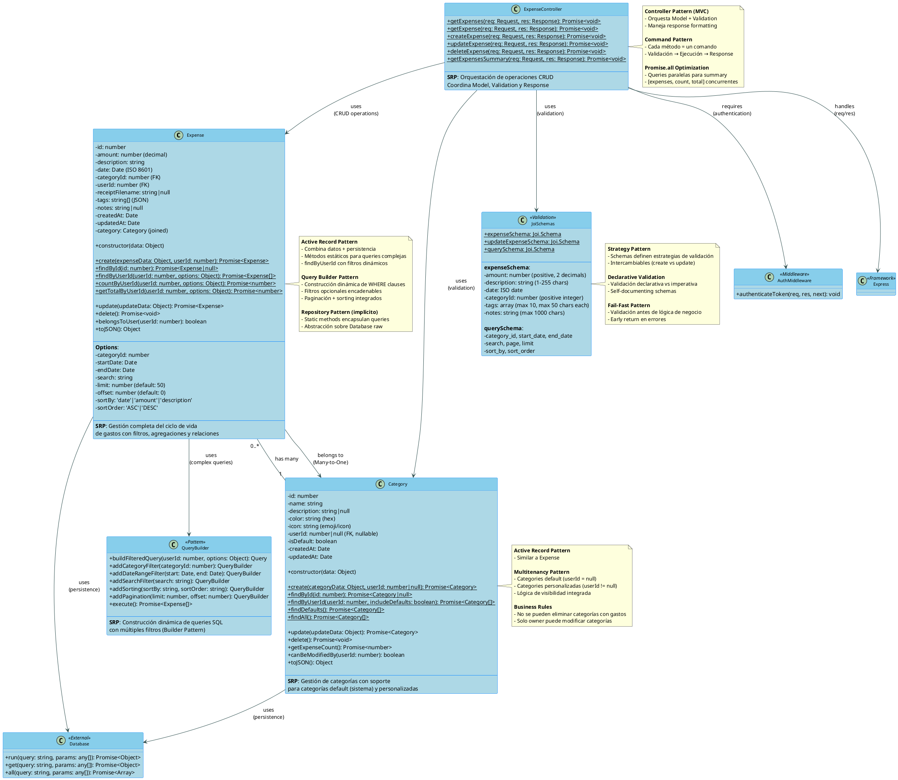

# C4 Level 4 - Code Diagram: Expense Management System

**Sistema**: Expense Tracker
**Componente**: Expense Management System
**Fecha**: 2025-11-06
**Versión**: 1.0

---

## 📋 Índice

- [Descripción General](#descripción-general)
- [Diagrama de Clases UML](#diagrama-de-clases-uml)
- [Componentes del Sistema](#componentes-del-sistema)
- [Patrones de Diseño](#patrones-de-diseño)
- [Flujos de Operaciones](#flujos-de-operaciones)
- [Principios SOLID](#principios-solid)
- [Responsabilidades (SRP)](#responsabilidades-srp)
- [Mejores Prácticas Implementadas](#mejores-prácticas-implementadas)

---

## Descripción General

El **Expense Management System** es el core del negocio, responsable de:

- **Gestión de gastos** (crear, leer, actualizar, eliminar)
- **Categorización** de gastos con categorías default y personalizadas
- **Filtrado y búsqueda** con paginación
- **Validación robusta** con Joi schemas
- **Agregaciones** (totales, promedios, conteos)
- **Relaciones** Expense → Category (Many-to-One)

### Componentes Principales

| Componente | Tipo | Responsabilidad | LOC |
|------------|------|-----------------|-----|
| **Expense** | Model | Persistencia y lógica de negocio de gastos | 227 |
| **Category** | Model | Persistencia y lógica de negocio de categorías | 132 |
| **ExpenseController** | Controller | Orquestación de operaciones CRUD de gastos | 247 |
| **Joi Schemas** | Validation | Validación de estructura de datos | 34 |

### Tecnologías Utilizadas

- **Joi 17.11.0**: Validación declarativa de schemas
- **SQLite 5.1.6**: Persistencia relacional
- **JSON**: Serialización de arrays (tags)
- **Express middleware**: Integración con pipeline

---

## Diagrama de Clases UML



---

## Componentes del Sistema

### 1. Expense Model (Active Record + Query Builder)

**Archivo**: `/server/src/models/Expense.js`

**Responsabilidad**: Gestión completa del ciclo de vida de gastos con filtrado avanzado, agregaciones y relaciones.

#### Propiedades

| Propiedad | Tipo | Descripción | Constraints |
|-----------|------|-------------|-------------|
| `id` | number | Identificador único | Auto-increment, PK |
| `amount` | number | Monto del gasto | Decimal(10,2), > 0 |
| `description` | string | Descripción del gasto | VARCHAR(255), NOT NULL |
| `date` | Date | Fecha del gasto | ISO 8601, NOT NULL |
| `categoryId` | number | ID de categoría | FK → categories.id |
| `userId` | number | ID de usuario dueño | FK → users.id |
| `receiptFilename` | string\|null | Nombre de archivo de recibo | VARCHAR(255), nullable |
| `tags` | string[] | Tags del gasto (JSON) | Array de strings, max 10 |
| `notes` | string\|null | Notas adicionales | TEXT, max 1000 chars |
| `createdAt` | Date | Timestamp de creación | CURRENT_TIMESTAMP |
| `updatedAt` | Date | Timestamp de actualización | CURRENT_TIMESTAMP |
| `category` | Category | Categoría relacionada | Joined data (eager loading) |

#### Constructor y Transformaciones

```javascript
constructor(data) {
  this.id = data.id;
  this.amount = parseFloat(data.amount); // String → Number
  this.description = data.description;
  this.date = data.date;
  this.categoryId = data.category_id;
  this.userId = data.user_id;
  this.receiptFilename = data.receipt_filename;
  this.tags = data.tags ? JSON.parse(data.tags) : []; // JSON → Array
  this.notes = data.notes;
  this.createdAt = data.created_at;
  this.updatedAt = data.updated_at;

  // Eager loading de Category (si existe JOIN)
  if (data.category_name) {
    this.category = {
      id: data.category_id,
      name: data.category_name,
      color: data.category_color,
      icon: data.category_icon
    };
  }
}
```

#### Métodos Estáticos (Factory/Finder Pattern)

##### 1. create() - Factory Method

```javascript
static async create(expenseData, userId) {
  const {
    amount, description, date, categoryId,
    receiptFilename, tags = [], notes
  } = expenseData;

  const query = `
    INSERT INTO expenses (amount, description, date, category_id, user_id, receipt_filename, tags, notes)
    VALUES (?, ?, ?, ?, ?, ?, ?, ?)
  `;

  const result = await database.run(query, [
    amount,
    description,
    date,
    categoryId,
    userId,
    receiptFilename,
    JSON.stringify(tags), // Array → JSON
    notes
  ]);

  return await Expense.findById(result.id);
}
```

##### 2. findById() - Finder con Eager Loading

```javascript
static async findById(id) {
  const query = `
    SELECT
      e.*,
      c.name as category_name,
      c.color as category_color,
      c.icon as category_icon
    FROM expenses e
    LEFT JOIN categories c ON e.category_id = c.id
    WHERE e.id = ?
  `;

  const expenseData = await database.get(query, [id]);
  return expenseData ? new Expense(expenseData) : null;
}
```

##### 3. findByUserId() - Query Builder Pattern

**Query dinámico con múltiples filtros opcionales**:

```javascript
static async findByUserId(userId, options = {}) {
  const {
    categoryId,      // Filtro por categoría
    startDate,       // Rango de fechas (inicio)
    endDate,         // Rango de fechas (fin)
    search,          // Búsqueda full-text
    limit = 50,      // Paginación (items por página)
    offset = 0,      // Paginación (offset)
    sortBy = 'date', // Ordenamiento
    sortOrder = 'DESC'
  } = options;

  // Base query con JOIN para eager loading
  let query = `
    SELECT
      e.*,
      c.name as category_name,
      c.color as category_color,
      c.icon as category_icon
    FROM expenses e
    LEFT JOIN categories c ON e.category_id = c.id
    WHERE e.user_id = ?
  `;

  const params = [userId];

  // ===== DYNAMIC FILTERS (Query Builder) =====

  // Filter: Category
  if (categoryId) {
    query += ' AND e.category_id = ?';
    params.push(categoryId);
  }

  // Filter: Date range (start)
  if (startDate) {
    query += ' AND e.date >= ?';
    params.push(startDate);
  }

  // Filter: Date range (end)
  if (endDate) {
    query += ' AND e.date <= ?';
    params.push(endDate);
  }

  // Filter: Full-text search (description OR notes)
  if (search) {
    query += ' AND (e.description LIKE ? OR e.notes LIKE ?)';
    params.push(`%${search}%`, `%${search}%`);
  }

  // ===== SORTING =====
  const validSortFields = ['date', 'amount', 'description', 'created_at'];
  const validSortOrders = ['ASC', 'DESC'];

  if (validSortFields.includes(sortBy) && validSortOrders.includes(sortOrder.toUpperCase())) {
    query += ` ORDER BY e.${sortBy} ${sortOrder.toUpperCase()}`;
  } else {
    query += ' ORDER BY e.date DESC'; // Default sorting
  }

  // ===== PAGINATION =====
  query += ' LIMIT ? OFFSET ?';
  params.push(limit, offset);

  const expensesData = await database.all(query, params);
  return expensesData.map(expenseData => new Expense(expenseData));
}
```

**Ejemplo de uso**:

```javascript
// Buscar gastos del mes actual en categoría "Food"
const expenses = await Expense.findByUserId(userId, {
  categoryId: 1,
  startDate: '2024-11-01',
  endDate: '2024-11-30',
  search: 'restaurant',
  limit: 20,
  offset: 0,
  sortBy: 'amount',
  sortOrder: 'DESC'
});
```

##### 4. Métodos de Agregación

```javascript
// Contar gastos con filtros
static async countByUserId(userId, options = {}) {
  let query = 'SELECT COUNT(*) as count FROM expenses WHERE user_id = ?';
  const params = [userId];

  // Aplicar mismos filtros que findByUserId
  if (options.categoryId) {
    query += ' AND category_id = ?';
    params.push(options.categoryId);
  }
  // ... otros filtros

  const result = await database.get(query, params);
  return result.count;
}

// Sumar total con filtros
static async getTotalByUserId(userId, options = {}) {
  let query = 'SELECT SUM(amount) as total FROM expenses WHERE user_id = ?';
  const params = [userId];

  // Aplicar mismos filtros
  // ...

  const result = await database.get(query, params);
  return parseFloat(result.total) || 0;
}
```

#### Métodos de Instancia

```javascript
// Actualización
async update(updateData) {
  const { amount, description, date, categoryId, receiptFilename, tags, notes } = updateData;

  const query = `
    UPDATE expenses
    SET amount = ?, description = ?, date = ?, category_id = ?,
        receipt_filename = ?, tags = ?, notes = ?, updated_at = CURRENT_TIMESTAMP
    WHERE id = ?
  `;

  await database.run(query, [
    amount, description, date, categoryId, receiptFilename,
    JSON.stringify(tags || []), notes, this.id
  ]);

  // Refrescar instancia
  const updated = await Expense.findById(this.id);
  Object.assign(this, updated);
  return this;
}

// Eliminación
async delete() {
  const query = 'DELETE FROM expenses WHERE id = ?';
  await database.run(query, [this.id]);
}

// Validación de ownership
belongsToUser(userId) {
  return this.userId === userId;
}

// Serialización
toJSON() {
  return {
    id: this.id,
    amount: this.amount,
    description: this.description,
    date: this.date,
    categoryId: this.categoryId,
    userId: this.userId,
    receiptFilename: this.receiptFilename,
    tags: this.tags,
    notes: this.notes,
    createdAt: this.createdAt,
    updatedAt: this.updatedAt,
    category: this.category // Include joined data
  };
}
```

---

### 2. Category Model (Active Record + Multitenancy)

**Archivo**: `/server/src/models/Category.js`

**Responsabilidad**: Gestión de categorías con soporte para categorías default (sistema) y personalizadas (usuario).

#### Propiedades

| Propiedad | Tipo | Descripción | Constraints |
|-----------|------|-------------|-------------|
| `id` | number | Identificador único | Auto-increment, PK |
| `name` | string | Nombre de categoría | VARCHAR(100), NOT NULL |
| `description` | string\|null | Descripción opcional | TEXT, nullable |
| `color` | string | Color (hex) | VARCHAR(7), default '#666666' |
| `icon` | string | Emoji o icono | VARCHAR(50), default '📦' |
| `userId` | number\|null | ID usuario (null = default) | FK → users.id, nullable |
| `isDefault` | boolean | Es categoría del sistema | BOOLEAN, default 0 |
| `createdAt` | Date | Timestamp de creación | CURRENT_TIMESTAMP |
| `updatedAt` | Date | Timestamp de actualización | CURRENT_TIMESTAMP |

#### Multitenancy Pattern

```javascript
constructor(data) {
  this.id = data.id;
  this.name = data.name;
  this.description = data.description;
  this.color = data.color;
  this.icon = data.icon;
  this.userId = data.user_id; // null = default category
  this.isDefault = Boolean(data.is_default);
  this.createdAt = data.created_at;
  this.updatedAt = data.updated_at;
}
```

#### Métodos Estáticos

##### 1. findByUserId() - Multitenancy Query

```javascript
static async findByUserId(userId, includeDefaults = true) {
  let query = '';
  let params = [];

  if (includeDefaults) {
    // Retorna categorías del usuario + default
    query = `
      SELECT * FROM categories
      WHERE user_id = ? OR user_id IS NULL
      ORDER BY is_default DESC, name ASC
    `;
    params = [userId];
  } else {
    // Solo categorías del usuario
    query = `
      SELECT * FROM categories
      WHERE user_id = ?
      ORDER BY name ASC
    `;
    params = [userId];
  }

  const categoriesData = await database.all(query, params);
  return categoriesData.map(categoryData => new Category(categoryData));
}
```

**Ejemplo de uso**:

```javascript
// GET /api/categories → incluye default
const categories = await Category.findByUserId(userId, true);
// Retorna: [Food (default), Transport (default), Entertainment (user), ...]

// GET /api/categories?only_mine=true → solo propias
const categories = await Category.findByUserId(userId, false);
// Retorna: [Entertainment (user), Custom Category (user)]
```

##### 2. findDefaults() - Categorías del Sistema

```javascript
static async findDefaults() {
  const query = 'SELECT * FROM categories WHERE is_default = 1 AND user_id IS NULL ORDER BY name';
  const categoriesData = await database.all(query);
  return categoriesData.map(categoryData => new Category(categoryData));
}
```

#### Métodos de Instancia

##### 1. delete() - Validación de Business Rules

```javascript
async delete() {
  // Business Rule: No eliminar categorías con gastos
  const expenseQuery = 'SELECT COUNT(*) as count FROM expenses WHERE category_id = ?';
  const result = await database.get(expenseQuery, [this.id]);

  if (result.count > 0) {
    throw new Error('Cannot delete category that is being used by expenses');
  }

  const query = 'DELETE FROM categories WHERE id = ?';
  await database.run(query, [this.id]);
}
```

##### 2. canBeModifiedBy() - Authorization Logic

```javascript
canBeModifiedBy(userId) {
  // Default categories (user_id = null) → Read-only
  // User categories → Solo owner puede modificar
  return this.userId === userId;
}
```

**Uso en controller**:

```javascript
// PUT /api/categories/:id
const category = await Category.findById(id);

if (!category.canBeModifiedBy(req.user.id)) {
  return res.status(403).json({ error: 'Cannot modify this category' });
}

await category.update(updateData);
```

---

### 3. ExpenseController (Controller Pattern - MVC)

**Archivo**: `/server/src/controllers/expenseController.js`

**Responsabilidad**: Orquestación de operaciones CRUD de gastos con validación, autorización y response formatting.

#### Métodos del Controller

##### 1. getExpenses() - List with Filters + Pagination

```javascript
static async getExpenses(req, res) {
  try {
    // 1. Validación de query params con Joi
    const { error, value } = querySchema.validate(req.query);
    if (error) {
      return res.status(400).json({
        error: 'Validation error',
        details: error.details.map(d => d.message)
      });
    }

    const {
      category_id, start_date, end_date, search,
      page, limit, sort_by, sort_order
    } = value;

    const offset = (page - 1) * limit;

    const options = {
      categoryId: category_id,
      startDate: start_date,
      endDate: end_date,
      search,
      limit,
      offset,
      sortBy: sort_by,
      sortOrder: sort_order
    };

    // 2. Queries paralelas con Promise.all (optimización)
    const [expenses, totalCount, totalAmount] = await Promise.all([
      Expense.findByUserId(req.user.id, options),
      Expense.countByUserId(req.user.id, options),
      Expense.getTotalByUserId(req.user.id, options)
    ]);

    const totalPages = Math.ceil(totalCount / limit);

    // 3. Response con metadata
    res.json({
      expenses: expenses.map(expense => expense.toJSON()),
      pagination: {
        page,
        limit,
        totalCount,
        totalPages,
        hasNext: page < totalPages,
        hasPrev: page > 1
      },
      summary: {
        totalAmount,
        averageAmount: totalCount > 0 ? totalAmount / totalCount : 0
      }
    });
  } catch (error) {
    console.error('Get expenses error:', error);
    res.status(500).json({ error: 'Internal server error' });
  }
}
```

**Query Schema (Joi)**:

```javascript
const querySchema = Joi.object({
  category_id: Joi.number().integer().positive().optional(),
  start_date: Joi.date().iso().optional(),
  end_date: Joi.date().iso().optional(),
  search: Joi.string().trim().max(100).optional(),
  page: Joi.number().integer().min(1).default(1),
  limit: Joi.number().integer().min(1).max(100).default(20),
  sort_by: Joi.string().valid('date', 'amount', 'description', 'created_at').default('date'),
  sort_order: Joi.string().valid('asc', 'desc').insensitive().default('desc')
});
```

##### 2. createExpense() - Create with Validation

```javascript
static async createExpense(req, res) {
  try {
    // 1. Validación de body con Joi
    const { error, value } = expenseSchema.validate(req.body);
    if (error) {
      return res.status(400).json({
        error: 'Validation error',
        details: error.details.map(d => d.message)
      });
    }

    // 2. Validación de categoría (Business Rule)
    const category = await Category.findById(value.categoryId);
    if (!category) {
      return res.status(400).json({ error: 'Category not found' });
    }

    // 3. Autorización de categoría
    if (category.userId !== null && category.userId !== req.user.id) {
      return res.status(400).json({ error: 'Cannot use this category' });
    }

    // 4. Crear gasto
    const expense = await Expense.create(value, req.user.id);

    // 5. Response 201 Created
    res.status(201).json({
      message: 'Expense created successfully',
      expense: expense.toJSON()
    });
  } catch (error) {
    console.error('Create expense error:', error);
    res.status(500).json({ error: 'Internal server error' });
  }
}
```

**Expense Schema (Joi)**:

```javascript
const expenseSchema = Joi.object({
  amount: Joi.number().positive().precision(2).required(),
  description: Joi.string().trim().min(1).max(255).required(),
  date: Joi.date().iso().required(),
  categoryId: Joi.number().integer().positive().required(),
  receiptFilename: Joi.string().trim().max(255).allow(null).optional(),
  tags: Joi.array().items(Joi.string().trim().max(50)).max(10).optional(),
  notes: Joi.string().trim().max(1000).allow('').optional()
});
```

##### 3. updateExpense() - Update with Authorization

```javascript
static async updateExpense(req, res) {
  try {
    const expenseId = parseInt(req.params.id);

    // 1. Buscar gasto
    const expense = await Expense.findById(expenseId);
    if (!expense) {
      return res.status(404).json({ error: 'Expense not found' });
    }

    // 2. Autorización (ownership)
    if (!expense.belongsToUser(req.user.id)) {
      return res.status(403).json({ error: 'Access denied' });
    }

    // 3. Validación de body
    const { error, value } = updateExpenseSchema.validate(req.body);
    if (error) {
      return res.status(400).json({
        error: 'Validation error',
        details: error.details.map(d => d.message)
      });
    }

    // 4. Validación de categoría (si se actualiza)
    if (value.categoryId) {
      const category = await Category.findById(value.categoryId);
      if (!category) {
        return res.status(400).json({ error: 'Category not found' });
      }

      if (category.userId !== null && category.userId !== req.user.id) {
        return res.status(400).json({ error: 'Cannot use this category' });
      }
    }

    // 5. Actualizar gasto
    const updatedExpense = await expense.update(value);

    res.json({
      message: 'Expense updated successfully',
      expense: updatedExpense.toJSON()
    });
  } catch (error) {
    console.error('Update expense error:', error);
    res.status(500).json({ error: 'Internal server error' });
  }
}
```

##### 4. deleteExpense() - Delete with Authorization

```javascript
static async deleteExpense(req, res) {
  try {
    const expenseId = parseInt(req.params.id);

    // 1. Buscar gasto
    const expense = await Expense.findById(expenseId);
    if (!expense) {
      return res.status(404).json({ error: 'Expense not found' });
    }

    // 2. Autorización (ownership)
    if (!expense.belongsToUser(req.user.id)) {
      return res.status(403).json({ error: 'Access denied' });
    }

    // 3. Eliminar gasto
    await expense.delete();

    res.json({
      message: 'Expense deleted successfully'
    });
  } catch (error) {
    console.error('Delete expense error:', error);
    res.status(500).json({ error: 'Internal server error' });
  }
}
```

---

## Patrones de Diseño

### 1. Active Record Pattern

**Implementado en**: `Expense`, `Category` Models

**Descripción**: Combina datos, persistencia y lógica de negocio en una sola clase.

**Ventajas**:
- ✅ Simplicidad: `expense.save()`, `expense.delete()`
- ✅ Intuitividad: OOP natural
- ✅ Menos código: No necesita Repository separado

**Ejemplo**:

```javascript
// Factory
const expense = await Expense.create({ amount: 50, description: 'Lunch', ... }, userId);

// Finder
const expense = await Expense.findById(1);

// Instance operations
await expense.update({ amount: 60 });
await expense.delete();
```

---

### 2. Query Builder Pattern

**Implementado en**: `Expense.findByUserId()`

**Descripción**: Construcción dinámica de queries SQL con filtros opcionales.

**Ventajas**:
- ✅ Flexibilidad: Filtros opcionales sin código duplicado
- ✅ DRY: Un método maneja todas las combinaciones
- ✅ Performance: Solo añade WHERE clauses necesarios

**Ejemplo**:

```javascript
// Query simple
const expenses = await Expense.findByUserId(userId);

// Query con filtros
const expenses = await Expense.findByUserId(userId, {
  categoryId: 1,
  startDate: '2024-11-01',
  endDate: '2024-11-30',
  search: 'restaurant',
  limit: 20,
  offset: 0,
  sortBy: 'amount',
  sortOrder: 'DESC'
});
```

**Implementación**:

```javascript
let query = 'SELECT * FROM expenses WHERE user_id = ?';
const params = [userId];

// Cada filtro añade WHERE clause condicionalmente
if (categoryId) {
  query += ' AND category_id = ?';
  params.push(categoryId);
}

if (startDate) {
  query += ' AND date >= ?';
  params.push(startDate);
}

// ... más filtros

query += ' LIMIT ? OFFSET ?';
params.push(limit, offset);
```

---

### 3. Repository Pattern (Implícito)

**Implementado en**: Métodos estáticos de `Expense`, `Category`

**Descripción**: Abstracción sobre persistencia, encapsula queries SQL.

**Ventajas**:
- ✅ Abstracción: Controllers no conocen SQL
- ✅ Testeable: Fácil mockear static methods
- ✅ Centralizado: Queries en un solo lugar

**Ejemplo**:

```javascript
// Controller no conoce SQL
const expenses = await Expense.findByUserId(userId, options);

// En tests, mockear el repository
jest.spyOn(Expense, 'findByUserId').mockResolvedValue([mockExpense1, mockExpense2]);
```

---

### 4. Strategy Pattern (Validation)

**Implementado en**: Joi Schemas

**Descripción**: Diferentes estrategias de validación para diferentes operaciones.

**Ventajas**:
- ✅ Declarativo: Schema define reglas
- ✅ Reusable: Mismo schema en múltiples endpoints
- ✅ Intercambiable: create vs update schemas

**Ejemplo**:

```javascript
// Strategy: Create (todos los campos requeridos)
const expenseSchema = Joi.object({
  amount: Joi.number().positive().precision(2).required(),
  description: Joi.string().trim().min(1).max(255).required(),
  date: Joi.date().iso().required(),
  categoryId: Joi.number().integer().positive().required(),
  // ...
});

// Strategy: Update (todos los campos opcionales)
const updateExpenseSchema = Joi.object({
  amount: Joi.number().positive().precision(2).optional(),
  description: Joi.string().trim().min(1).max(255).optional(),
  date: Joi.date().iso().optional(),
  categoryId: Joi.number().integer().positive().optional(),
  // ...
});
```

---

### 5. Multitenancy Pattern

**Implementado en**: `Category` Model

**Descripción**: Soporte para datos compartidos (default) y datos privados (user).

**Ventajas**:
- ✅ Flexibilidad: Categorías default + personalizadas
- ✅ Eficiencia: Un solo schema para ambos tipos
- ✅ Escalabilidad: Fácil añadir más tenants

**Ejemplo**:

```javascript
// Default category (compartida)
const defaultCategory = await Category.create({
  name: 'Food',
  color: '#FF5733',
  icon: '🍔',
  isDefault: true
}, null); // userId = null

// User category (privada)
const userCategory = await Category.create({
  name: 'Custom Category',
  color: '#00FF00',
  icon: '🎯'
}, userId); // userId = 123

// Query con multitenancy
const categories = await Category.findByUserId(userId, true);
// Retorna: default + user categories
```

**Schema**:

```sql
CREATE TABLE categories (
  id INTEGER PRIMARY KEY AUTOINCREMENT,
  name VARCHAR(100) NOT NULL,
  user_id INTEGER REFERENCES users(id), -- nullable
  is_default BOOLEAN DEFAULT 0,
  -- ...
);

-- Default: user_id = NULL, is_default = 1
-- User: user_id = 123, is_default = 0
```

---

### 6. Promise.all Optimization Pattern

**Implementado en**: `ExpenseController.getExpenses()`

**Descripción**: Queries paralelas para minimizar latencia.

**Ventajas**:
- ✅ Performance: 3 queries paralelas vs secuenciales
- ✅ Latencia: ~30ms total vs ~90ms secuencial
- ✅ Resource usage: Mejor utilización de DB connections

**Ejemplo**:

```javascript
// ❌ Secuencial (lento)
const expenses = await Expense.findByUserId(userId, options);
const totalCount = await Expense.countByUserId(userId, options);
const totalAmount = await Expense.getTotalByUserId(userId, options);
// Total: ~90ms (30ms * 3)

// ✅ Paralelo (rápido)
const [expenses, totalCount, totalAmount] = await Promise.all([
  Expense.findByUserId(userId, options),
  Expense.countByUserId(userId, options),
  Expense.getTotalByUserId(userId, options)
]);
// Total: ~30ms (max latency, no suma)
```

---

## Flujos de Operaciones

### 1. Flujo: Crear Gasto

```
┌──────┐    ┌─────────────┐    ┌──────┐    ┌────────┐    ┌───────┐    ┌──────────┐
│Client│    │ExpenseController│  │Joi   │    │Category│    │Expense│    │Database│
└──┬───┘    └──────┬──────┘    └──┬───┘    └───┬────┘    └───┬───┘    └────┬─────┘
   │               │               │            │             │             │
   │ POST /api/expenses            │            │             │             │
   │ {amount, description, ...}    │            │             │             │
   ├──────────────>│               │            │             │             │
   │               │               │            │             │             │
   │               │ validate(body)│            │             │             │
   │               ├──────────────>│            │             │             │
   │               │<──────────────┤            │             │             │
   │               │  {error, value}            │             │             │
   │               │               │            │             │             │
   │               │ Category.findById(categoryId)           │             │
   │               ├─────────────────────────────>│           │             │
   │               │               │              │ SELECT * FROM categories│
   │               │               │              ├────────────────────────>│
   │               │               │              │<────────────────────────┤
   │               │<─────────────────────────────┤ Category instance       │
   │               │               │              │           │             │
   │               │ category.userId === req.user.id?          │             │
   │               │ (authorization)              │           │             │
   │               │               │              │           │             │
   │               │ Expense.create(value, req.user.id)       │             │
   │               ├──────────────────────────────────────────>│             │
   │               │               │              │           │ INSERT INTO expenses│
   │               │               │              │           ├────────────>│
   │               │               │              │           │<────────────┤
   │               │<──────────────────────────────────────────┤ {id: 1, ...}│
   │               │           Expense instance   │           │             │
   │<──────────────┤               │              │           │             │
   │  201 Created  │               │              │           │             │
   │  {expense}    │               │              │           │             │
   │               │               │              │           │             │
```

**Pasos**:
1. **Validación de body**: Joi valida estructura
2. **Validación de categoría**: Verifica que existe
3. **Autorización**: Verifica que user puede usar la categoría
4. **Persistencia**: INSERT en DB
5. **Response**: 201 Created con expense

---

### 2. Flujo: Listar Gastos con Filtros

```
┌──────┐    ┌─────────────┐    ┌──────┐    ┌───────┐    ┌──────────┐
│Client│    │ExpenseController│  │Joi   │    │Expense│    │Database│
└──┬───┘    └──────┬──────┘    └──┬───┘    └───┬───┘    └────┬─────┘
   │               │               │            │             │
   │ GET /api/expenses?category_id=1&start_date=2024-11-01    │
   ├──────────────>│               │            │             │
   │               │               │            │             │
   │               │ validate(query)            │             │
   │               ├──────────────>│            │             │
   │               │<──────────────┤            │             │
   │               │  {error, value}            │             │
   │               │               │            │             │
   │               │ Promise.all([              │             │
   │               │   findByUserId(userId, options),          │
   │               │   countByUserId(userId, options),         │
   │               │   getTotalByUserId(userId, options)       │
   │               │ ])             │            │             │
   │               ├────────────────────────────>│             │
   │               │               │            │ SELECT * FROM expenses WHERE user_id = ? AND category_id = ? AND date >= ?│
   │               │               │            ├────────────>│
   │               │               │            │<────────────┤
   │               │               │            │ [expense1, expense2, ...]│
   │               │               │            │             │
   │               │               │            │ SELECT COUNT(*) FROM expenses WHERE ...│
   │               │               │            ├────────────>│
   │               │               │            │<────────────┤
   │               │               │            │ {count: 15} │
   │               │               │            │             │
   │               │               │            │ SELECT SUM(amount) FROM expenses WHERE ...│
   │               │               │            ├────────────>│
   │               │               │            │<────────────┤
   │               │<────────────────────────────┤ {total: 450.50}│
   │               │ [expenses, count, total]   │             │
   │<──────────────┤               │            │             │
   │  200 OK       │               │            │             │
   │  {expenses, pagination, summary}           │             │
   │               │               │            │             │
```

**Pasos**:
1. **Validación de query**: Joi valida filtros y paginación
2. **Queries paralelas**: Promise.all para 3 queries simultáneas
   - `findByUserId`: Lista de gastos paginados
   - `countByUserId`: Total de registros (para paginación)
   - `getTotalByUserId`: Suma total (para summary)
3. **Cálculo de metadata**: totalPages, hasNext, hasPrev, averageAmount
4. **Response**: 200 OK con expenses, pagination y summary

---

### 3. Flujo: Actualizar Gasto

```
┌──────┐    ┌─────────────┐    ┌───────┐    ┌──────────┐
│Client│    │ExpenseController│  │Expense│    │Database│
└──┬───┘    └──────┬──────┘    └───┬───┘    └────┬─────┘
   │               │               │             │
   │ PUT /api/expenses/1           │             │
   │ {amount: 60}  │               │             │
   ├──────────────>│               │             │
   │               │               │             │
   │               │ Expense.findById(1)         │
   │               ├──────────────>│             │
   │               │               │ SELECT * FROM expenses WHERE id = 1│
   │               │               ├────────────>│
   │               │               │<────────────┤
   │               │<──────────────┤ Expense instance│
   │               │               │             │
   │               │ expense.belongsToUser(req.user.id)?     │
   │               │ (authorization)             │             │
   │               │               │             │
   │               │ validate(body)│             │
   │               │               │             │
   │               │ expense.update({amount: 60})│             │
   │               ├──────────────>│             │
   │               │               │ UPDATE expenses SET amount = 60 WHERE id = 1│
   │               │               ├────────────>│
   │               │               │<────────────┤
   │               │<──────────────┤ Updated instance│
   │<──────────────┤               │             │
   │  200 OK       │               │             │
   │  {expense}    │               │             │
   │               │               │             │
```

---

## Principios SOLID

### 1. Single Responsibility Principle (SRP) ✅

| Clase | Responsabilidad Única |
|-------|----------------------|
| `Expense` | Persistencia y lógica de negocio de gastos |
| `Category` | Persistencia y lógica de negocio de categorías |
| `ExpenseController` | Orquestación de operaciones CRUD |
| `JoiSchemas` | Validación de estructura de datos |

---

### 2. Open/Closed Principle (OCP) ✅

**Ejemplo**: Añadir nuevo filtro sin modificar `findByUserId`:

```javascript
// ✅ Extensible: Añadir filtro de tags
static async findByUserId(userId, options = {}) {
  // ... código existente

  // Nuevo filtro (extensión)
  if (options.tags && options.tags.length > 0) {
    query += ' AND EXISTS (SELECT 1 FROM json_each(e.tags) WHERE value IN (?))';
    params.push(options.tags.join(','));
  }

  // Sin modificar código existente
}
```

---

### 3. Liskov Substitution Principle (LSP) ✅

**Ejemplo**: Expense y Category son intercambiables como BaseModel:

```javascript
class BaseModel {
  async save() { ... }
  async delete() { ... }
  toJSON() { ... }
}

class Expense extends BaseModel { ... }
class Category extends BaseModel { ... }

// Cualquier BaseModel es intercambiable
function saveModel(model: BaseModel) {
  await model.save();
}

saveModel(new Expense(...)); // ✅
saveModel(new Category(...)); // ✅
```

---

### 4. Interface Segregation Principle (ISP) ✅

**Ejemplo**: Separación de interfaces de queries:

```javascript
// Interface: IExpenseFinder
interface IExpenseFinder {
  findById(id): Promise<Expense>
  findByUserId(userId, options): Promise<Expense[]>
}

// Interface: IExpenseAggregator
interface IExpenseAggregator {
  countByUserId(userId, options): Promise<number>
  getTotalByUserId(userId, options): Promise<number>
}

// Clientes usan solo la interface que necesitan
class ExpenseController {
  // Solo usa IExpenseFinder
  async getExpense(req, res) {
    const expense = await Expense.findById(id);
  }
}

class ReportController {
  // Solo usa IExpenseAggregator
  async getReport(req, res) {
    const total = await Expense.getTotalByUserId(userId);
  }
}
```

---

### 5. Dependency Inversion Principle (DIP) ✅

**Ejemplo**: Controller depende de abstracciones:

```javascript
// ✅ Correcto: Dependency Injection
class ExpenseController {
  static async createExpense(req, res) {
    const category = await Category.findById(value.categoryId); // Abstracción
    const expense = await Expense.create(value, req.user.id); // Abstracción
  }
}

// En tests, se mockean las abstracciones
jest.mock('../models/Expense');
jest.mock('../models/Category');
```

---

## Responsabilidades (SRP)

### Expense Model

**Responsabilidad**: Gestión del ciclo de vida de gastos

**Incluye**:
- ✅ CRUD operations
- ✅ Filtrado avanzado (Query Builder)
- ✅ Agregaciones (count, sum)
- ✅ Relaciones (belongsToUser, category JOIN)
- ✅ Serialización JSON

**NO Incluye**:
- ❌ Validación de schemas (responsabilidad de Joi)
- ❌ Request handling (responsabilidad de Controller)
- ❌ Authorization logic (responsabilidad de Controller)

---

### Category Model

**Responsabilidad**: Gestión de categorías

**Incluye**:
- ✅ CRUD operations
- ✅ Multitenancy (default vs user categories)
- ✅ Business rules (no delete si tiene gastos)
- ✅ Authorization helpers (canBeModifiedBy)

**NO Incluye**:
- ❌ Validación de schemas (responsabilidad de Joi)
- ❌ Request handling (responsabilidad de Controller)

---

### ExpenseController

**Responsabilidad**: Orquestación de operaciones CRUD

**Incluye**:
- ✅ Validación de request con Joi
- ✅ Coordinación de Model y Validation
- ✅ Authorization checks
- ✅ Response formatting
- ✅ Error handling

**NO Incluye**:
- ❌ SQL queries directos (responsabilidad de Model)
- ❌ Business rules complejas (responsabilidad de Model)

---

## Mejores Prácticas Implementadas

### 1. Input Validation ✅

```javascript
// ✅ Validación con Joi
const expenseSchema = Joi.object({
  amount: Joi.number().positive().precision(2).required(),
  description: Joi.string().trim().min(1).max(255).required(),
  date: Joi.date().iso().required(),
  categoryId: Joi.number().integer().positive().required(),
  // ...
});

const { error, value } = expenseSchema.validate(req.body);
if (error) {
  return res.status(400).json({
    error: 'Validation error',
    details: error.details.map(d => d.message)
  });
}
```

---

### 2. Authorization Checks ✅

```javascript
// ✅ Ownership validation
if (!expense.belongsToUser(req.user.id)) {
  return res.status(403).json({ error: 'Access denied' });
}

// ✅ Category authorization
if (category.userId !== null && category.userId !== req.user.id) {
  return res.status(400).json({ error: 'Cannot use this category' });
}
```

---

### 3. Error Handling ✅

```javascript
// ✅ Business rule validation
if (result.count > 0) {
  throw new Error('Cannot delete category that is being used by expenses');
}

// ✅ Try-catch in controllers
try {
  // ...
} catch (error) {
  console.error('Create expense error:', error);
  res.status(500).json({ error: 'Internal server error' });
}
```

---

### 4. SQL Injection Prevention ✅

```javascript
// ✅ Parameterized queries
const query = 'SELECT * FROM expenses WHERE user_id = ? AND category_id = ?';
const params = [userId, categoryId];
await database.all(query, params);

// ❌ Anti-pattern: String concatenation
const query = `SELECT * FROM expenses WHERE user_id = ${userId}`; // NUNCA
```

---

### 5. Performance Optimization ✅

```javascript
// ✅ Eager loading (JOIN)
const query = `
  SELECT
    e.*,
    c.name as category_name,
    c.color as category_color
  FROM expenses e
  LEFT JOIN categories c ON e.category_id = c.id
  WHERE e.id = ?
`;

// ✅ Parallel queries
const [expenses, totalCount, totalAmount] = await Promise.all([
  Expense.findByUserId(userId, options),
  Expense.countByUserId(userId, options),
  Expense.getTotalByUserId(userId, options)
]);

// ✅ Pagination
query += ' LIMIT ? OFFSET ?';
params.push(limit, offset);
```

---

## Mejoras Futuras

### 1. Soft Deletes

**Problema actual**: DELETE físico elimina datos permanentemente.

**Solución**:

```javascript
// Añadir columna deleted_at
ALTER TABLE expenses ADD COLUMN deleted_at TIMESTAMP NULL;

// Soft delete
async delete() {
  const query = 'UPDATE expenses SET deleted_at = CURRENT_TIMESTAMP WHERE id = ?';
  await database.run(query, [this.id]);
}

// Excluir soft-deleted en queries
static async findById(id) {
  const query = 'SELECT * FROM expenses WHERE id = ? AND deleted_at IS NULL';
  // ...
}
```

---

### 2. Audit Log

**Problema actual**: Sin tracking de cambios.

**Solución**:

```javascript
// Tabla de auditoría
CREATE TABLE audit_logs (
  id INTEGER PRIMARY KEY AUTOINCREMENT,
  entity_type VARCHAR(50), -- 'expense', 'category'
  entity_id INTEGER,
  action VARCHAR(20), -- 'create', 'update', 'delete'
  old_values JSON,
  new_values JSON,
  user_id INTEGER REFERENCES users(id),
  created_at TIMESTAMP DEFAULT CURRENT_TIMESTAMP
);

// Middleware de auditoría
async update(updateData) {
  const oldValues = this.toJSON();

  await database.run('UPDATE expenses ...', [...]);

  const newValues = await Expense.findById(this.id);

  await AuditLog.create({
    entityType: 'expense',
    entityId: this.id,
    action: 'update',
    oldValues,
    newValues,
    userId: req.user.id
  });
}
```

---

### 3. Caching

**Problema actual**: Queries repetidas sin cache.

**Solución**:

```javascript
const Redis = require('ioredis');
const redis = new Redis();

class Expense {
  static async findById(id) {
    // 1. Check cache
    const cached = await redis.get(`expense:${id}`);
    if (cached) {
      return new Expense(JSON.parse(cached));
    }

    // 2. Query DB
    const expenseData = await database.get(query, [id]);
    const expense = new Expense(expenseData);

    // 3. Cache result (TTL 5 min)
    await redis.setex(`expense:${id}`, 300, JSON.stringify(expenseData));

    return expense;
  }

  async update(updateData) {
    await database.run('UPDATE expenses ...', [...]);

    // Invalidar cache
    await redis.del(`expense:${this.id}`);

    return await Expense.findById(this.id);
  }
}
```

---

### 4. Bulk Operations

**Problema actual**: Solo operaciones individuales.

**Solución**:

```javascript
class Expense {
  static async bulkCreate(expensesData, userId) {
    const query = `
      INSERT INTO expenses (amount, description, date, category_id, user_id)
      VALUES (?, ?, ?, ?, ?)
    `;

    const transaction = await database.beginTransaction();

    try {
      const expenses = [];
      for (const data of expensesData) {
        const result = await database.run(query, [
          data.amount, data.description, data.date, data.categoryId, userId
        ]);
        expenses.push(await Expense.findById(result.id));
      }

      await transaction.commit();
      return expenses;
    } catch (error) {
      await transaction.rollback();
      throw error;
    }
  }

  static async bulkDelete(ids, userId) {
    const query = `
      DELETE FROM expenses
      WHERE id IN (${ids.map(() => '?').join(',')})
      AND user_id = ?
    `;

    const result = await database.run(query, [...ids, userId]);
    return result.changes;
  }
}
```

---

## Testing Strategy

### 1. Unit Tests

**Expense Model**:

```javascript
describe('Expense Model', () => {
  describe('create', () => {
    it('should create expense with tags', async () => {
      const expense = await Expense.create({
        amount: 50.99,
        description: 'Lunch',
        date: '2024-11-06',
        categoryId: 1,
        tags: ['restaurant', 'work']
      }, userId);

      expect(expense.amount).toBe(50.99);
      expect(expense.tags).toEqual(['restaurant', 'work']);
    });
  });

  describe('findByUserId', () => {
    it('should filter by category', async () => {
      const expenses = await Expense.findByUserId(userId, {
        categoryId: 1
      });

      expect(expenses.every(e => e.categoryId === 1)).toBe(true);
    });

    it('should filter by date range', async () => {
      const expenses = await Expense.findByUserId(userId, {
        startDate: '2024-11-01',
        endDate: '2024-11-30'
      });

      expect(expenses.every(e =>
        e.date >= '2024-11-01' && e.date <= '2024-11-30'
      )).toBe(true);
    });
  });
});
```

---

### 2. Integration Tests

**ExpenseController**:

```javascript
describe('POST /api/expenses', () => {
  it('should create expense with valid data', async () => {
    const response = await request(app)
      .post('/api/expenses')
      .set('Authorization', `Bearer ${token}`)
      .send({
        amount: 50.99,
        description: 'Lunch',
        date: '2024-11-06',
        categoryId: 1
      });

    expect(response.status).toBe(201);
    expect(response.body.expense.amount).toBe(50.99);
  });

  it('should return 400 for invalid category', async () => {
    const response = await request(app)
      .post('/api/expenses')
      .set('Authorization', `Bearer ${token}`)
      .send({
        amount: 50.99,
        description: 'Lunch',
        date: '2024-11-06',
        categoryId: 999
      });

    expect(response.status).toBe(400);
    expect(response.body.error).toBe('Category not found');
  });
});
```

---

## Referencias

### Documentación Externa

- [Joi Validation Documentation](https://joi.dev/api/)
- [SQLite JOIN Documentation](https://www.sqlite.org/lang_select.html#join)
- [Active Record Pattern](https://www.martinfowler.com/eaaCatalog/activeRecord.html)
- [Query Builder Pattern](https://en.wikipedia.org/wiki/Query_builder)

### ADRs Relacionados

- [ADR-005: Dual Database Strategy](../adr/ADR-005-dual-database-strategy.md)
- [ADR-006: MVC Architecture Backend](../adr/ADR-006-mvc-architecture-backend.md)
- [ADR-009: Express Backend Framework](../adr/ADR-009-express-backend-framework.md)

### Diagramas C4 Relacionados

- [C4 Level 2: Container Diagram](./02-container.md)
- [C4 Level 3: API Application Components](./03-components/02-api-application-components.md)

---

**Última actualización**: 2025-11-06
**Autor**: Análisis automatizado de código
**Estado**: Implementado en Fase 1
