# C4 Level 4 - Code Diagram: State Management System (Frontend)

**Sistema**: Expense Tracker
**Componente**: State Management System (React Context API + useReducer)
**Fecha**: 2025-11-06
**Versión**: 1.0

---

## 📋 Índice

- [Descripción General](#descripción-general)
- [Diagrama de Clases UML](#diagrama-de-clases-uml)
- [Componentes del Sistema](#componentes-del-sistema)
- [Patrones de Diseño](#patrones-de-diseño)
- [Flujos de Estado](#flujos-de-estado)
- [Principios SOLID](#principios-solid)
- [Responsabilidades (SRP)](#responsabilidades-srp)
- [Mejores Prácticas Implementadas](#mejores-prácticas-implementadas)

---

## Descripción General

El **State Management System** del frontend gestiona el estado global de la aplicación usando **React Context API + useReducer**, implementando un patrón similar a Flux/Redux pero sin dependencias externas.

### Responsabilidades

- **Gestión de estado de autenticación** (user, token, loading, error)
- **Gestión de estado de gastos** (expenses, categories, filters, pagination)
- **Sincronización con backend** (API calls)
- **Persistencia local** (localStorage para token)
- **Propagación de estado** a todos los componentes de la app

### Componentes Principales

| Componente | Tipo | Responsabilidad | LOC |
|------------|------|-----------------|-----|
| **AuthContext** | Context Provider | Estado global de autenticación | 137 |
| **ExpenseContext** | Context Provider | Estado global de gastos y categorías | 251 |
| **authReducer** | Reducer Function | Lógica de transiciones de estado auth | 36 |
| **expenseReducer** | Reducer Function | Lógica de transiciones de estado expenses | 102 |
| **useAuth** | Custom Hook | Acceso a auth context | 7 |
| **useExpenses** | Custom Hook | Acceso a expense context | 7 |

### Arquitectura

```
┌─────────────────────────────────────────────────────────┐
│                    React Component Tree                 │
├─────────────────────────────────────────────────────────┤
│                                                          │
│  ┌────────────────────────────────────────────────┐    │
│  │           AuthProvider (Context)               │    │
│  │  ┌──────────────────────────────────────────┐ │    │
│  │  │    ExpenseProvider (Context)             │ │    │
│  │  │  ┌────────────────────────────────────┐  │ │    │
│  │  │  │  App Component Tree                │  │ │    │
│  │  │  │                                    │  │ │    │
│  │  │  │  - Dashboard (useAuth, useExpenses)│  │ │    │
│  │  │  │  - Expenses (useAuth, useExpenses) │  │ │    │
│  │  │  │  - Login (useAuth)                 │  │ │    │
│  │  │  └────────────────────────────────────┘  │ │    │
│  │  └──────────────────────────────────────────┘ │    │
│  └────────────────────────────────────────────────┘    │
│                                                          │
└─────────────────────────────────────────────────────────┘
```

---

## Diagrama de Clases UML

```plantuml
@startuml State Management System - Class Diagram

!define RECTANGLE class

' Estilos
skinparam classAttributeIconSize 0
skinparam classFontSize 11
skinparam classBackgroundColor LightGreen
skinparam classHeaderBackgroundColor MediumSeaGreen
skinparam classBorderColor DarkGreen
skinparam arrowColor DarkSlateGray

' ===== AUTH STATE =====
class AuthState <<State>> {
  + user: User | null
  + token: string | null
  + loading: boolean
  + error: string | null

  ' Initial State
  --
  user: null
  token: localStorage.getItem('token')
  loading: true
  error: null
}

' ===== AUTH ACTIONS =====
class AuthActions <<Actions>> {
  + AUTH_START
  + AUTH_SUCCESS: { user, token }
  + AUTH_ERROR: { error }
  + LOGOUT
  + SET_LOADING: { loading }
  + CLEAR_ERROR

  ' Action Creators
  --
  dispatch({ type, payload })
}

' ===== AUTH REDUCER =====
class authReducer <<Reducer>> {
  + (state: AuthState, action: AuthActions): AuthState

  ' Pure Function
  --
  **Responsibilities**:
  - State transitions
  - Immutable updates
  - No side effects
}

' ===== AUTH CONTEXT =====
class AuthContext <<Context>> {
  + createContext(defaultValue: null): Context

  ' Context Value
  --
  **Type**: AuthContextValue
  **Provided by**: AuthProvider
}

' ===== AUTH PROVIDER =====
class AuthProvider <<Provider Component>> {
  - state: AuthState
  - dispatch: Dispatch<AuthActions>

  ' Methods (Actions)
  + login(email: string, password: string): Promise<Result>
  + register(userData: Object): Promise<Result>
  + logout(): Promise<void>
  + clearError(): void

  ' Lifecycle
  + useEffect(() => initializeAuth(), [])

  ' Render
  + render(): ReactElement
  --
  **Pattern**: Provider Pattern
  **Hooks**: useReducer, useEffect
}

' ===== USE AUTH HOOK =====
class useAuth <<Custom Hook>> {
  + (): AuthContextValue

  ' Returns
  --
  **Returns**:
  - ...state (user, token, loading, error)
  - login, register, logout, clearError

  ' Validation
  --
  **Throws**: Error if used outside AuthProvider
}

' ===== EXPENSE STATE =====
class ExpenseState <<State>> {
  + expenses: Expense[]
  + categories: Category[]
  + loading: boolean
  + error: string | null
  + pagination: PaginationState
  + summary: SummaryState
  + filters: FiltersState

  ' Nested States
  --
  **PaginationState**: page, limit, totalCount, totalPages, hasNext, hasPrev
  **SummaryState**: totalAmount, averageAmount
  **FiltersState**: categoryId, startDate, endDate, search
}

' ===== EXPENSE ACTIONS =====
class ExpenseActions <<Actions>> {
  + SET_LOADING: { loading }
  + SET_ERROR: { error }
  + CLEAR_ERROR
  + SET_EXPENSES: { expenses, pagination, summary }
  + SET_CATEGORIES: { categories }
  + ADD_EXPENSE: { expense }
  + UPDATE_EXPENSE: { expense }
  + DELETE_EXPENSE: { expenseId }
  + ADD_CATEGORY: { category }
  + UPDATE_CATEGORY: { category }
  + DELETE_CATEGORY: { categoryId }
  + SET_FILTERS: { filters }
  + SET_PAGINATION: { pagination }

  ' Action Creators
  --
  dispatch({ type, payload })
}

' ===== EXPENSE REDUCER =====
class expenseReducer <<Reducer>> {
  + (state: ExpenseState, action: ExpenseActions): ExpenseState

  ' Pure Function
  --
  **Responsibilities**:
  - State transitions
  - Immutable updates
  - Array operations (map, filter)
  - No side effects
}

' ===== EXPENSE CONTEXT =====
class ExpenseContext <<Context>> {
  + createContext(defaultValue: null): Context

  ' Context Value
  --
  **Type**: ExpenseContextValue
  **Provided by**: ExpenseProvider
}

' ===== EXPENSE PROVIDER =====
class ExpenseProvider <<Provider Component>> {
  - state: ExpenseState
  - dispatch: Dispatch<ExpenseActions>

  ' Methods (Actions)
  + fetchExpenses(options: Object): Promise<void>
  + addExpense(expenseData: Object): Promise<Result>
  + updateExpense(id: number, expenseData: Object): Promise<Result>
  + deleteExpense(id: number): Promise<Result>
  + fetchCategories(): Promise<void>
  + addCategory(categoryData: Object): Promise<Result>
  + updateCategory(id: number, categoryData: Object): Promise<Result>
  + deleteCategory(id: number): Promise<Result>
  + setFilters(filters: Object): void
  + clearError(): void

  ' Render
  + render(): ReactElement
  --
  **Pattern**: Provider Pattern
  **Hooks**: useReducer
}

' ===== USE EXPENSES HOOK =====
class useExpenses <<Custom Hook>> {
  + (): ExpenseContextValue

  ' Returns
  --
  **Returns**:
  - ...state (expenses, categories, loading, error, pagination, summary, filters)
  - fetchExpenses, addExpense, updateExpense, deleteExpense
  - fetchCategories, addCategory, updateCategory, deleteCategory
  - setFilters, clearError

  ' Validation
  --
  **Throws**: Error if used outside ExpenseProvider
}

' ===== API SERVICE =====
class apiService <<External>> {
  + get(url: string, config: Object): Promise<Response>
  + post(url: string, data: Object, config: Object): Promise<Response>
  + put(url: string, data: Object, config: Object): Promise<Response>
  + delete(url: string, config: Object): Promise<Response>

  ' Interceptors
  --
  **Request**: Add Authorization header
  **Response**: Handle 401 errors
}

' ===== LOCAL STORAGE =====
class localStorage <<Browser API>> {
  + getItem(key: string): string | null
  + setItem(key: string, value: string): void
  + removeItem(key: string): void
}

' ===== RELACIONES =====

' Auth relationships
AuthProvider --> AuthState : manages
AuthProvider --> authReducer : uses
AuthProvider --> AuthContext : provides
AuthProvider --> apiService : uses
AuthProvider --> localStorage : uses
AuthActions --> authReducer : input
AuthState --> authReducer : output
useAuth --> AuthContext : consumes

' Expense relationships
ExpenseProvider --> ExpenseState : manages
ExpenseProvider --> expenseReducer : uses
ExpenseProvider --> ExpenseContext : provides
ExpenseProvider --> apiService : uses
ExpenseActions --> expenseReducer : input
ExpenseState --> expenseReducer : output
useExpenses --> ExpenseContext : consumes

' Provider hierarchy
AuthProvider "1" *-- "1" ExpenseProvider : contains
ExpenseProvider "1" *-- "*" "React Components" : wraps

' Notes sobre patrones
note right of AuthProvider
  **Provider Pattern**
  - Proporciona estado a componentes hijos
  - Evita prop drilling
  - Single source of truth

  **useReducer Pattern**
  - Estado complejo con múltiples sub-valores
  - Transiciones predecibles
  - Similar a Redux pero built-in

  **Flux Architecture**
  - Actions → Reducer → State → View
  - Unidirectional data flow
end note

note right of authReducer
  **Reducer Pattern**
  - Pure function (same inputs → same outputs)
  - No side effects
  - Immutable updates

  **Switch Statement**
  - Pattern matching de actions
  - Default case para unknown actions
end note

note right of useAuth
  **Custom Hook Pattern**
  - Encapsula lógica de context
  - Validación de provider
  - Type-safe access

  **Error Handling**
  - Throws error si usado fuera de Provider
  - Ayuda a debuggear errores de uso
end note

note right of ExpenseProvider
  **Separation of Concerns**
  - Provider: Side effects (API calls)
  - Reducer: Pure logic (state transitions)
  - Components: UI rendering

  **Async Actions**
  - Provider methods son async
  - Dispatch actions sync en reducer
  - Loading states para UX
end note

note right of expenseReducer
  **Immutable Updates**
  - Spread operator (...)
  - Array.map() para updates
  - Array.filter() para deletes
  - No mutations directas

  **Optimistic Updates**
  - ADD_EXPENSE añade a array inmediatamente
  - DELETE_EXPENSE filtra inmediatamente
  - Server sync en background
end note

@enduml
```



---

## Componentes del Sistema

### 1. AuthContext - Authentication State Management

**Archivo**: `/client/src/context/AuthContext.jsx`

**Responsabilidad**: Gestión del estado global de autenticación, sincronización con backend y localStorage.

#### Estado (AuthState)

```javascript
const initialState = {
  user: null,              // Usuario autenticado (User object)
  token: localStorage.getItem('token'), // JWT token
  loading: true,           // Estado de carga inicial
  error: null              // Error message
};
```

**Estructura de User**:

```javascript
{
  id: number,
  email: string,
  firstName: string,
  lastName: string,
  createdAt: Date,
  updatedAt: Date
}
```

#### Acciones (AuthActions)

```javascript
const AuthActions = {
  AUTH_START: 'AUTH_START',           // Inicia operación de auth
  AUTH_SUCCESS: 'AUTH_SUCCESS',       // Auth exitosa
  AUTH_ERROR: 'AUTH_ERROR',           // Error en auth
  LOGOUT: 'LOGOUT',                   // Logout
  SET_LOADING: 'SET_LOADING',         // Cambio de loading state
  CLEAR_ERROR: 'CLEAR_ERROR'          // Limpiar error
};
```

#### Reducer (authReducer)

```javascript
function authReducer(state, action) {
  switch (action.type) {
    case 'AUTH_START':
      return {
        ...state,
        loading: true,
        error: null
      };

    case 'AUTH_SUCCESS':
      return {
        ...state,
        user: action.payload.user,
        token: action.payload.token,
        loading: false,
        error: null
      };

    case 'AUTH_ERROR':
      return {
        ...state,
        loading: false,
        error: action.payload
      };

    case 'LOGOUT':
      return {
        ...initialState,
        loading: false,
        token: null
      };

    case 'SET_LOADING':
      return {
        ...state,
        loading: action.payload
      };

    case 'CLEAR_ERROR':
      return {
        ...state,
        error: null
      };

    default:
      return state;
  }
}
```

**Características del Reducer**:
- ✅ Pure function (no side effects)
- ✅ Immutable updates (spread operator)
- ✅ Predictable state transitions
- ✅ Default case para unknown actions

#### Provider (AuthProvider)

```javascript
export function AuthProvider({ children }) {
  const [state, dispatch] = useReducer(authReducer, initialState);

  // ===== INITIALIZATION =====
  useEffect(() => {
    const initializeAuth = async () => {
      const token = localStorage.getItem('token');
      if (token) {
        try {
          // Validar token con backend
          const response = await api.get('/auth/me');
          dispatch({
            type: 'AUTH_SUCCESS',
            payload: { user: response.data.user, token }
          });
        } catch (error) {
          console.error('Token validation failed:', error);
          localStorage.removeItem('token');
          dispatch({ type: 'SET_LOADING', payload: false });
        }
      } else {
        dispatch({ type: 'SET_LOADING', payload: false });
      }
    };

    initializeAuth();
  }, []);

  // ===== ACTIONS =====

  // Login
  const login = async (email, password) => {
    dispatch({ type: 'AUTH_START' });
    try {
      const response = await api.post('/auth/login', { email, password });
      const { user, token } = response.data;

      // Persistir token
      localStorage.setItem('token', token);

      dispatch({ type: 'AUTH_SUCCESS', payload: { user, token } });
      return { success: true };
    } catch (error) {
      const message = error.response?.data?.error || 'Login failed';
      dispatch({ type: 'AUTH_ERROR', payload: message });
      return { success: false, error: message };
    }
  };

  // Register
  const register = async (userData) => {
    dispatch({ type: 'AUTH_START' });
    try {
      const response = await api.post('/auth/register', userData);
      const { user, token } = response.data;

      localStorage.setItem('token', token);

      dispatch({ type: 'AUTH_SUCCESS', payload: { user, token } });
      return { success: true };
    } catch (error) {
      let message = 'Registration failed';
      if (error.response?.data?.error) {
        message = error.response.data.error;
      } else if (error.response?.data?.details) {
        message = error.response.data.details.join(', ');
      }
      dispatch({ type: 'AUTH_ERROR', payload: message });
      return { success: false, error: message };
    }
  };

  // Logout
  const logout = async () => {
    try {
      await api.post('/auth/logout');
    } catch (error) {
      console.error('Logout request failed:', error);
    } finally {
      localStorage.removeItem('token');
      dispatch({ type: 'LOGOUT' });
    }
  };

  // Clear Error
  const clearError = () => {
    dispatch({ type: 'CLEAR_ERROR' });
  };

  // ===== CONTEXT VALUE =====
  const value = {
    ...state,
    login,
    logout,
    register,
    clearError
  };

  return (
    <AuthContext.Provider value={value}>
      {children}
    </AuthContext.Provider>
  );
}
```

**Características del Provider**:
- ✅ useReducer para estado complejo
- ✅ useEffect para inicialización async
- ✅ Async actions con try-catch
- ✅ localStorage sync
- ✅ Error handling robusto

#### Custom Hook (useAuth)

```javascript
export function useAuth() {
  const context = useContext(AuthContext);
  if (!context) {
    throw new Error('useAuth must be used within an AuthProvider');
  }
  return context;
}
```

**Uso en componentes**:

```javascript
// Login.jsx
function Login() {
  const { login, loading, error } = useAuth();

  const handleSubmit = async (e) => {
    e.preventDefault();
    const result = await login(email, password);
    if (result.success) {
      navigate('/dashboard');
    }
  };

  return (
    <form onSubmit={handleSubmit}>
      {/* ... */}
      {error && <div className="error">{error}</div>}
      <button disabled={loading}>
        {loading ? 'Loading...' : 'Login'}
      </button>
    </form>
  );
}
```

---

### 2. ExpenseContext - Expense & Category State Management

**Archivo**: `/client/src/context/ExpenseContext.jsx`

**Responsabilidad**: Gestión del estado global de gastos, categorías, filtros y paginación.

#### Estado (ExpenseState)

```javascript
const initialState = {
  expenses: [],            // Array de Expense objects
  categories: [],          // Array de Category objects
  loading: false,          // Estado de carga
  error: null,             // Error message
  pagination: {
    page: 1,
    limit: 20,
    totalCount: 0,
    totalPages: 0,
    hasNext: false,
    hasPrev: false
  },
  summary: {
    totalAmount: 0,
    averageAmount: 0
  },
  filters: {
    categoryId: null,
    startDate: null,
    endDate: null,
    search: ''
  }
};
```

#### Acciones (ExpenseActions)

```javascript
const ExpenseActions = {
  SET_LOADING: 'SET_LOADING',
  SET_ERROR: 'SET_ERROR',
  CLEAR_ERROR: 'CLEAR_ERROR',
  SET_EXPENSES: 'SET_EXPENSES',
  SET_CATEGORIES: 'SET_CATEGORIES',
  ADD_EXPENSE: 'ADD_EXPENSE',
  UPDATE_EXPENSE: 'UPDATE_EXPENSE',
  DELETE_EXPENSE: 'DELETE_EXPENSE',
  ADD_CATEGORY: 'ADD_CATEGORY',
  UPDATE_CATEGORY: 'UPDATE_CATEGORY',
  DELETE_CATEGORY: 'DELETE_CATEGORY',
  SET_FILTERS: 'SET_FILTERS',
  SET_PAGINATION: 'SET_PAGINATION'
};
```

#### Reducer (expenseReducer)

```javascript
function expenseReducer(state, action) {
  switch (action.type) {
    case 'SET_LOADING':
      return { ...state, loading: action.payload };

    case 'SET_ERROR':
      return { ...state, error: action.payload, loading: false };

    case 'CLEAR_ERROR':
      return { ...state, error: null };

    case 'SET_EXPENSES':
      return {
        ...state,
        expenses: action.payload.expenses || [],
        pagination: {
          ...state.pagination,
          ...action.payload.pagination
        },
        summary: {
          ...state.summary,
          ...action.payload.summary
        },
        loading: false,
        error: null
      };

    case 'SET_CATEGORIES':
      return { ...state, categories: action.payload, loading: false, error: null };

    // Optimistic Update: Add
    case 'ADD_EXPENSE':
      return {
        ...state,
        expenses: [action.payload, ...state.expenses],
        pagination: {
          ...state.pagination,
          totalCount: state.pagination.totalCount + 1
        }
      };

    // Optimistic Update: Update
    case 'UPDATE_EXPENSE':
      return {
        ...state,
        expenses: state.expenses.map(expense =>
          expense.id === action.payload.id ? action.payload : expense
        )
      };

    // Optimistic Update: Delete
    case 'DELETE_EXPENSE':
      return {
        ...state,
        expenses: state.expenses.filter(expense => expense.id !== action.payload),
        pagination: {
          ...state.pagination,
          totalCount: Math.max(0, state.pagination.totalCount - 1)
        }
      };

    case 'ADD_CATEGORY':
      return { ...state, categories: [...state.categories, action.payload] };

    case 'UPDATE_CATEGORY':
      return {
        ...state,
        categories: state.categories.map(category =>
          category.id === action.payload.id ? action.payload : category
        )
      };

    case 'DELETE_CATEGORY':
      return {
        ...state,
        categories: state.categories.filter(category => category.id !== action.payload)
      };

    case 'SET_FILTERS':
      return { ...state, filters: { ...state.filters, ...action.payload } };

    case 'SET_PAGINATION':
      return { ...state, pagination: { ...state.pagination, ...action.payload } };

    default:
      return state;
  }
}
```

**Características del Reducer**:
- ✅ Immutable updates con spread operator
- ✅ Array.map() para updates (no mutation)
- ✅ Array.filter() para deletes (no mutation)
- ✅ Nested state updates (pagination, summary, filters)
- ✅ Optimistic updates para mejor UX

#### Provider (ExpenseProvider)

```javascript
export function ExpenseProvider({ children }) {
  const [state, dispatch] = useReducer(expenseReducer, initialState);

  // ===== EXPENSE OPERATIONS =====

  // Fetch Expenses
  const fetchExpenses = async (options = {}) => {
    dispatch({ type: 'SET_LOADING', payload: true });

    try {
      const params = {
        page: options.page || 1,
        limit: options.limit || 20,
        ...options.filters
      };

      // Clean up null/undefined values
      Object.keys(params).forEach(key => {
        if (params[key] === null || params[key] === undefined || params[key] === '') {
          delete params[key];
        }
      });

      const response = await apiService.get('/expenses', { params });
      dispatch({ type: 'SET_EXPENSES', payload: response.data });
    } catch (error) {
      const message = error.response?.data?.error || 'Failed to fetch expenses';
      dispatch({ type: 'SET_ERROR', payload: message });
    }
  };

  // Add Expense
  const addExpense = async (expenseData) => {
    try {
      const response = await apiService.post('/expenses', expenseData);
      dispatch({ type: 'ADD_EXPENSE', payload: response.data.expense });
      return { success: true, expense: response.data.expense };
    } catch (error) {
      const message = error.response?.data?.error || 'Failed to create expense';
      dispatch({ type: 'SET_ERROR', payload: message });
      return { success: false, error: message };
    }
  };

  // Update Expense
  const updateExpense = async (id, expenseData) => {
    try {
      const response = await apiService.put(`/expenses/${id}`, expenseData);
      dispatch({ type: 'UPDATE_EXPENSE', payload: response.data.expense });
      return { success: true, expense: response.data.expense };
    } catch (error) {
      const message = error.response?.data?.error || 'Failed to update expense';
      dispatch({ type: 'SET_ERROR', payload: message });
      return { success: false, error: message };
    }
  };

  // Delete Expense
  const deleteExpense = async (id) => {
    try {
      await apiService.delete(`/expenses/${id}`);
      dispatch({ type: 'DELETE_EXPENSE', payload: id });
      return { success: true };
    } catch (error) {
      const message = error.response?.data?.error || 'Failed to delete expense';
      dispatch({ type: 'SET_ERROR', payload: message });
      return { success: false, error: message };
    }
  };

  // ===== CATEGORY OPERATIONS =====

  // Fetch Categories
  const fetchCategories = async () => {
    try {
      const response = await apiService.get('/categories');
      dispatch({ type: 'SET_CATEGORIES', payload: response.data.categories });
    } catch (error) {
      const message = error.response?.data?.error || 'Failed to fetch categories';
      dispatch({ type: 'SET_ERROR', payload: message });
    }
  };

  // Add Category
  const addCategory = async (categoryData) => {
    try {
      const response = await apiService.post('/categories', categoryData);
      dispatch({ type: 'ADD_CATEGORY', payload: response.data.category });
      return { success: true, category: response.data.category };
    } catch (error) {
      const message = error.response?.data?.error || 'Failed to create category';
      dispatch({ type: 'SET_ERROR', payload: message });
      return { success: false, error: message };
    }
  };

  // Update Category
  const updateCategory = async (id, categoryData) => {
    try {
      const response = await apiService.put(`/categories/${id}`, categoryData);
      dispatch({ type: 'UPDATE_CATEGORY', payload: response.data.category });
      return { success: true, category: response.data.category };
    } catch (error) {
      const message = error.response?.data?.error || 'Failed to update category';
      dispatch({ type: 'SET_ERROR', payload: message });
      return { success: false, error: message };
    }
  };

  // Delete Category
  const deleteCategory = async (id) => {
    try {
      await apiService.delete(`/categories/${id}`);
      dispatch({ type: 'DELETE_CATEGORY', payload: id });
      return { success: true };
    } catch (error) {
      const message = error.response?.data?.error || 'Failed to delete category';
      dispatch({ type: 'SET_ERROR', payload: message });
      return { success: false, error: message };
    }
  };

  // ===== FILTERS =====

  const setFilters = (filters) => {
    dispatch({ type: 'SET_FILTERS', payload: filters });
  };

  const clearError = () => {
    dispatch({ type: 'CLEAR_ERROR' });
  };

  // ===== CONTEXT VALUE =====
  const value = {
    ...state,
    fetchExpenses,
    addExpense,
    updateExpense,
    deleteExpense,
    fetchCategories,
    addCategory,
    updateCategory,
    deleteCategory,
    setFilters,
    clearError
  };

  return (
    <ExpenseContext.Provider value={value}>
      {children}
    </ExpenseContext.Provider>
  );
}
```

#### Custom Hook (useExpenses)

```javascript
export function useExpenses() {
  const context = useContext(ExpenseContext);
  if (!context) {
    throw new Error('useExpenses must be used within an ExpenseProvider');
  }
  return context;
}
```

**Uso en componentes**:

```javascript
// Expenses.jsx
function Expenses() {
  const { expenses, loading, error, fetchExpenses, deleteExpense } = useExpenses();

  useEffect(() => {
    fetchExpenses({ page: 1, limit: 20 });
  }, []);

  const handleDelete = async (id) => {
    const result = await deleteExpense(id);
    if (result.success) {
      toast.success('Expense deleted');
    }
  };

  if (loading) return <Spinner />;
  if (error) return <Error message={error} />;

  return (
    <div>
      {expenses.map(expense => (
        <ExpenseCard
          key={expense.id}
          expense={expense}
          onDelete={handleDelete}
        />
      ))}
    </div>
  );
}
```

---

## Patrones de Diseño

### 1. Provider Pattern

**Implementado en**: AuthProvider, ExpenseProvider

**Descripción**: Proporciona estado global a componentes hijos sin prop drilling.

**Ventajas**:
- ✅ Evita prop drilling (pasar props por múltiples niveles)
- ✅ Single source of truth
- ✅ Reusable en cualquier parte del árbol de componentes

**Ejemplo**:

```javascript
// App.jsx - Setup de providers
function App() {
  return (
    <AuthProvider>
      <ExpenseProvider>
        <Router>
          <Routes>
            <Route path="/" element={<Dashboard />} />
            <Route path="/expenses" element={<Expenses />} />
          </Routes>
        </Router>
      </ExpenseProvider>
    </AuthProvider>
  );
}

// Dashboard.jsx - Consume context
function Dashboard() {
  const { user } = useAuth(); // Acceso directo sin props
  const { expenses } = useExpenses(); // Acceso directo sin props

  return <div>Welcome {user.firstName}!</div>;
}
```

---

### 2. Reducer Pattern (Flux Architecture)

**Implementado en**: authReducer, expenseReducer

**Descripción**: Gestión de estado con acciones y reducer pure function.

**Ventajas**:
- ✅ Transiciones de estado predecibles
- ✅ Fácil de testear (pure functions)
- ✅ Time-travel debugging (con Redux DevTools)
- ✅ Estado complejo con múltiples sub-valores

**Flujo de datos**:

```
Action → Reducer → New State → Re-render
   ↑                              ↓
   └────────── User interaction ──┘
```

**Ejemplo**:

```javascript
// Action dispatch
dispatch({
  type: 'ADD_EXPENSE',
  payload: { id: 1, amount: 50, description: 'Lunch' }
});

// Reducer (pure function)
function expenseReducer(state, action) {
  switch (action.type) {
    case 'ADD_EXPENSE':
      return {
        ...state,
        expenses: [action.payload, ...state.expenses]
      };
    // ...
  }
}

// New state triggers re-render
```

---

### 3. Custom Hook Pattern

**Implementado en**: useAuth, useExpenses

**Descripción**: Encapsula lógica de context en un hook reutilizable.

**Ventajas**:
- ✅ Validación centralizada (throw error si fuera de Provider)
- ✅ Type-safe access
- ✅ Simplifica uso en componentes

**Ejemplo**:

```javascript
// ❌ Sin custom hook (verbose)
import { useContext } from 'react';
import { AuthContext } from '../context/AuthContext';

function Login() {
  const context = useContext(AuthContext);
  if (!context) {
    throw new Error('useAuth must be used within an AuthProvider');
  }
  const { login } = context;
  // ...
}

// ✅ Con custom hook (simple)
import { useAuth } from '../context/AuthContext';

function Login() {
  const { login } = useAuth(); // Validación automática
  // ...
}
```

---

### 4. Optimistic Update Pattern

**Implementado en**: ADD_EXPENSE, UPDATE_EXPENSE, DELETE_EXPENSE

**Descripción**: Actualiza UI inmediatamente, sincroniza con backend en background.

**Ventajas**:
- ✅ UI responsiva (no espera respuesta del servidor)
- ✅ Mejor UX (feedback inmediato)
- ✅ Rollback en caso de error (opcional)

**Ejemplo**:

```javascript
// Optimistic Update
const addExpense = async (expenseData) => {
  // 1. Update UI inmediatamente (optimistic)
  dispatch({ type: 'ADD_EXPENSE', payload: { ...expenseData, id: 'temp' } });

  try {
    // 2. Sync con backend
    const response = await apiService.post('/expenses', expenseData);

    // 3. Reemplazar con datos reales del servidor
    dispatch({ type: 'UPDATE_EXPENSE', payload: response.data.expense });

    return { success: true };
  } catch (error) {
    // 4. Rollback en caso de error (opcional)
    dispatch({ type: 'DELETE_EXPENSE', payload: 'temp' });

    dispatch({ type: 'SET_ERROR', payload: error.message });
    return { success: false, error: error.message };
  }
};
```

---

### 5. Separation of Concerns Pattern

**Implementado en**: Provider (side effects) vs Reducer (pure logic)

**Descripción**: Provider maneja side effects (API calls), Reducer maneja lógica pura.

**Ventajas**:
- ✅ Reducer es pure function (testeable)
- ✅ Provider maneja async operations
- ✅ Clara separación entre lógica y efectos

**Ejemplo**:

```javascript
// ✅ Provider: Side effects (API calls)
const fetchExpenses = async (options) => {
  dispatch({ type: 'SET_LOADING', payload: true });

  try {
    const response = await apiService.get('/expenses', { params: options }); // Side effect
    dispatch({ type: 'SET_EXPENSES', payload: response.data });
  } catch (error) {
    dispatch({ type: 'SET_ERROR', payload: error.message });
  }
};

// ✅ Reducer: Pure logic (no side effects)
function expenseReducer(state, action) {
  switch (action.type) {
    case 'SET_EXPENSES':
      return { ...state, expenses: action.payload.expenses, loading: false };
    // ...
  }
}
```

---

## Flujos de Estado

### 1. Flujo de Login

```
┌──────────┐    ┌────────────┐    ┌──────────┐    ┌─────────────┐    ┌───────────┐
│User Input│    │AuthProvider│    │authReducer│   │apiService  │    │localStorage│
└────┬─────┘    └─────┬──────┘    └─────┬────┘    └──────┬──────┘    └─────┬─────┘
     │                │                  │                 │                  │
     │ login(email, password)            │                 │                  │
     ├───────────────>│                  │                 │                  │
     │                │                  │                 │                  │
     │                │ dispatch(AUTH_START)               │                  │
     │                ├─────────────────>│                 │                  │
     │                │<─────────────────┤                 │                  │
     │                │ state: loading=true               │                  │
     │                │                  │                 │                  │
     │                │ api.post('/auth/login', {email, password})            │
     │                ├──────────────────────────────────>│                  │
     │                │                  │                 │ POST /auth/login │
     │                │<──────────────────────────────────┤                  │
     │                │ {user, token}    │                 │                  │
     │                │                  │                 │                  │
     │                │ localStorage.setItem('token', token)                  │
     │                ├──────────────────────────────────────────────────────>│
     │                │                  │                 │                  │
     │                │ dispatch(AUTH_SUCCESS, {user, token})                  │
     │                ├─────────────────>│                 │                  │
     │                │<─────────────────┤                 │                  │
     │                │ state: user, token, loading=false  │                  │
     │<───────────────┤                  │                 │                  │
     │ {success: true}│                  │                 │                  │
     │                │                  │                 │                  │
     │ navigate('/dashboard')            │                 │                  │
     │                │                  │                 │                  │
```

---

### 2. Flujo de Fetch Expenses

```
┌──────────┐    ┌───────────────┐    ┌───────────────┐    ┌─────────┐
│Component │    │ExpenseProvider│    │expenseReducer │    │apiService│
└────┬─────┘    └───────┬───────┘    └───────┬───────┘    └────┬────┘
     │                  │                    │                  │
     │ useEffect(() => fetchExpenses(), [])  │                  │
     ├─────────────────>│                    │                  │
     │                  │                    │                  │
     │                  │ dispatch(SET_LOADING, true)          │
     │                  ├───────────────────>│                  │
     │                  │<───────────────────┤                  │
     │                  │ state: loading=true│                  │
     │                  │                    │                  │
     │                  │ api.get('/expenses', {params})        │
     │                  ├──────────────────────────────────────>│
     │                  │                    │                  │ GET /api/expenses
     │                  │<──────────────────────────────────────┤
     │                  │ {expenses, pagination, summary}       │
     │                  │                    │                  │
     │                  │ dispatch(SET_EXPENSES, response.data) │
     │                  ├───────────────────>│                  │
     │                  │<───────────────────┤                  │
     │                  │ state: expenses[], pagination, summary, loading=false
     │<─────────────────┤                    │                  │
     │ Re-render con nuevos expenses         │                  │
     │                  │                    │                  │
```

---

### 3. Flujo de Add Expense (Optimistic Update)

```
┌──────────┐    ┌───────────────┐    ┌───────────────┐    ┌─────────┐
│Component │    │ExpenseProvider│    │expenseReducer │    │apiService│
└────┬─────┘    └───────┬───────┘    └───────┬───────┘    └────┬────┘
     │                  │                    │                  │
     │ addExpense({amount, description, ...})│                  │
     ├─────────────────>│                    │                  │
     │                  │                    │                  │
     │                  │ api.post('/expenses', data)          │
     │                  ├──────────────────────────────────────>│
     │                  │                    │                  │ POST /api/expenses
     │                  │<──────────────────────────────────────┤
     │                  │ {expense: {id: 1, ...}}              │
     │                  │                    │                  │
     │                  │ dispatch(ADD_EXPENSE, expense)       │
     │                  ├───────────────────>│                  │
     │                  │<───────────────────┤                  │
     │                  │ state: expenses = [newExpense, ...oldExpenses]
     │<─────────────────┤                    │                  │
     │ {success: true}  │                    │                  │
     │                  │                    │                  │
     │ Re-render con nuevo expense           │                  │
     │ (aparece inmediatamente en UI)        │                  │
     │                  │                    │                  │
```

---

## Principios SOLID

### 1. Single Responsibility Principle (SRP) ✅

| Componente | Responsabilidad Única |
|------------|----------------------|
| `AuthContext` | Estado de autenticación |
| `ExpenseContext` | Estado de gastos y categorías |
| `authReducer` | Lógica de transiciones de estado auth |
| `expenseReducer` | Lógica de transiciones de estado expenses |
| `useAuth` | Acceso validado a auth context |
| `useExpenses` | Acceso validado a expense context |

---

### 2. Open/Closed Principle (OCP) ✅

**Ejemplo**: Añadir nueva acción sin modificar reducer existente:

```javascript
// ✅ Extensible: Añadir nueva acción
function expenseReducer(state, action) {
  switch (action.type) {
    // ... acciones existentes

    // Nueva acción (extensión)
    case 'ARCHIVE_EXPENSE':
      return {
        ...state,
        expenses: state.expenses.map(expense =>
          expense.id === action.payload ? { ...expense, archived: true } : expense
        )
      };

    default:
      return state;
  }
}
```

---

### 3. Liskov Substitution Principle (LSP) ✅

**Ejemplo**: Context providers son intercambiables:

```javascript
// Cualquier Provider puede wrappear componentes
function App() {
  return (
    <SomeProvider>  {/* Intercambiable */}
      <OtherProvider> {/* Intercambiable */}
        <ComponentTree />
      </OtherProvider>
    </SomeProvider>
  );
}
```

---

### 4. Interface Segregation Principle (ISP) ✅

**Ejemplo**: Componentes usan solo lo que necesitan:

```javascript
// Login solo usa auth
function Login() {
  const { login, loading, error } = useAuth();
  // No necesita expenses, categories, etc.
}

// Expenses solo usa expenses
function Expenses() {
  const { expenses, fetchExpenses } = useExpenses();
  // No necesita auth (solo req.user en backend)
}
```

---

### 5. Dependency Inversion Principle (DIP) ✅

**Ejemplo**: Provider depende de abstracciones (apiService):

```javascript
// ✅ Correcto: Dependency Injection
import apiService from '../services/api'; // Abstracción

const fetchExpenses = async (options) => {
  const response = await apiService.get('/expenses', { params: options });
  // ...
};

// En tests, se mockea apiService
jest.mock('../services/api', () => ({
  get: jest.fn().mockResolvedValue({ data: mockExpenses })
}));
```

---

## Responsabilidades (SRP)

### AuthProvider

**Responsabilidad**: Estado de autenticación y sincronización con backend

**Incluye**:
- ✅ Estado de user, token, loading, error
- ✅ Acciones de login, register, logout
- ✅ Sincronización con localStorage
- ✅ Token validation en init

**NO Incluye**:
- ❌ UI rendering (responsabilidad de componentes)
- ❌ Routing (responsabilidad de Router)
- ❌ Business logic de expenses (responsabilidad de ExpenseProvider)

---

### ExpenseProvider

**Responsabilidad**: Estado de gastos y categorías

**Incluye**:
- ✅ Estado de expenses, categories, filters, pagination
- ✅ CRUD operations de expenses y categories
- ✅ Filtrado y paginación
- ✅ Error handling

**NO Incluye**:
- ❌ UI rendering (responsabilidad de componentes)
- ❌ Auth logic (responsabilidad de AuthProvider)

---

### authReducer / expenseReducer

**Responsabilidad**: Lógica de transiciones de estado

**Incluye**:
- ✅ Pure functions
- ✅ Immutable updates
- ✅ State transitions

**NO Incluye**:
- ❌ Side effects (API calls, localStorage)
- ❌ Async operations

---

## Mejores Prácticas Implementadas

### 1. Immutable Updates ✅

```javascript
// ✅ Spread operator para objetos
case 'AUTH_SUCCESS':
  return {
    ...state,
    user: action.payload.user,
    token: action.payload.token
  };

// ✅ Array.map() para updates (no mutation)
case 'UPDATE_EXPENSE':
  return {
    ...state,
    expenses: state.expenses.map(expense =>
      expense.id === action.payload.id ? action.payload : expense
    )
  };

// ✅ Array.filter() para deletes (no mutation)
case 'DELETE_EXPENSE':
  return {
    ...state,
    expenses: state.expenses.filter(expense => expense.id !== action.payload)
  };
```

---

### 2. Error Handling ✅

```javascript
// ✅ Try-catch en async actions
const fetchExpenses = async (options) => {
  try {
    const response = await apiService.get('/expenses', { params: options });
    dispatch({ type: 'SET_EXPENSES', payload: response.data });
  } catch (error) {
    const message = error.response?.data?.error || 'Failed to fetch expenses';
    dispatch({ type: 'SET_ERROR', payload: message });
  }
};

// ✅ Error state en UI
{error && <div className="error">{error}</div>}
```

---

### 3. Loading States ✅

```javascript
// ✅ Loading state para UX
const fetchExpenses = async (options) => {
  dispatch({ type: 'SET_LOADING', payload: true });
  try {
    // ...
  } finally {
    dispatch({ type: 'SET_LOADING', payload: false });
  }
};

// ✅ Loading UI
{loading && <Spinner />}
```

---

### 4. Context Validation ✅

```javascript
// ✅ Custom hook valida provider
export function useAuth() {
  const context = useContext(AuthContext);
  if (!context) {
    throw new Error('useAuth must be used within an AuthProvider');
  }
  return context;
}

// Error claro si se usa fuera de Provider
```

---

### 5. Cleanup en useEffect ✅

```javascript
// ✅ Cleanup function
useEffect(() => {
  let isMounted = true;

  const initializeAuth = async () => {
    const token = localStorage.getItem('token');
    if (token && isMounted) {
      try {
        const response = await api.get('/auth/me');
        if (isMounted) {
          dispatch({ type: 'AUTH_SUCCESS', payload: { user: response.data.user, token } });
        }
      } catch (error) {
        // ...
      }
    }
  };

  initializeAuth();

  return () => {
    isMounted = false; // Cleanup
  };
}, []);
```

---

## Mejoras Futuras

### 1. Redux DevTools Integration

**Problema actual**: Sin time-travel debugging.

**Solución**:

```javascript
import { useReducer } from 'react';

function useReducerWithDevTools(reducer, initialState, name) {
  const [state, dispatch] = useReducer(reducer, initialState);

  // Integrar con Redux DevTools
  useEffect(() => {
    if (window.__REDUX_DEVTOOLS_EXTENSION__) {
      window.__REDUX_DEVTOOLS_EXTENSION__.connect({ name });
    }
  }, [name]);

  return [state, dispatch];
}

// Uso
const [state, dispatch] = useReducerWithDevTools(authReducer, initialState, 'AuthContext');
```

---

### 2. Undo/Redo Functionality

**Problema actual**: Sin historial de estados.

**Solución**:

```javascript
function useUndoableReducer(reducer, initialState) {
  const undoableReducer = (state, action) => {
    if (action.type === 'UNDO') {
      return {
        ...state,
        present: state.past[state.past.length - 1],
        past: state.past.slice(0, -1),
        future: [state.present, ...state.future]
      };
    }

    if (action.type === 'REDO') {
      return {
        ...state,
        present: state.future[0],
        past: [...state.past, state.present],
        future: state.future.slice(1)
      };
    }

    const newPresent = reducer(state.present, action);
    return {
      past: [...state.past, state.present],
      present: newPresent,
      future: []
    };
  };

  const [state, dispatch] = useReducer(undoableReducer, {
    past: [],
    present: initialState,
    future: []
  });

  return [state, dispatch];
}
```

---

### 3. Persistence Layer

**Problema actual**: Estado se pierde al refresh (excepto token).

**Solución**:

```javascript
// Middleware para persistir estado
const persistMiddleware = (key) => (state) => {
  localStorage.setItem(key, JSON.stringify(state));
  return state;
};

// Custom hook con persistencia
function usePersistedReducer(reducer, initialState, key) {
  const [state, dispatch] = useReducer(reducer, initialState, (initial) => {
    const persisted = localStorage.getItem(key);
    return persisted ? JSON.parse(persisted) : initial;
  });

  useEffect(() => {
    persistMiddleware(key)(state);
  }, [state, key]);

  return [state, dispatch];
}
```

---

### 4. Optimistic Rollback

**Problema actual**: Optimistic updates sin rollback en errores.

**Solución**:

```javascript
const addExpense = async (expenseData) => {
  const tempId = `temp-${Date.now()}`;

  // 1. Optimistic update
  dispatch({ type: 'ADD_EXPENSE', payload: { ...expenseData, id: tempId } });

  try {
    // 2. Server sync
    const response = await apiService.post('/expenses', expenseData);

    // 3. Replace temp con real
    dispatch({ type: 'REPLACE_EXPENSE', payload: { tempId, expense: response.data.expense } });

    return { success: true };
  } catch (error) {
    // 4. Rollback on error
    dispatch({ type: 'DELETE_EXPENSE', payload: tempId });

    dispatch({ type: 'SET_ERROR', payload: error.message });
    return { success: false, error: error.message };
  }
};
```

---

## Testing Strategy

### 1. Unit Tests

**Reducer Tests**:

```javascript
describe('authReducer', () => {
  it('should handle AUTH_SUCCESS', () => {
    const state = {
      user: null,
      token: null,
      loading: true,
      error: null
    };

    const action = {
      type: 'AUTH_SUCCESS',
      payload: {
        user: { id: 1, email: 'test@example.com' },
        token: 'jwt-token'
      }
    };

    const newState = authReducer(state, action);

    expect(newState.user).toEqual({ id: 1, email: 'test@example.com' });
    expect(newState.token).toBe('jwt-token');
    expect(newState.loading).toBe(false);
    expect(newState.error).toBeNull();
  });

  it('should handle LOGOUT', () => {
    const state = {
      user: { id: 1, email: 'test@example.com' },
      token: 'jwt-token',
      loading: false,
      error: null
    };

    const action = { type: 'LOGOUT' };

    const newState = authReducer(state, action);

    expect(newState.user).toBeNull();
    expect(newState.token).toBeNull();
    expect(newState.loading).toBe(false);
  });
});
```

---

### 2. Integration Tests

**Provider Tests**:

```javascript
import { renderHook, act } from '@testing-library/react-hooks';
import { AuthProvider, useAuth } from './AuthContext';
import api from '../services/api';

jest.mock('../services/api');

describe('AuthProvider', () => {
  it('should login successfully', async () => {
    api.post.mockResolvedValue({
      data: {
        user: { id: 1, email: 'test@example.com' },
        token: 'jwt-token'
      }
    });

    const wrapper = ({ children }) => <AuthProvider>{children}</AuthProvider>;
    const { result } = renderHook(() => useAuth(), { wrapper });

    await act(async () => {
      const response = await result.current.login('test@example.com', 'password');
      expect(response.success).toBe(true);
    });

    expect(result.current.user).toEqual({ id: 1, email: 'test@example.com' });
    expect(result.current.token).toBe('jwt-token');
  });
});
```

---

## Referencias

### Documentación Externa

- [React Context API](https://react.dev/reference/react/useContext)
- [useReducer Hook](https://react.dev/reference/react/useReducer)
- [React Custom Hooks](https://react.dev/learn/reusing-logic-with-custom-hooks)
- [Flux Architecture](https://facebook.github.io/flux/)

### ADRs Relacionados

- [ADR-001: React Framework](../adr/ADR-001-react-framework.md)
- [ADR-003: Context API + useReducer State Management](../adr/ADR-003-context-api-state-management.md)

### Diagramas C4 Relacionados

- [C4 Level 2: Container Diagram](./02-container.md)
- [C4 Level 3: Web Application Components](./03-components/01-web-application-components.md)

---

**Última actualización**: 2025-11-06
**Autor**: Análisis automatizado de código
**Estado**: Implementado en Fase 1
