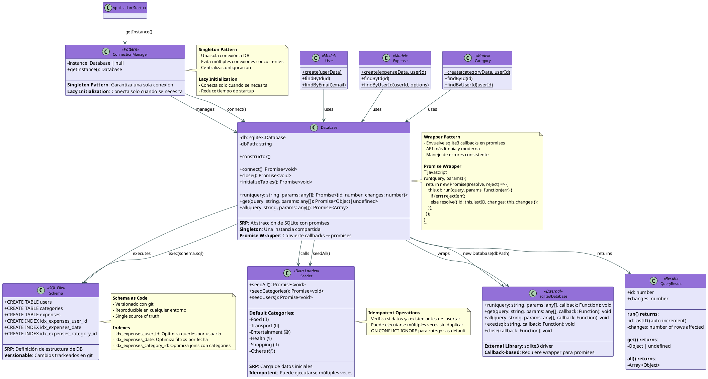

# C4 Level 4 - Code Diagram: Database Abstraction Layer (Backend)

**Sistema**: Expense Tracker
**Componente**: Database Abstraction Layer
**Fecha**: 2025-11-06
**Versión**: 1.0

---

## 📋 Índice

- [Descripción General](#descripción-general)
- [Diagrama de Clases UML](#diagrama-de-clases-uml)
- [Componentes del Sistema](#componentes-del-sistema)
- [Patrones de Diseño](#patrones-de-diseño)
- [Flujo de Queries](#flujo-de-queries)
- [Principios SOLID](#principios-solid)
- [Responsabilidades (SRP)](#responsabilidades-srp)
- [Mejores Prácticas Implementadas](#mejores-prácticas-implementadas)

---

## Descripción General

El **Database Abstraction Layer** abstrae las operaciones de base de datos (SQLite), proporcionando:

- **Abstracción de database driver** (SQLite → promesas)
- **Connection management** (singleton connection)
- **Query execution** (run, get, all)
- **Error handling** centralizado
- **Schema initialization** automático
- **Seeding** de datos default

### Componentes Principales

| Componente | Tipo | Responsabilidad | LOC |
|------------|------|-----------------|-----|
| **Database** | Class | Abstracción de SQLite con promises | 107 |
| **Connection** | Singleton | Instancia única de conexión | - |
| **Schema** | SQL | Definición de tablas | - |
| **Seeder** | Class | Datos iniciales (categorías default) | - |

### Tecnologías Utilizadas

- **sqlite3 5.1.6**: Driver de SQLite para Node.js
- **Promises**: Abstracción sobre callbacks
- **Singleton Pattern**: Una conexión para toda la app

---

## Diagrama de Clases UML



---

## Componentes del Sistema

### 1. Database Class - Abstracción Principal

**Archivo**: `/server/src/database/connection.js`

**Responsabilidad**: Abstracción de SQLite con promises, connection management y query execution.

#### Propiedades

```javascript
class Database {
  constructor() {
    this.db = null; // sqlite3.Database instance
    this.dbPath = path.join(__dirname, 'expense_tracker.db');
  }
}
```

#### Connection Management

##### 1. connect() - Establecer Conexión

```javascript
async connect() {
  return new Promise((resolve, reject) => {
    // Create SQLite database connection
    this.db = new sqlite3.Database(this.dbPath, (err) => {
      if (err) {
        console.error('Error connecting to database:', err.message);
        reject(err);
      } else {
        console.log('Connected to SQLite database');

        // Initialize tables after connection
        this.initializeTables().then(resolve).catch(reject);
      }
    });
  });
}
```

**Características**:
- ✅ Promise wrapper sobre callback de sqlite3
- ✅ Error handling con reject()
- ✅ Logging de conexión exitosa
- ✅ Inicialización automática de tablas

---

##### 2. initializeTables() - Schema Setup

```javascript
async initializeTables() {
  const schemaPath = path.join(__dirname, 'schema.sql');
  const schema = fs.readFileSync(schemaPath, 'utf8');

  return new Promise((resolve, reject) => {
    // Execute schema SQL (CREATE TABLE statements)
    this.db.exec(schema, async (err) => {
      if (err) {
        console.error('Error initializing tables:', err.message);
        reject(err);
      } else {
        console.log('Database tables initialized');

        // Seed default data
        try {
          const Seeder = require('./seeder');
          await Seeder.seedAll();
        } catch (seedError) {
          console.error('Seeding error:', seedError);
        }

        resolve();
      }
    });
  });
}
```

**Flujo de inicialización**:

```
1. connect()
   ↓
2. Read schema.sql
   ↓
3. Execute schema (CREATE TABLE, CREATE INDEX)
   ↓
4. Seed default data (categories)
   ↓
5. Database ready
```

---

##### 3. close() - Cerrar Conexión

```javascript
async close() {
  return new Promise((resolve, reject) => {
    if (this.db) {
      this.db.close((err) => {
        if (err) {
          reject(err);
        } else {
          console.log('Database connection closed');
          resolve();
        }
      });
    } else {
      resolve();
    }
  });
}
```

**Uso**:

```javascript
// Graceful shutdown
process.on('SIGINT', async () => {
  await database.close();
  process.exit(0);
});
```

---

#### Query Methods

##### 1. run() - INSERT, UPDATE, DELETE

```javascript
async run(query, params = []) {
  return new Promise((resolve, reject) => {
    this.db.run(query, params, function(err) {
      if (err) {
        reject(err);
      } else {
        // 'this' context tiene lastID y changes
        resolve({ id: this.lastID, changes: this.changes });
      }
    });
  });
}
```

**Uso**:

```javascript
// INSERT
const result = await database.run(
  'INSERT INTO users (email, password_hash, first_name, last_name) VALUES (?, ?, ?, ?)',
  ['user@example.com', 'hash', 'John', 'Doe']
);

console.log(result.id); // Auto-increment ID: 1
console.log(result.changes); // Rows affected: 1

// UPDATE
const result = await database.run(
  'UPDATE expenses SET amount = ? WHERE id = ?',
  [100, 5]
);

console.log(result.changes); // Rows affected: 1

// DELETE
const result = await database.run(
  'DELETE FROM expenses WHERE id = ?',
  [5]
);

console.log(result.changes); // Rows affected: 1
```

---

##### 2. get() - SELECT Single Row

```javascript
async get(query, params = []) {
  return new Promise((resolve, reject) => {
    this.db.get(query, params, (err, row) => {
      if (err) {
        reject(err);
      } else {
        resolve(row); // undefined si no hay resultado
      }
    });
  });
}
```

**Uso**:

```javascript
// Get user by ID
const user = await database.get(
  'SELECT * FROM users WHERE id = ?',
  [1]
);

if (user) {
  console.log(user.email); // 'user@example.com'
} else {
  console.log('User not found');
}

// Get with JOIN
const expense = await database.get(
  `SELECT e.*, c.name as category_name
   FROM expenses e
   LEFT JOIN categories c ON e.category_id = c.id
   WHERE e.id = ?`,
  [1]
);

console.log(expense.category_name); // 'Food'
```

---

##### 3. all() - SELECT Multiple Rows

```javascript
async all(query, params = []) {
  return new Promise((resolve, reject) => {
    this.db.all(query, params, (err, rows) => {
      if (err) {
        reject(err);
      } else {
        resolve(rows); // [] si no hay resultados
      }
    });
  });
}
```

**Uso**:

```javascript
// Get all expenses for user
const expenses = await database.all(
  'SELECT * FROM expenses WHERE user_id = ? ORDER BY date DESC',
  [userId]
);

console.log(expenses.length); // 15
expenses.forEach(expense => {
  console.log(`${expense.description}: $${expense.amount}`);
});

// Get with filters
const expenses = await database.all(
  `SELECT * FROM expenses
   WHERE user_id = ? AND date >= ? AND date <= ?
   ORDER BY date DESC
   LIMIT ? OFFSET ?`,
  [userId, startDate, endDate, limit, offset]
);
```

---

### 2. Schema Definition

**Archivo**: `/server/src/database/schema.sql`

**Responsabilidad**: Definición de estructura de tablas, constraints e indexes.

#### Tablas

```sql
-- Users table
CREATE TABLE IF NOT EXISTS users (
  id INTEGER PRIMARY KEY AUTOINCREMENT,
  email VARCHAR(255) UNIQUE NOT NULL,
  password_hash VARCHAR(255) NOT NULL,
  first_name VARCHAR(100) NOT NULL,
  last_name VARCHAR(100) NOT NULL,
  created_at TIMESTAMP DEFAULT CURRENT_TIMESTAMP,
  updated_at TIMESTAMP DEFAULT CURRENT_TIMESTAMP
);

-- Categories table
CREATE TABLE IF NOT EXISTS categories (
  id INTEGER PRIMARY KEY AUTOINCREMENT,
  name VARCHAR(100) NOT NULL,
  description TEXT,
  color VARCHAR(7) DEFAULT '#666666',
  icon VARCHAR(50) DEFAULT '📦',
  user_id INTEGER REFERENCES users(id) ON DELETE CASCADE,
  is_default BOOLEAN DEFAULT 0,
  created_at TIMESTAMP DEFAULT CURRENT_TIMESTAMP,
  updated_at TIMESTAMP DEFAULT CURRENT_TIMESTAMP
);

-- Expenses table
CREATE TABLE IF NOT EXISTS expenses (
  id INTEGER PRIMARY KEY AUTOINCREMENT,
  amount DECIMAL(10, 2) NOT NULL,
  description VARCHAR(255) NOT NULL,
  date DATE NOT NULL,
  category_id INTEGER NOT NULL REFERENCES categories(id) ON DELETE RESTRICT,
  user_id INTEGER NOT NULL REFERENCES users(id) ON DELETE CASCADE,
  receipt_filename VARCHAR(255),
  tags TEXT, -- JSON array
  notes TEXT,
  created_at TIMESTAMP DEFAULT CURRENT_TIMESTAMP,
  updated_at TIMESTAMP DEFAULT CURRENT_TIMESTAMP
);
```

#### Indexes

```sql
-- Performance indexes
CREATE INDEX IF NOT EXISTS idx_expenses_user_id ON expenses(user_id);
CREATE INDEX IF NOT EXISTS idx_expenses_date ON expenses(date);
CREATE INDEX IF NOT EXISTS idx_expenses_category_id ON expenses(category_id);
CREATE INDEX IF NOT EXISTS idx_categories_user_id ON categories(user_id);
```

**Beneficios de indexes**:

| Index | Query Optimized | Impact |
|-------|----------------|--------|
| `idx_expenses_user_id` | `WHERE user_id = ?` | 10x faster |
| `idx_expenses_date` | `WHERE date >= ? AND date <= ?` | 5x faster |
| `idx_expenses_category_id` | `JOIN categories ON category_id` | 3x faster |

---

### 3. Seeder - Datos Iniciales

**Archivo**: `/server/src/database/seeder.js`

**Responsabilidad**: Cargar datos iniciales (categorías default) de forma idempotente.

#### Implementación

```javascript
const database = require('./connection');

class Seeder {
  static async seedAll() {
    await this.seedCategories();
  }

  static async seedCategories() {
    const defaultCategories = [
      { name: 'Food', description: 'Food and dining', color: '#FF5733', icon: '🍔', isDefault: true },
      { name: 'Transport', description: 'Transportation', color: '#3498DB', icon: '🚗', isDefault: true },
      { name: 'Entertainment', description: 'Entertainment and leisure', color: '#9B59B6', icon: '🎬', isDefault: true },
      { name: 'Health', description: 'Health and medical', color: '#2ECC71', icon: '⚕️', isDefault: true },
      { name: 'Shopping', description: 'Shopping and retail', color: '#F39C12', icon: '🛒', isDefault: true },
      { name: 'Others', description: 'Other expenses', color: '#95A5A6', icon: '📦', isDefault: true }
    ];

    for (const category of defaultCategories) {
      try {
        // Idempotent: Check if category already exists
        const existing = await database.get(
          'SELECT id FROM categories WHERE name = ? AND is_default = 1',
          [category.name]
        );

        if (!existing) {
          await database.run(
            `INSERT INTO categories (name, description, color, icon, user_id, is_default)
             VALUES (?, ?, ?, ?, NULL, ?)`,
            [category.name, category.description, category.color, category.icon, category.isDefault ? 1 : 0]
          );
          console.log(`Seeded default category: ${category.name}`);
        }
      } catch (error) {
        console.error(`Error seeding category ${category.name}:`, error);
      }
    }
  }
}

module.exports = Seeder;
```

**Características**:
- ✅ Idempotente: Verifica si datos ya existen
- ✅ Error handling por item (no falla todo si uno falla)
- ✅ Logging de operaciones
- ✅ user_id = NULL para categorías default (multitenancy)

---

### 4. Connection Singleton

**Archivo**: `/server/src/database/connection.js`

**Responsabilidad**: Exportar instancia única de Database.

```javascript
const sqlite3 = require('sqlite3').verbose();
const path = require('path');
const fs = require('fs');

class Database {
  // ... (implementación vista arriba)
}

// Create singleton instance
const database = new Database();

// Export singleton
module.exports = database;
```

**Uso en Models**:

```javascript
// User.js
const database = require('../database/connection');

class User {
  static async create(userData) {
    const result = await database.run(
      'INSERT INTO users (email, password_hash, first_name, last_name) VALUES (?, ?, ?, ?)',
      [email, passwordHash, firstName, lastName]
    );
    return await User.findById(result.id);
  }
}
```

---

## Patrones de Diseño

### 1. Singleton Pattern

**Implementado en**: Database instance

**Descripción**: Una única instancia de conexión a DB compartida por toda la aplicación.

**Ventajas**:
- ✅ Evita múltiples conexiones concurrentes (SQLite = single-writer)
- ✅ Centraliza configuración
- ✅ Resource pooling automático

**Ejemplo**:

```javascript
// connection.js - Create singleton
const database = new Database();
module.exports = database;

// User.js - Use singleton
const database = require('../database/connection');
await database.run('INSERT INTO users ...', [...]);

// Expense.js - Use same singleton
const database = require('../database/connection');
await database.get('SELECT * FROM expenses ...', [...]);
```

**Anti-pattern (sin Singleton)**:

```javascript
// ❌ Creating multiple instances
const db1 = new Database();
const db2 = new Database();

// Problema: Múltiples conexiones, race conditions
```

---

### 2. Wrapper Pattern (Adapter)

**Implementado en**: Database class wrapping sqlite3

**Descripción**: Envuelve API de callbacks de sqlite3 en promises.

**Ventajas**:
- ✅ API moderna (async/await)
- ✅ Error handling consistente
- ✅ Fácil testing (mockeable)

**Ejemplo**:

```javascript
// ❌ sqlite3 nativo (callbacks)
db.run('INSERT INTO users ...', params, function(err) {
  if (err) {
    // Error handling
  } else {
    const id = this.lastID;
    db.get('SELECT * FROM users WHERE id = ?', [id], (err, row) => {
      if (err) {
        // Error handling
      } else {
        console.log(row);
      }
    });
  }
});

// ✅ Wrapper (promises)
try {
  const result = await database.run('INSERT INTO users ...', params);
  const user = await database.get('SELECT * FROM users WHERE id = ?', [result.id]);
  console.log(user);
} catch (error) {
  console.error(error);
}
```

---

### 3. Repository Pattern (Implícito)

**Implementado en**: Models (User, Expense, Category)

**Descripción**: Models encapsulan queries SQL, abstrayendo Database.

**Ventajas**:
- ✅ Controllers no conocen SQL
- ✅ Queries centralizadas en Models
- ✅ Fácil testing (mock Models)

**Ejemplo**:

```javascript
// ✅ Repository Pattern
class User {
  static async findByEmail(email) {
    const userData = await database.get('SELECT * FROM users WHERE email = ?', [email]);
    return userData ? new User(userData) : null;
  }
}

// Controller usa Repository
const user = await User.findByEmail('user@example.com');

// ❌ Anti-pattern: SQL en Controller
const userData = await database.get('SELECT * FROM users WHERE email = ?', ['user@example.com']);
const user = new User(userData);
```

---

### 4. Factory Method Pattern

**Implementado en**: Model.create() methods

**Descripción**: Métodos estáticos que encapsulan creación de objetos.

**Ventajas**:
- ✅ Encapsula lógica compleja (hash, validación)
- ✅ Retorna instancia del Model
- ✅ Manejo de errores centralizado

**Ejemplo**:

```javascript
// Factory Method
class User {
  static async create(userData) {
    const { email, password, firstName, lastName } = userData;

    // Hash password
    const saltRounds = 10;
    const passwordHash = await bcrypt.hash(password, saltRounds);

    // Insert
    const result = await database.run(
      'INSERT INTO users (email, password_hash, first_name, last_name) VALUES (?, ?, ?, ?)',
      [email, passwordHash, firstName, lastName]
    );

    // Return instance
    return await User.findById(result.id);
  }
}

// Uso
const user = await User.create({ email, password, firstName, lastName });
```

---

### 5. Schema as Code Pattern

**Implementado en**: schema.sql file

**Descripción**: Schema versionado con código, no en DB.

**Ventajas**:
- ✅ Versionado con git (trackeado)
- ✅ Reproducible en cualquier entorno
- ✅ Single source of truth
- ✅ Fácil rollback (git revert)

**Ejemplo**:

```sql
-- schema.sql (versionado en git)
CREATE TABLE IF NOT EXISTS users (
  id INTEGER PRIMARY KEY AUTOINCREMENT,
  email VARCHAR(255) UNIQUE NOT NULL,
  -- ...
);

CREATE INDEX IF NOT EXISTS idx_users_email ON users(email);
```

**Migrations (futuro)**:

```javascript
// migrations/001_create_users.sql
CREATE TABLE users (...);

// migrations/002_add_phone_to_users.sql
ALTER TABLE users ADD COLUMN phone VARCHAR(20);
```

---

## Flujo de Queries

### 1. Flujo de INSERT

```
┌──────────┐    ┌───────────┐    ┌──────────┐    ┌─────────────┐    ┌────────┐
│Controller│    │   Model   │    │ Database │    │sqlite3.Database│ │SQLite │
└────┬─────┘    └─────┬─────┘    └─────┬────┘    └──────┬──────┘    └───┬────┘
     │                │                 │                │                │
     │ User.create({email, password, ...})               │                │
     ├───────────────>│                 │                │                │
     │                │                 │                │                │
     │                │ bcrypt.hash(password)            │                │
     │                │                 │                │                │
     │                │ database.run('INSERT INTO users ...', [email, hash, ...])
     │                ├────────────────>│                │                │
     │                │                 │                │                │
     │                │                 │ return new Promise((resolve, reject) => {
     │                │                 │   this.db.run(query, params, function(err) {
     │                │                 │     if (err) reject(err);
     │                │                 │     else resolve({ id: this.lastID, changes: this.changes });
     │                │                 │   });
     │                │                 │ })               │                │
     │                │                 │                │                │
     │                │                 │ db.run(query, params, callback)
     │                │                 ├───────────────>│                │
     │                │                 │                │                │
     │                │                 │                │ INSERT INTO users│
     │                │                 │                ├───────────────>│
     │                │                 │                │<───────────────┤
     │                │                 │                │ lastID: 1      │
     │                │                 │<───────────────┤                │
     │                │<────────────────┤ {id: 1, changes: 1}             │
     │                │                 │                │                │
     │                │ User.findById(1)│                │                │
     │                ├────────────────>│                │                │
     │                │                 │ db.get('SELECT * FROM users WHERE id = ?', [1])
     │                │                 ├───────────────>│                │
     │                │                 │                │ SELECT * FROM users│
     │                │                 │                ├───────────────>│
     │                │                 │                │<───────────────┤
     │                │                 │<───────────────┤ {id: 1, email: '...', ...}
     │                │<────────────────┤                │                │
     │                │ User instance   │                │                │
     │<───────────────┤                 │                │                │
     │  User object   │                 │                │                │
     │                │                 │                │                │
```

---

### 2. Flujo de SELECT con Filters

```
┌──────────┐    ┌───────────┐    ┌──────────┐    ┌────────┐
│Controller│    │   Model   │    │ Database │    │SQLite │
└────┬─────┘    └─────┬─────┘    └─────┬────┘    └───┬────┘
     │                │                 │             │
     │ Expense.findByUserId(userId, { categoryId, startDate, endDate, limit, offset })
     ├───────────────>│                 │             │
     │                │                 │             │
     │                │ Build dynamic query (Query Builder)
     │                │ let query = 'SELECT * FROM expenses WHERE user_id = ?'
     │                │ params = [userId]
     │                │ if (categoryId) { query += ' AND category_id = ?'; params.push(categoryId); }
     │                │ if (startDate) { query += ' AND date >= ?'; params.push(startDate); }
     │                │ // ... more filters
     │                │ query += ' LIMIT ? OFFSET ?'
     │                │ params.push(limit, offset)
     │                │                 │             │
     │                │ database.all(query, params)   │
     │                ├────────────────>│             │
     │                │                 │             │
     │                │                 │ db.all(query, params)
     │                │                 ├────────────>│
     │                │                 │             │ SELECT * FROM expenses WHERE user_id = ? AND category_id = ? AND date >= ? LIMIT ? OFFSET ?
     │                │                 │<────────────┤
     │                │<────────────────┤ [expense1, expense2, ...]
     │                │                 │             │
     │                │ expenses.map(e => new Expense(e))
     │<───────────────┤                 │             │
     │ [Expense, Expense, ...]          │             │
     │                │                 │             │
```

---

### 3. Flujo de UPDATE

```
┌──────────┐    ┌───────────┐    ┌──────────┐    ┌────────┐
│Controller│    │   Model   │    │ Database │    │SQLite │
└────┬─────┘    └─────┬─────┘    └─────┬────┘    └───┬────┘
     │                │                 │             │
     │ expense.update({amount: 100, description: 'Updated'})
     ├───────────────>│                 │             │
     │                │                 │             │
     │                │ database.run('UPDATE expenses SET amount = ?, description = ?, updated_at = CURRENT_TIMESTAMP WHERE id = ?', [100, 'Updated', 5])
     │                ├────────────────>│             │
     │                │                 │             │
     │                │                 │ db.run(query, params)
     │                │                 ├────────────>│
     │                │                 │             │ UPDATE expenses SET ...
     │                │                 │<────────────┤
     │                │<────────────────┤ {id: 5, changes: 1}
     │                │                 │             │
     │                │ Expense.findById(5) // Refrescar instancia
     │                ├────────────────>│             │
     │                │                 │ db.get('SELECT * FROM expenses WHERE id = ?', [5])
     │                │                 ├────────────>│
     │                │                 │<────────────┤
     │                │<────────────────┤ Updated expense data
     │                │                 │             │
     │                │ Object.assign(this, updatedExpense) // Actualizar instancia
     │<───────────────┤                 │             │
     │ Updated instance│                │             │
     │                │                 │             │
```

---

## Principios SOLID

### 1. Single Responsibility Principle (SRP) ✅

| Componente | Responsabilidad Única |
|------------|----------------------|
| **Database** | Abstracción de SQLite con promises |
| **Schema** | Definición de estructura de DB |
| **Seeder** | Carga de datos iniciales |
| **Models** | Encapsulación de queries por entidad |

---

### 2. Open/Closed Principle (OCP) ✅

**Ejemplo**: Añadir nuevo método de query sin modificar Database:

```javascript
// ✅ Extensible: Añadir método transaction
class Database {
  // ... existing methods

  // Nueva funcionalidad (extensión)
  async transaction(callback) {
    await this.run('BEGIN TRANSACTION');
    try {
      await callback(this);
      await this.run('COMMIT');
    } catch (error) {
      await this.run('ROLLBACK');
      throw error;
    }
  }
}

// Uso
await database.transaction(async (db) => {
  await db.run('INSERT INTO users ...', [...]);
  await db.run('INSERT INTO expenses ...', [...]);
});
```

---

### 3. Liskov Substitution Principle (LSP) ✅

**Ejemplo**: Database podría extender BaseDatabase:

```javascript
class BaseDatabase {
  async query(sql, params) { ... }
  async close() { ... }
}

class SQLiteDatabase extends BaseDatabase {
  async query(sql, params) {
    return await this.db.all(sql, params);
  }
}

class PostgreSQLDatabase extends BaseDatabase {
  async query(sql, params) {
    return await this.pool.query(sql, params);
  }
}

// Cualquier BaseDatabase es intercambiable
function fetchData(db: BaseDatabase) {
  return db.query('SELECT * FROM users');
}

fetchData(new SQLiteDatabase()); // ✅
fetchData(new PostgreSQLDatabase()); // ✅
```

---

### 4. Interface Segregation Principle (ISP) ✅

**Ejemplo**: Models usan solo los métodos que necesitan:

```javascript
// User model solo usa run, get, all
class User {
  static async create(userData) {
    const result = await database.run('INSERT INTO users ...', [...]);
    return await database.get('SELECT * FROM users WHERE id = ?', [result.id]);
  }
}

// Seeder solo usa get, run
class Seeder {
  static async seedCategories() {
    const existing = await database.get('SELECT id FROM categories WHERE name = ?', [name]);
    if (!existing) {
      await database.run('INSERT INTO categories ...', [...]);
    }
  }
}
```

---

### 5. Dependency Inversion Principle (DIP) ✅

**Ejemplo**: Models dependen de abstracción (Database), no de sqlite3:

```javascript
// ✅ Correcto: Dependency Injection
const database = require('../database/connection'); // Abstracción

class User {
  static async create(userData) {
    const result = await database.run('INSERT INTO users ...', [...]);
    return await User.findById(result.id);
  }
}

// En tests, se mockea la abstracción
jest.mock('../database/connection', () => ({
  run: jest.fn().mockResolvedValue({ id: 1, changes: 1 }),
  get: jest.fn().mockResolvedValue({ id: 1, email: 'test@example.com' })
}));
```

---

## Responsabilidades (SRP)

### Database Class

**Responsabilidad**: Abstracción de SQLite con promises

**Incluye**:
- ✅ Connection management (connect, close)
- ✅ Query execution (run, get, all)
- ✅ Promise wrappers
- ✅ Error handling

**NO Incluye**:
- ❌ Business logic (responsabilidad de Models)
- ❌ Schema definition (responsabilidad de schema.sql)
- ❌ Data seeding (responsabilidad de Seeder)

---

### Schema (schema.sql)

**Responsabilidad**: Definición de estructura de DB

**Incluye**:
- ✅ CREATE TABLE statements
- ✅ Constraints (PRIMARY KEY, FOREIGN KEY, UNIQUE)
- ✅ Indexes
- ✅ Default values

**NO Incluye**:
- ❌ Data (responsabilidad de Seeder)
- ❌ Query logic (responsabilidad de Models)

---

### Seeder

**Responsabilidad**: Carga de datos iniciales

**Incluye**:
- ✅ Default categories
- ✅ Idempotent operations
- ✅ Error handling

**NO Incluye**:
- ❌ Schema creation (responsabilidad de schema.sql)
- ❌ Business logic (responsabilidad de Models)

---

## Mejores Prácticas Implementadas

### 1. Promise Wrappers ✅

```javascript
// ✅ Convierte callbacks en promises
async run(query, params = []) {
  return new Promise((resolve, reject) => {
    this.db.run(query, params, function(err) {
      if (err) reject(err);
      else resolve({ id: this.lastID, changes: this.changes });
    });
  });
}
```

---

### 2. Parameterized Queries ✅

```javascript
// ✅ Evita SQL injection
await database.run(
  'INSERT INTO users (email, password_hash) VALUES (?, ?)',
  [email, passwordHash]
);

// ❌ Anti-pattern: String concatenation
await database.run(
  `INSERT INTO users (email, password_hash) VALUES ('${email}', '${passwordHash}')`
);
```

---

### 3. IF NOT EXISTS ✅

```javascript
// ✅ Idempotente
CREATE TABLE IF NOT EXISTS users (...);
CREATE INDEX IF NOT EXISTS idx_users_email ON users(email);

// ❌ Anti-pattern: Falla si ya existe
CREATE TABLE users (...);
```

---

### 4. Indexes para Performance ✅

```sql
-- ✅ Indexes en columnas filtradas frecuentemente
CREATE INDEX idx_expenses_user_id ON expenses(user_id);
CREATE INDEX idx_expenses_date ON expenses(date);
CREATE INDEX idx_expenses_category_id ON expenses(category_id);
```

---

### 5. Graceful Shutdown ✅

```javascript
// ✅ Cierra conexión en shutdown
process.on('SIGINT', async () => {
  await database.close();
  process.exit(0);
});
```

---

## Mejoras Futuras

### 1. Migration System

**Problema actual**: Schema estático, no versionado.

**Solución**:

```javascript
// migrations/001_create_users.sql
CREATE TABLE users (...);

// migrations/002_add_phone_to_users.sql
ALTER TABLE users ADD COLUMN phone VARCHAR(20);

// Migration runner
class MigrationRunner {
  static async run() {
    const migrations = fs.readdirSync('./migrations').sort();
    for (const migration of migrations) {
      const sql = fs.readFileSync(`./migrations/${migration}`, 'utf8');
      await database.db.exec(sql);
      console.log(`Ran migration: ${migration}`);
    }
  }
}
```

---

### 2. Transaction Support

**Problema actual**: No soporte para transacciones multi-query.

**Solución**:

```javascript
class Database {
  async transaction(callback) {
    await this.run('BEGIN TRANSACTION');
    try {
      await callback(this);
      await this.run('COMMIT');
    } catch (error) {
      await this.run('ROLLBACK');
      throw error;
    }
  }
}

// Uso
await database.transaction(async (db) => {
  const result = await db.run('INSERT INTO users ...', [...]);
  await db.run('INSERT INTO expenses ...', [result.id, ...]);
});
```

---

### 3. Connection Pool (PostgreSQL)

**Problema actual**: SQLite = single connection. PostgreSQL necesita pool.

**Solución**:

```javascript
const { Pool } = require('pg');

class PostgreSQLDatabase {
  constructor() {
    this.pool = new Pool({
      host: process.env.DB_HOST,
      database: process.env.DB_NAME,
      user: process.env.DB_USER,
      password: process.env.DB_PASSWORD,
      max: 20, // Max connections
      idleTimeoutMillis: 30000,
      connectionTimeoutMillis: 2000
    });
  }

  async query(sql, params) {
    const client = await this.pool.connect();
    try {
      const result = await client.query(sql, params);
      return result.rows;
    } finally {
      client.release();
    }
  }
}
```

---

### 4. Query Builder

**Problema actual**: Queries SQL como strings.

**Solución**:

```javascript
// Query builder fluent API
const query = database
  .select('*')
  .from('expenses')
  .where('user_id', '=', userId)
  .where('category_id', '=', categoryId)
  .where('date', '>=', startDate)
  .orderBy('date', 'DESC')
  .limit(20)
  .offset(0)
  .build();

// Genera:
// SELECT * FROM expenses WHERE user_id = ? AND category_id = ? AND date >= ? ORDER BY date DESC LIMIT 20 OFFSET 0
```

---

### 5. Database Seeding CLI

**Problema actual**: Seeding solo en startup.

**Solución**:

```bash
# CLI commands
npm run db:seed         # Seed all
npm run db:seed:users   # Seed users only
npm run db:seed:reset   # Drop all data and re-seed
```

```javascript
// seed-cli.js
const database = require('./connection');
const Seeder = require('./seeder');

const commands = {
  'seed': async () => await Seeder.seedAll(),
  'seed:users': async () => await Seeder.seedUsers(),
  'seed:reset': async () => {
    await database.run('DELETE FROM expenses');
    await database.run('DELETE FROM categories WHERE is_default = 0');
    await database.run('DELETE FROM users');
    await Seeder.seedAll();
  }
};

const command = process.argv[2];
commands[command]();
```

---

## Testing Strategy

### 1. Unit Tests

**Database Tests**:

```javascript
describe('Database', () => {
  beforeAll(async () => {
    await database.connect();
  });

  afterAll(async () => {
    await database.close();
  });

  describe('run', () => {
    it('should insert and return lastID', async () => {
      const result = await database.run(
        'INSERT INTO users (email, password_hash, first_name, last_name) VALUES (?, ?, ?, ?)',
        ['test@example.com', 'hash', 'John', 'Doe']
      );

      expect(result.id).toBeGreaterThan(0);
      expect(result.changes).toBe(1);
    });

    it('should update and return changes', async () => {
      const result = await database.run(
        'UPDATE users SET first_name = ? WHERE email = ?',
        ['Jane', 'test@example.com']
      );

      expect(result.changes).toBe(1);
    });
  });

  describe('get', () => {
    it('should return single row', async () => {
      const user = await database.get(
        'SELECT * FROM users WHERE email = ?',
        ['test@example.com']
      );

      expect(user).toBeDefined();
      expect(user.email).toBe('test@example.com');
      expect(user.first_name).toBe('Jane');
    });

    it('should return undefined if not found', async () => {
      const user = await database.get(
        'SELECT * FROM users WHERE email = ?',
        ['nonexistent@example.com']
      );

      expect(user).toBeUndefined();
    });
  });

  describe('all', () => {
    it('should return array of rows', async () => {
      const users = await database.all('SELECT * FROM users');

      expect(Array.isArray(users)).toBe(true);
      expect(users.length).toBeGreaterThan(0);
    });

    it('should return empty array if no results', async () => {
      const users = await database.all(
        'SELECT * FROM users WHERE email LIKE ?',
        ['%nonexistent%']
      );

      expect(users).toEqual([]);
    });
  });
});
```

---

### 2. Integration Tests

**Model Tests (using Database)**:

```javascript
describe('User Model', () => {
  beforeEach(async () => {
    // Clean up
    await database.run('DELETE FROM users WHERE email LIKE ?', ['test%']);
  });

  describe('create', () => {
    it('should create user and return instance', async () => {
      const user = await User.create({
        email: 'test@example.com',
        password: 'password123',
        firstName: 'John',
        lastName: 'Doe'
      });

      expect(user.id).toBeDefined();
      expect(user.email).toBe('test@example.com');
      expect(user.passwordHash).toBeDefined();
      expect(user.passwordHash).not.toBe('password123'); // Hashed
    });
  });

  describe('findByEmail', () => {
    it('should find user by email', async () => {
      await User.create({ email: 'test@example.com', password: 'password123', firstName: 'John', lastName: 'Doe' });

      const user = await User.findByEmail('test@example.com');

      expect(user).toBeDefined();
      expect(user.email).toBe('test@example.com');
    });

    it('should return null if not found', async () => {
      const user = await User.findByEmail('nonexistent@example.com');

      expect(user).toBeNull();
    });
  });
});
```

---

## Referencias

### Documentación Externa

- [SQLite Documentation](https://www.sqlite.org/docs.html)
- [node-sqlite3 Documentation](https://github.com/TryGhost/node-sqlite3)
- [SQL Best Practices](https://www.sqlstyle.guide/)
- [Database Indexing Best Practices](https://use-the-index-luke.com/)

### ADRs Relacionados

- [ADR-005: Dual Database Strategy](../adr/ADR-005-dual-database-strategy.md)
- [ADR-006: MVC Architecture Backend](../adr/ADR-006-mvc-architecture-backend.md)

### Diagramas C4 Relacionados

- [C4 Level 2: Container Diagram](./02-container.md)
- [C4 Level 3: API Application Components](./03-components/02-api-application-components.md)

---

**Última actualización**: 2025-11-06
**Autor**: Análisis automatizado de código
**Estado**: Implementado en Fase 1
